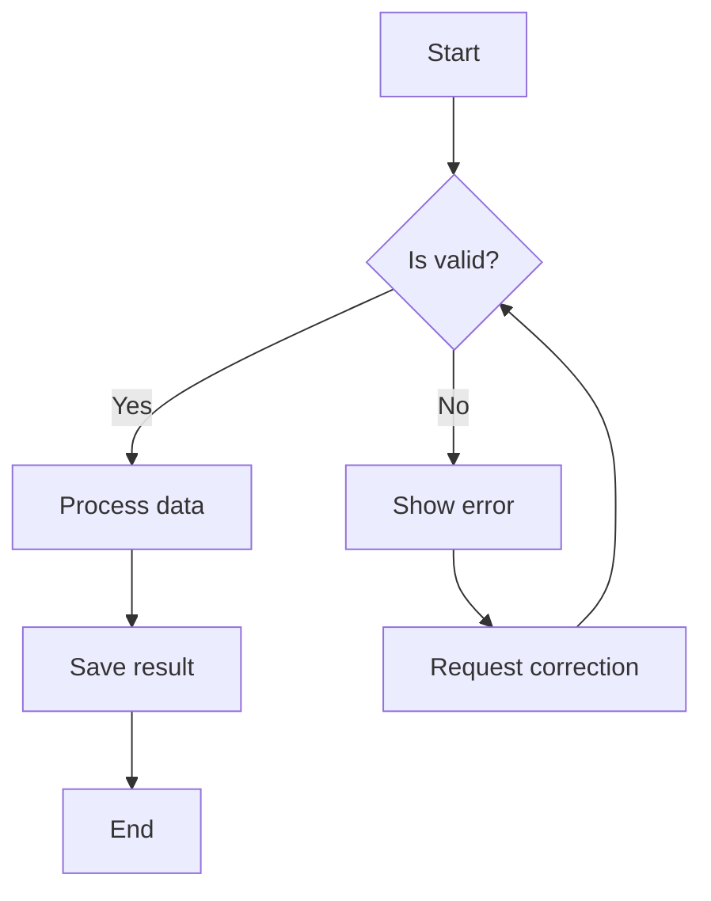
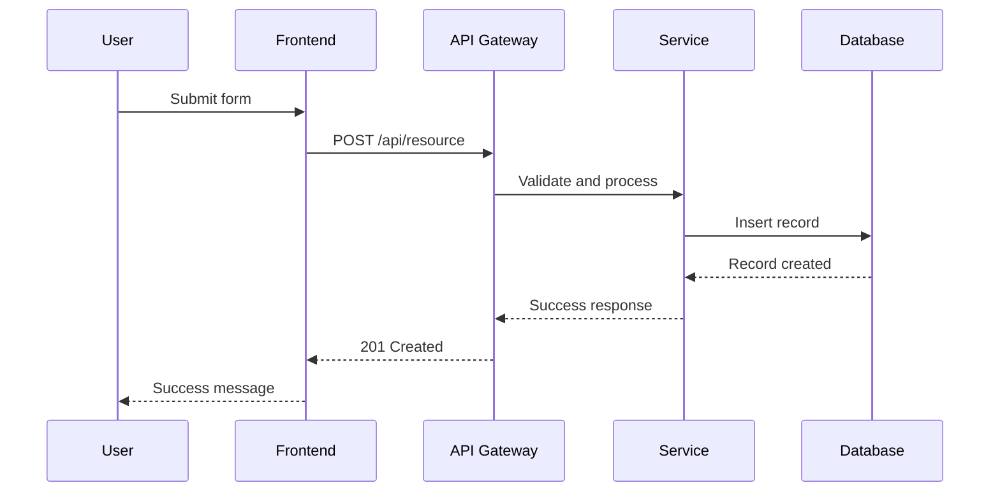
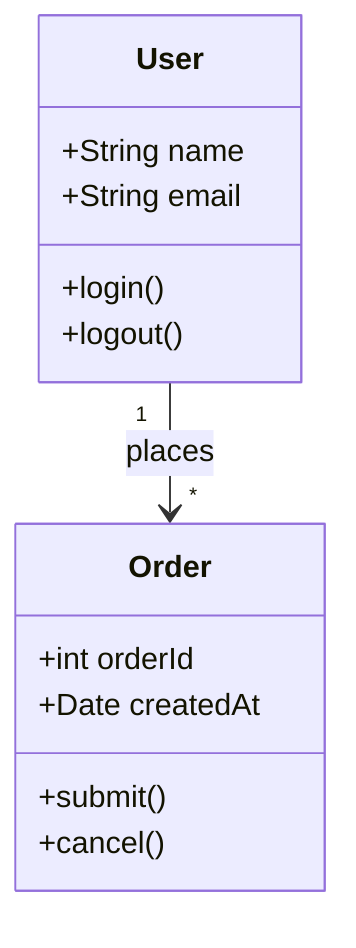
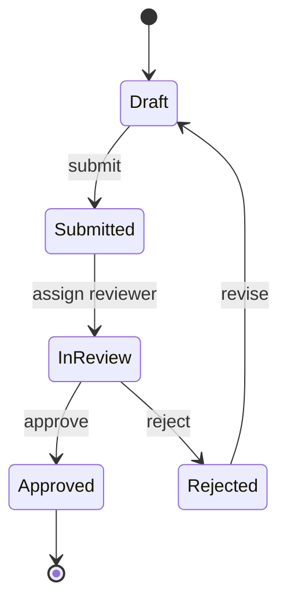
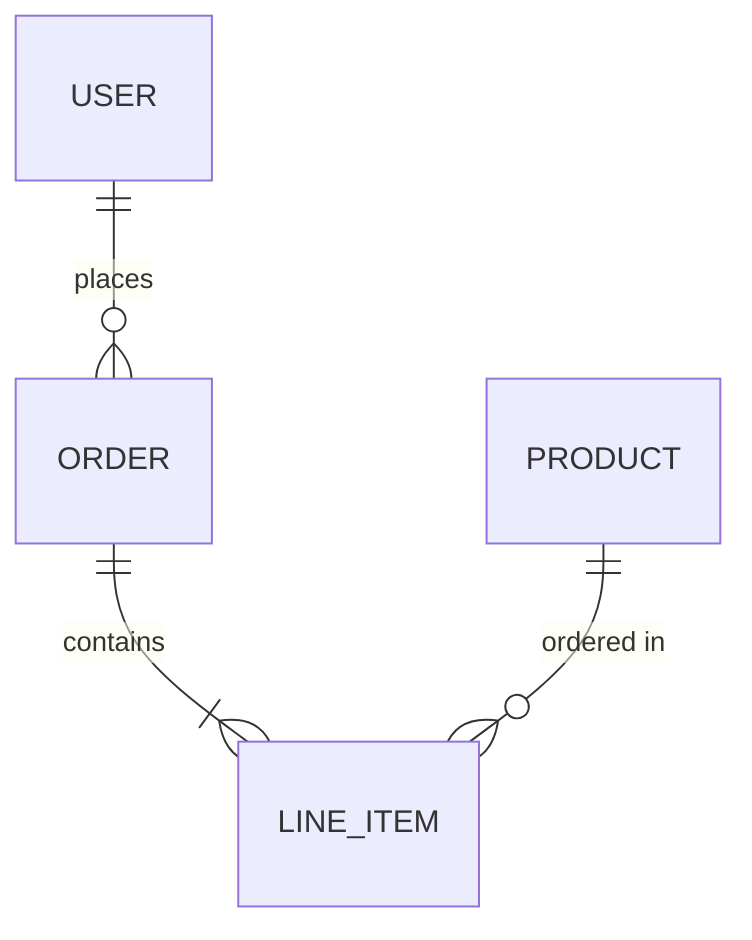
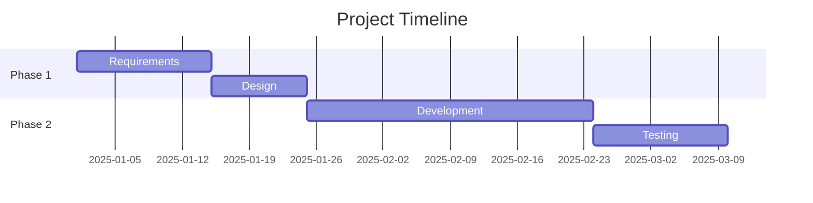

# Mermaid Diagram Standards

This skill defines standards for creating Mermaid diagrams with default theming, accessibility compliance, and universal platform compatibility.

## 1. Core Rule: Default Theme Only

All Mermaid diagrams MUST use the default Mermaid theme. No custom theming is allowed.

### Rules
1. **No `%%{init}` blocks** — Never use theme initialization directives
2. **No `themeVariables`** — Never set custom colors, fonts, or styles
3. **No `style` directives** — Do not use inline `style` node overrides
4. **Default theme only** — Let Mermaid handle all visual styling

### Rationale
- **Light/Dark mode**: Default theme automatically adapts
- **Universal compatibility**: Works across all platforms (GitHub, GitLab, IDEs, browsers)
- **Accessibility**: Default theme provides proper contrast ratios
- **Zero maintenance**: No custom theme variables to maintain

## 2. Supported Diagram Types

### Flowcharts

### Sequence Diagrams

### Class Diagrams

### State Diagrams

### ER Diagrams

### Gantt Charts

## 3. Accessibility Requirements

- **Descriptive Node Labels**: Use clear, meaningful text (not `A`, `B`, `C`)
- **Logical Flow Direction**: `TD` for hierarchical, `LR` for sequential
- **Meaningful Link Text**: Label edges with descriptive actions
- **Diagram Complexity**: Limit to ~15 nodes per diagram for readability

## 4. Common Mistakes

| Mistake | Fix |
|---------|-----|
| `%%{init: {'theme': 'dark'}}%%` | Remove the init block entirely |
| `style A fill:#ff0000` | Remove all style directives |
| Unlabeled edges | Add descriptive labels |
| 30+ nodes in one diagram | Split into multiple focused diagrams |
| Cryptic node labels | Use descriptive labels |

## References

- [Mermaid.js Official Documentation](https://mermaid.js.org/)
- [Mermaid Live Editor](https://mermaid.live/)
- [GitHub Mermaid Support](https://docs.github.com/en/get-started/writing-on-github/working-with-advanced-formatting/creating-diagrams)
