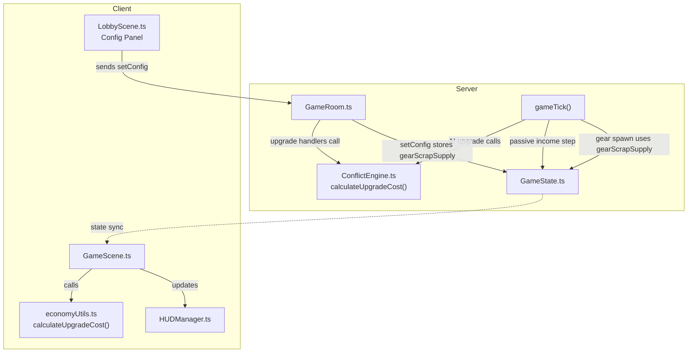
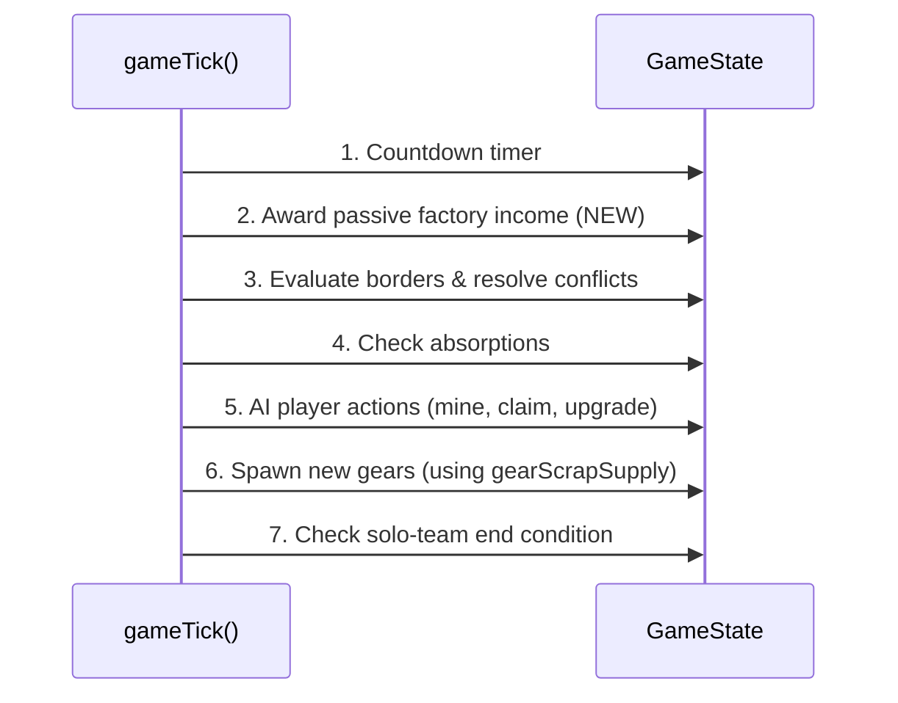

# Design Document: Economy Rebalance

## Overview

This design covers three coordinated economy changes to Scrapyard Steal: (1) replacing the linear upgrade cost formula with a percentage-based exponential curve, (2) adding passive scrap income from owned factories, and (3) making gear pile scrap supply configurable via the lobby config panel. The changes also include updating the client-side HUD to reflect the new formula and ensuring AI players follow the same rules.

All three changes touch the same economic loop — the `gameTick()` cycle in `GameRoom`, the `calculateUpgradeCost` function in `ConflictEngine`, and the client-side cost display in `GameScene` and `HUDManager`. Bundling them ensures the economy stays internally consistent after the update.

### Design Decisions

1. **Shared pure function for upgrade cost**: The `calculateUpgradeCost` function in `ConflictEngine.ts` is the single source of truth for the formula. Both server-side upgrade handlers and client-side display code call (or replicate) this function. Changing it in one place updates the entire system. The client currently duplicates the formula inline in `GameScene.ts` — this will be extracted to a shared utility to prevent desync.

2. **Factory income in existing gameTick**: Passive income is added as a new step in the existing `gameTick()` loop, before border conflict resolution. This keeps the tick order predictable: income → conflicts → absorption → gear spawning. No new timer or interval is needed.

3. **Config via existing setConfig message**: The gear scrap supply setting piggybacks on the existing `setConfig` message handler and config panel UI pattern. This avoids adding new message types or network plumbing.

4. **State field for gearScrapSupply**: A new `gearScrapSupply` field on `GameState` stores the configured value so it syncs to clients (for display in the config panel) and persists across series rounds. Default is 1000.

5. **No client-side import of server code**: The client cannot import from `server/` due to the build setup (Vite client vs ts-node server). The upgrade cost formula will be duplicated as a small pure function in a client-side utility file (`src/utils/economyUtils.ts`), matching the server implementation exactly.

## Architecture



### Tick Order (updated)



## Components and Interfaces

### ConflictEngine.ts — Updated `calculateUpgradeCost`

```typescript
/**
 * Calculates the cost to upgrade a stat (attack or defense).
 * Formula: floor(50 × 1.10^currentStatValue)
 *
 * @param currentStatValue - The player's current stat level (attack or defense), >= 1
 * @returns Non-negative integer cost in scrap
 */
export function calculateUpgradeCost(currentStatValue: number): number {
  return Math.floor(50 * Math.pow(1.10, currentStatValue));
}
```

The old formula `50 * currentStatValue` is replaced. The function signature stays the same — all existing call sites continue to work without changes.

### src/utils/economyUtils.ts — New Client-Side Utility

```typescript
/**
 * Client-side mirror of server's calculateUpgradeCost.
 * Must stay in sync with server/logic/ConflictEngine.ts.
 *
 * Formula: floor(50 × 1.10^currentStatValue)
 */
export function calculateUpgradeCost(currentStatValue: number): number {
  return Math.floor(50 * Math.pow(1.10, currentStatValue));
}
```

### GameState.ts — New Field

```typescript
// Added to GameState class:
@type("number") gearScrapSupply: number = 1000;
```

This field is synced to all clients so the config panel can display the current value.

### GameRoom.ts — Changes

1. **setConfig handler** — Accept `gearScrapSupply` in the config message:

```typescript
this.onMessage("setConfig", (client, data: {
  timeLimit?: number;
  matchFormat?: string;
  gearScrapSupply?: number;  // NEW
}) => {
  // ... existing time/format handling ...

  const ALLOWED_SCRAP_SUPPLIES = [50, 200, 500, 1000];
  if (data.gearScrapSupply !== undefined
      && ALLOWED_SCRAP_SUPPLIES.includes(data.gearScrapSupply)) {
    this.state.gearScrapSupply = data.gearScrapSupply;
  }
});
```

2. **startGame / resetForNextRound** — Use `gearScrapSupply` when setting initial gear scrap:

```typescript
// Replace hardcoded 50 with:
neutralTiles[i].gearScrap = this.state.gearScrapSupply;
```

3. **gameTick — gear spawning** — Use `gearScrapSupply` for newly spawned gears:

```typescript
tile.gearScrap = this.state.gearScrapSupply;
```

4. **gameTick — passive factory income** — New step before border resolution:

```typescript
// Award passive factory income: 1 scrap per owned factory per tick
this.state.players.forEach((player) => {
  if (player.absorbed) return;
  let factoryCount = 0;
  this.state.tiles.forEach((tile) => {
    if (tile.isSpawn && tile.ownerId === player.id) factoryCount++;
  });
  player.resources += factoryCount;
});
```

### LobbyScene.ts — Config Panel Addition

A new "SCRAP SUPPLY" section is added to the config panel between the "AI PLAYERS" section and the "DONE" button:

```typescript
const SCRAP_OPTIONS = [
  { label: "50", value: 50 },
  { label: "200", value: 200 },
  { label: "500", value: 500 },
  { label: "1000", value: 1000 },
];
```

The UI follows the same button-group pattern as the existing TIME LIMIT and MATCH FORMAT sections. The selected value is sent via `sendSetConfig({ gearScrapSupply: value })`.

### NetworkManager.ts — Updated sendSetConfig

```typescript
sendSetConfig(config: {
  timeLimit?: number;
  matchFormat?: string;
  gearScrapSupply?: number;  // NEW
}): void {
  this.room?.send("setConfig", config);
}
```

### GameScene.ts — Updated Cost Calculation

Replace the inline `50 * effectivePlayer.attack` with:

```typescript
import { calculateUpgradeCost } from "../utils/economyUtils";

// In onStateUpdate:
const attackCost = calculateUpgradeCost(effectivePlayer.attack);
const defenseCost = calculateUpgradeCost(effectivePlayer.defense);
```

### HUDManager.ts — Factory Count Display

The HUD already receives `factoryCount` in `updateStats()` and displays `🏭: Nx`. No interface change needed — the factory count is already visible, satisfying Requirement 2.6.

## Data Models

### GameState Changes

| Field | Type | Default | Description |
|---|---|---|---|
| `gearScrapSupply` | `number` | `1000` | Configurable scrap amount for each gear pile. Synced to clients. |

### Player Schema (unchanged)

No changes to the Player schema. The `resources` field continues to hold total scrap. Factory count is derived at runtime by counting `isSpawn` tiles owned by the player — no denormalized field needed.

### Upgrade Cost Formula

| Level | Old Formula (`50 × level`) | New Formula (`floor(50 × 1.10^level)`) |
|---|---|---|
| 1 | 50 | 55 |
| 2 | 100 | 60 |
| 5 | 250 | 80 |
| 10 | 500 | 129 |
| 20 | 1000 | 336 |
| 30 | 1500 | 872 |
| 50 | 2500 | 5869 |

The exponential curve makes early upgrades cheaper and late-game upgrades significantly more expensive, creating a more satisfying progression curve.

### Configuration Validation

| Setting | Allowed Values | Default | Storage |
|---|---|---|---|
| `gearScrapSupply` | 50, 200, 500, 1000 | 1000 | `GameState.gearScrapSupply` |

Invalid values sent via `setConfig` are silently ignored (same pattern as existing time limit and match format validation).

## Correctness Properties

*A property is a characteristic or behavior that should hold true across all valid executions of a system — essentially, a formal statement about what the system should do. Properties serve as the bridge between human-readable specifications and machine-verifiable correctness guarantees.*

### Property 1: Upgrade cost formula correctness

*For any* stat level between 1 and 50 (inclusive), `calculateUpgradeCost(level)` SHALL return `Math.floor(50 * Math.pow(1.10, level))`, and the result SHALL be a non-negative integer.

**Validates: Requirements 1.1, 1.5**

### Property 2: Upgrade cost is monotonically increasing

*For any* two stat levels `a` and `b` where `1 <= a < b <= 50`, `calculateUpgradeCost(a)` SHALL be strictly less than `calculateUpgradeCost(b)`.

**Validates: Requirements 1.1**

### Property 3: Passive factory income is proportional to factory count

*For any* non-absorbed player (human or AI) owning `n` factories (where `n >= 0`), a single game tick SHALL increase that player's resources by exactly `n`.

**Validates: Requirements 2.1, 2.2, 2.3, 5.1**

### Property 4: Invalid gear scrap supply values are rejected

*For any* integer value that is NOT in the allowed set `{50, 200, 500, 1000}`, sending it as `gearScrapSupply` via `setConfig` SHALL leave the stored `gearScrapSupply` unchanged.

**Validates: Requirements 3.8**

### Property 5: Client-server upgrade cost consistency

*For any* stat level between 1 and 50, the client-side `calculateUpgradeCost` (in `src/utils/economyUtils.ts`) SHALL return the exact same value as the server-side `calculateUpgradeCost` (in `server/logic/ConflictEngine.ts`).

**Validates: Requirements 4.1, 4.3**

## Error Handling

| Scenario | Behavior |
|---|---|
| Player sends upgrade request with insufficient resources | Handler returns early — no state change, no error message to client (existing pattern). |
| Player sends upgrade request at max stat level (50) | Handler returns early — existing cap check unchanged. |
| Host sends `gearScrapSupply` value not in allowed list | `setConfig` handler ignores the value, retains current setting. No error sent. |
| Host sends `gearScrapSupply` as non-number or undefined | JavaScript type coercion means `ALLOWED_SCRAP_SUPPLIES.includes(undefined)` returns false — value is ignored. |
| Non-host sends `setConfig` | Existing host check rejects the message. No change. |
| `calculateUpgradeCost` called with 0 or negative level | Returns `Math.floor(50 * Math.pow(1.10, value))` — for 0 returns 50, for negative returns values < 50. Players start at level 1, so this is not reachable in normal gameplay. No guard needed. |
| Factory count is 0 (player lost all spawn tiles) | Passive income awards 0 scrap — correct behavior, no special handling needed. |
| Absorbed player's factories | Factories owned by an absorbed player's ID still exist on the grid. The passive income loop skips absorbed players, so no income is awarded for those factories until they are captured by another player. |

## Testing Strategy

### Property-Based Tests

**Library**: `fast-check` (already in devDependencies)
**File**: `tests/property/economyRebalance.prop.ts`
**Minimum iterations**: 100 per property

| Test | Property | Approach |
|---|---|---|
| Formula correctness | Property 1 | Generate random stat levels (1–50). Verify `calculateUpgradeCost(level) === Math.floor(50 * Math.pow(1.10, level))` and result is non-negative integer. |
| Monotonicity | Property 2 | Generate pairs `(a, b)` where `1 <= a < b <= 50`. Verify `calculateUpgradeCost(a) < calculateUpgradeCost(b)`. |
| Passive income | Property 3 | Generate random factory counts (0–10) and initial resource amounts (0–10000). Simulate one tick of passive income logic. Verify `resources_after === resources_before + factoryCount`. |
| Config validation | Property 4 | Generate random integers outside `{50, 200, 500, 1000}`. Verify the stored value doesn't change after attempting to set the invalid value. |
| Client-server consistency | Property 5 | Generate random stat levels (1–50). Import both client and server `calculateUpgradeCost`. Verify identical output. |

**Tag format**: Each test is tagged with a comment referencing its design property, e.g.:
```
// Feature: economy-rebalance, Property 1: Upgrade cost formula correctness
```

### Unit Tests

**File**: `tests/unit/logic/ConflictEngine.test.ts` (extend existing)

Unit tests cover the specific examples from requirements:
- `calculateUpgradeCost(1)` returns expected value (Requirement 1.2)
- `calculateUpgradeCost(2)` returns 60 (Requirement 1.3)
- `calculateUpgradeCost(10)` returns 129 (Requirement 1.4)
- `gearScrapSupply` defaults to 1000 (Requirement 3.3)
- Each allowed scrap supply value (50, 200, 500, 1000) is accepted (Requirement 3.5)

### Integration Tests

**Scope**: Verify GameRoom behavior end-to-end:

- Upgrade with insufficient resources leaves state unchanged (Requirement 1.6)
- Upgrade with sufficient resources deducts cost and increments stat (Requirement 1.7)
- Passive income awards correct scrap after one tick (Requirement 2.1)
- Factory ownership change reflects in next tick's income (Requirement 2.5)
- Configured gearScrapSupply is used for initial and respawned gears (Requirements 3.6, 3.7)
- Series round reset preserves gearScrapSupply (Requirement 3.9)
- AI players use same upgrade cost formula (Requirement 5.2)

### Test Balance

- **Property tests** handle comprehensive input coverage for the pure upgrade cost function and passive income logic (5 properties × 100+ iterations each)
- **Unit tests** handle specific examples from requirements and default value verification (~5-8 tests)
- **Integration tests** handle GameRoom wiring, state mutation, and multi-component interactions (~7 tests)

