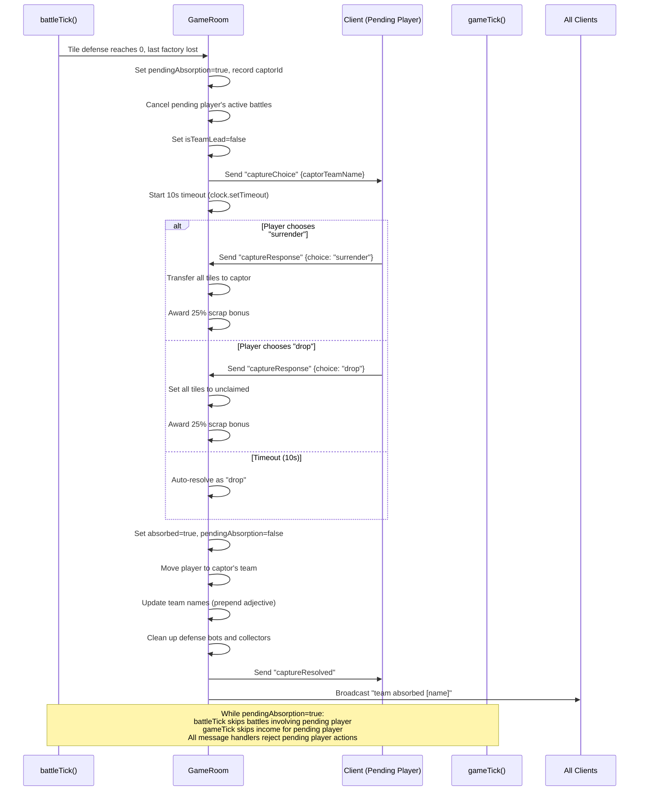
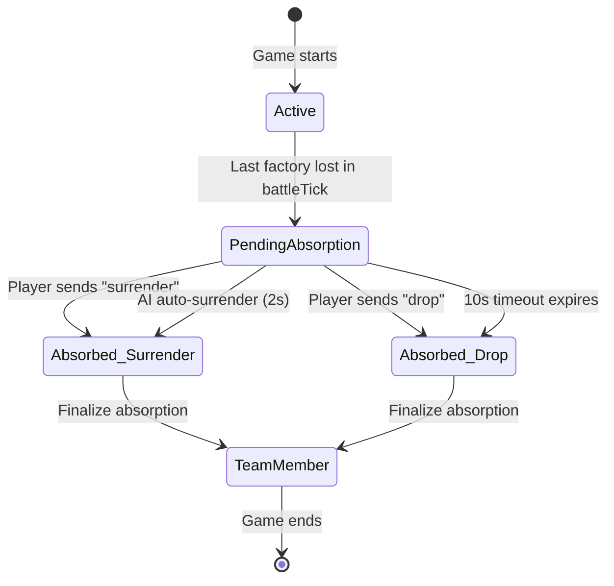

# Design Document: Factory Capture Choice

## Overview

This feature replaces the current instant-absorption mechanic in `battleTick()` with a two-phase flow. When a player loses their last factory, they enter a `pendingAbsorption` state and are presented with a choice: **surrender** all tiles to the captor, or **drop** them as unclaimed. While pending, the player is frozen out of battles, income, and actions. A 10-second timeout auto-resolves as "drop" if the player doesn't respond. After the choice, absorption finalizes with team name updates, adjective transfers, and broadcasts.

The current code has three known race conditions (documented in `known-bugs.md`):
1. Same-tick battles can transfer tiles from already-absorbed players
2. Absorbed players can receive income for one tick after absorption
3. Same-click claim + mine can double-deduct resources

This design addresses all three by introducing explicit state guards and a deferred absorption flow.

### Key Design Decisions

1. **Server-authoritative choice**: The server manages the entire pending → resolved flow. The client only sends a `captureResponse` message; the server validates and resolves.
2. **Timeout defaults to "drop"**: If a player disconnects or goes AFK, their tiles become neutral rather than gifted to the captor. This prevents griefing via intentional disconnection.
3. **AI auto-surrenders after 2 seconds**: AI players always surrender to keep the game moving and simulate cooperative behavior.
4. **Pending state freezes the player completely**: No income, no actions, no battles. This eliminates all race conditions by making the pending player inert.

## Architecture

### System Flow



### State Machine



### Modified Components

| Component | Change Type | Description |
|-----------|------------|-------------|
| `server/state/GameState.ts` | Schema addition | Add `pendingAbsorption`, `captorId` fields to `Player` |
| `server/rooms/GameRoom.ts` | Logic rewrite | Replace instant absorption with two-phase flow; add guards to `battleTick()`, `gameTick()`, and all message handlers |
| `src/ui/HUDManager.ts` | UI addition | Add capture choice modal with countdown timer |
| `src/scenes/GameScene.ts` | Event handling | Listen for `captureChoice` / `captureResolved` messages; manage input blocking |
| `src/network/NetworkManager.ts` | Method addition | Add `sendCaptureResponse()` method |

## Components and Interfaces

### Server-Side Changes

#### New Message Types

```typescript
// Server → Client: Prompt the pending player to choose
interface CaptureChoiceMessage {
  captorTeamName: string;  // Display name of the capturing team
  timeoutSeconds: number;  // Countdown duration (10)
}

// Client → Server: Player's choice
interface CaptureResponseMessage {
  choice: "surrender" | "drop";
}

// Server → Client: Confirm resolution (dismiss dialog)
interface CaptureResolvedMessage {
  result: "surrender" | "drop" | "timeout";
}

// Server → All Clients: Factory capture broadcast
interface FactoryCapturedMessage {
  claimingTeamName: string;
  factoryAdj: string;  // The adjective of the original factory owner
}
```

#### GameRoom Changes

**New private fields:**
```typescript
/** Pending absorption timers: key = playerId, value = clock timeout reference */
private pendingTimers: Map<string, ReturnType<typeof this.clock.setTimeout>> = new Map();
```

**New message handler:**
```typescript
this.onMessage("captureResponse", (client, data: { choice: string }) => { ... });
```

**Modified methods:**
- `battleTick()`: Replace inline absorption block with `enterPendingAbsorption()` call; add skip guards for pending/absorbed players
- `gameTick()`: Add skip guards for pending players in automine and collector income sections
- All action message handlers (`claimTile`, `upgradeAttack`, etc.): Add `pendingAbsorption` check

**New private methods:**
```typescript
private enterPendingAbsorption(defenderId: string, captorId: string): void;
private resolveCapture(pendingPlayerId: string, choice: "surrender" | "drop"): void;
private finalizeAbsorption(pendingPlayerId: string, captorId: string): void;
```

#### enterPendingAbsorption(defenderId, captorId)

1. Set `defender.pendingAbsorption = true`
2. Set `defender.captorId = captorId`
3. Set `defender.isTeamLead = false`
4. Cancel all active battles where `attackerId === defenderId`
5. If defender is AI: schedule `clock.setTimeout(() => resolveCapture(defenderId, "surrender"), 2000)`
6. Else: send `captureChoice` message to defender's client; schedule 10s timeout that calls `resolveCapture(defenderId, "drop")`
7. Store timeout reference in `pendingTimers`

#### resolveCapture(pendingPlayerId, choice)

1. Clear the pending timer from `pendingTimers`
2. Retrieve the pending player and captor
3. If choice is `"surrender"`:
   - Transfer all tiles owned by pending player to captor (`tile.ownerId = captorId`)
   - Update captor's `tileCount += pendingPlayer.tileCount`
   - Set pending player's `tileCount = 0`
4. If choice is `"drop"`:
   - Set all tiles owned by pending player to unclaimed (`tile.ownerId = ""`)
   - Set pending player's `tileCount = 0`
5. Award captor bonus scrap: `Math.floor(0.25 * pendingPlayer.resources)`
6. Call `finalizeAbsorption(pendingPlayerId, captorId)`
7. Send `captureResolved` to the pending player's client

#### finalizeAbsorption(pendingPlayerId, captorId)

1. Set `pendingPlayer.absorbed = true`, `pendingPlayer.pendingAbsorption = false`
2. Set `pendingPlayer.teamId = captorId`
3. Prepend `pendingPlayer.nameAdj` to captor's `teamName`
4. Update `teamName` for all players on the captor's team
5. Clean up defense bots and collectors on tiles no longer owned by the pending player
6. Cancel any remaining battles involving the pending player
7. Broadcast `"team absorbed [adjective noun]"` notification

### Client-Side Changes

#### NetworkManager

```typescript
sendCaptureResponse(choice: "surrender" | "drop"): void {
  this.room?.send("captureResponse", { choice });
}
```

#### HUDManager — Capture Choice Modal

New methods:
```typescript
showCaptureChoice(captorTeamName: string, timeoutSeconds: number, onChoice: (choice: "surrender" | "drop") => void): void;
dismissCaptureChoice(): void;
```

The modal is a full-screen overlay (depth 300, above all other UI) with:
- Dark semi-transparent background
- Title: "YOUR FACTORY HAS FALLEN"
- Captor name display
- Two buttons: "⚔ Surrender Tiles" and "💀 Drop Tiles"
- Countdown timer text updating every second
- All game input blocked while displayed

#### GameScene

- Listen for `captureChoice` message → call `hudManager.showCaptureChoice()`
- Listen for `captureResolved` message → call `hudManager.dismissCaptureChoice()`
- Listen for `factoryCaptured` message → call `hudManager.showNotification()`
- While capture choice is displayed, block `handleTileClick()` and placement modes

### Factory Adjective Transfer (Requirement 9)

When a tile claim (`claimTile` handler) captures an unclaimed spawn tile:
1. Look up the original owner of that spawn (by matching `spawnX`/`spawnY` on all players)
2. If the original owner is absorbed and their adjective is currently on another team's name, remove it from that team
3. Prepend the adjective to the claiming player's team name
4. Update all team members' `teamName` on both affected teams
5. Broadcast `factoryCaptured` message

### Factory Capture Broadcast (Requirement 10)

When a player claims an unclaimed spawn factory:
- Broadcast: `"{claiming team name} claimed the {original adjective} Factory"`
- Client displays as a 3-second HUD notification via `showNotification()`

## Data Models

### Player Schema Changes

```typescript
export class Player extends Schema {
  // ... existing fields ...

  @type("boolean") pendingAbsorption: boolean = false;
  @type("string") captorId: string = "";
}
```

Two new fields added to the Colyseus `Player` schema:
- `pendingAbsorption`: `boolean` — `true` while the player is awaiting a surrender/drop choice
- `captorId`: `string` — the session ID of the player who captured the last factory (empty when not pending)

These are synced to all clients so the client can detect when the local player enters pending state (as a fallback to the explicit `captureChoice` message).

### No Tile Schema Changes

The `Tile` schema remains unchanged. Factory ownership is already tracked via `isSpawn` and `ownerId`. The original spawn owner can be determined by matching `Player.spawnX`/`Player.spawnY` against tile coordinates.

### Server-Side Internal State

```typescript
// In GameRoom class:
private pendingTimers: Map<string, ReturnType<typeof this.clock.setTimeout>> = new Map();
```

This map tracks active timeout handles so they can be cleared when a player responds before the timeout expires.

## Correctness Properties

*A property is a characteristic or behavior that should hold true across all valid executions of a system — essentially, a formal statement about what the system should do. Properties serve as the bridge between human-readable specifications and machine-verifiable correctness guarantees.*

### Property 1: Entering pending absorption sets correct state and cancels battles

*For any* player who loses their last factory, calling `enterPendingAbsorption` SHALL set `pendingAbsorption = true`, record the `captorId`, set `isTeamLead = false`, and remove all active battles where that player is the attacker.

**Validates: Requirements 1.1, 1.2, 1.3**

### Property 2: Battles involving pending or absorbed players are skipped

*For any* set of active battles, if the attacker or the defending tile's owner has `pendingAbsorption = true` or `absorbed = true`, that battle SHALL be skipped (not processed) during battle tick resolution.

**Validates: Requirements 1.4, 7.1, 7.2, 7.3**

### Property 3: Pending and absorbed players receive no income

*For any* player with `pendingAbsorption = true` or `absorbed = true`, processing automine and collector income SHALL not change that player's `resources` value.

**Validates: Requirements 1.5, 8.1, 8.2**

### Property 4: Pending players cannot perform any game actions

*For any* player with `pendingAbsorption = true` and *for any* action in {claimTile, upgradeAttack, upgradeDefense, upgradeCollection, placeDefenseBot, placeCollector, attackTile, mineGear}, attempting that action SHALL leave the game state unchanged.

**Validates: Requirements 1.6**

### Property 5: Surrender transfers all tiles to captor with correct counts

*For any* pending player with N tiles (N ≥ 0) and a captor with M tiles, resolving as "surrender" SHALL result in the captor owning all N tiles (captor tileCount = M + N) and the pending player owning 0 tiles.

**Validates: Requirements 3.1, 3.2**

### Property 6: Drop sets all tiles to unclaimed with correct counts

*For any* pending player with N tiles (N ≥ 0), resolving as "drop" SHALL result in all N tiles having `ownerId = ""` and the pending player's `tileCount = 0`.

**Validates: Requirements 4.1, 4.2**

### Property 7: Captor receives 25% bonus scrap on either choice

*For any* pending player with R resources (R ≥ 0) and *for any* choice in {"surrender", "drop"}, the captor SHALL receive exactly `Math.floor(0.25 * R)` bonus scrap added to their existing resources.

**Validates: Requirements 3.3, 4.3**

### Property 8: Finalization sets correct absorption state and team membership

*For any* resolved capture (surrender or drop), the pending player SHALL have `absorbed = true`, `pendingAbsorption = false`, and `teamId` equal to the captor's id.

**Validates: Requirements 5.1, 5.2**

### Property 9: Finalization prepends adjective and propagates team name

*For any* absorbed player with adjective A and captor with team name T, finalization SHALL set the captor's team name to `"A T"`, and all players on the captor's team SHALL have the same updated team name.

**Validates: Requirements 5.3, 5.4**

### Property 10: Finalization removes bots and collectors from transferred tiles

*For any* absorbed player, after finalization, the absorbed player's `defenseBotsJSON` and `collectorsJSON` SHALL not contain any entries referencing tiles that are no longer owned by the absorbed player (which is all tiles, since tileCount = 0).

**Validates: Requirements 5.6**

## Error Handling

### Server-Side Error Cases

| Scenario | Handling |
|----------|----------|
| `captureResponse` from non-pending player | Ignore message (early return) |
| `captureResponse` with invalid choice value | Ignore message (validate against "surrender" \| "drop") |
| `captureResponse` after timeout already resolved | Ignore (player is already absorbed, `pendingAbsorption` is false) |
| Captor disconnects while choice is pending | Resolve as "drop" — tiles become neutral since captor no longer exists |
| Pending player disconnects | Existing `onLeave` handler converts tiles to neutral; clear pending timer |
| Double `captureResponse` from same player | Second message ignored because `pendingAbsorption` is already false after first resolution |
| Pending player's team members try to act | Team members who are not themselves pending can still act normally; their actions route through the team leader (captor after absorption) |

### Client-Side Error Cases

| Scenario | Handling |
|----------|----------|
| `captureChoice` received but game already ended | Ignore (check `gameEnded` flag) |
| `captureResolved` received but dialog not showing | No-op (dismiss is idempotent) |
| Network disconnect during choice dialog | Dialog remains; reconnection logic is out of scope for this feature |

### Edge Cases

- **Captor is also pending absorption**: If the captor enters pending absorption before the first player resolves, the first player's timeout will fire and resolve as "drop." The `resolveCapture` method checks that the captor still exists and is not absorbed.
- **Multiple players lose factories in the same battle tick**: Each enters pending state independently. The `enterPendingAbsorption` call is made per-player, and each gets their own timer.
- **Player has 0 tiles when entering pending state**: This can happen if tiles were already lost in the same tick. The surrender/drop logic handles 0 tiles gracefully (no tiles to transfer or drop).

## Testing Strategy

### Property-Based Tests (fast-check)

All property tests use `fast-check` with a minimum of 100 iterations per property. Tests are located in `tests/property/factoryCaptureChoice.prop.ts`.

The properties test pure logic functions extracted from `GameRoom`:
- `enterPendingAbsorption` state transitions (Property 1)
- Battle guard filtering (Property 2)
- Income guard filtering (Property 3)
- Action rejection for pending players (Property 4)
- Surrender tile transfer (Property 5)
- Drop tile clearing (Property 6)
- Bonus scrap calculation (Property 7)
- Finalization state transitions (Property 8)
- Team name propagation (Property 9)
- Bot/collector cleanup (Property 10)

Each test is tagged with: `Feature: factory-capture-choice, Property {N}: {title}`

### Unit Tests (vitest)

Located in `tests/unit/logic/factoryCaptureChoice.test.ts`:

- **Specific examples**: Concrete scenarios for surrender and drop with known tile counts
- **AI auto-surrender**: Verify AI players auto-select surrender after 2s delay
- **Timeout resolution**: Verify timeout auto-resolves as "drop"
- **Captor disconnect**: Verify graceful handling when captor leaves during pending state
- **Factory adjective transfer**: Specific examples of adjective prepend/removal with known names
- **Factory capture broadcast**: Verify correct broadcast message format

### Integration Tests

- **Message flow**: Verify `captureChoice` → `captureResponse` → `captureResolved` message sequence using Colyseus test utilities
- **Full absorption flow**: End-to-end test of a player losing their last factory through to team membership update
- **Client dialog lifecycle**: Manual testing of the Phaser UI modal (not automated)

### Test File Structure

```
tests/
  property/
    factoryCaptureChoice.prop.ts    # 10 property-based tests
  unit/
    logic/
      factoryCaptureChoice.test.ts  # Example-based unit tests
```

