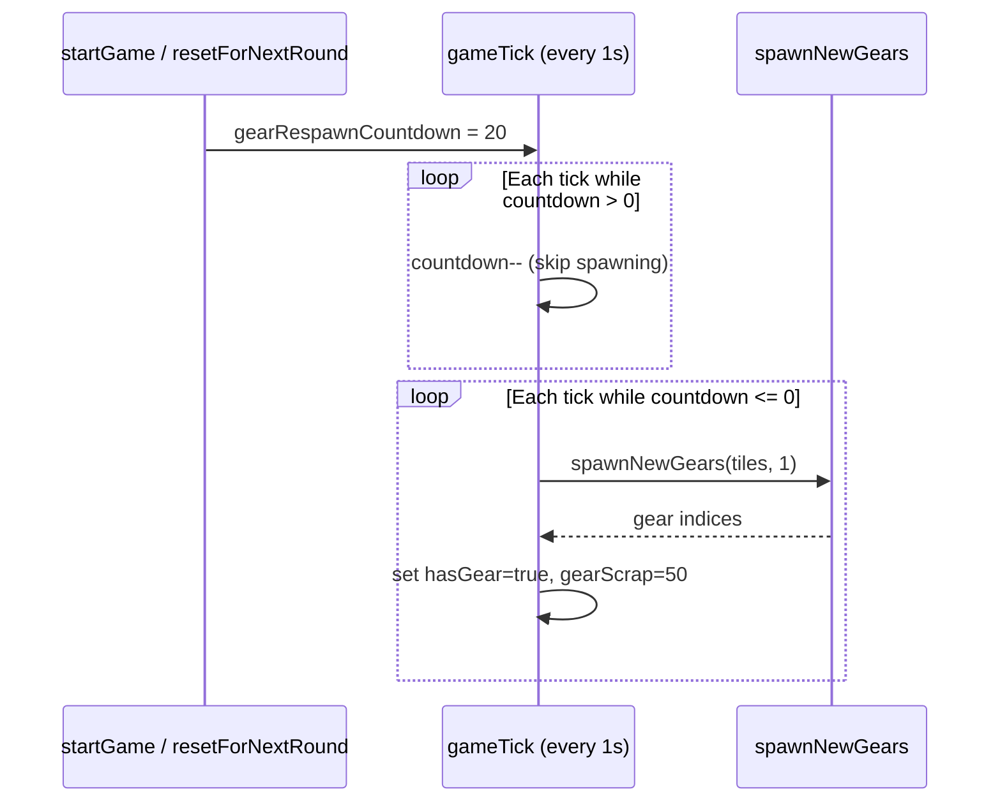

# Design Document: Gear Respawn Delay

## Overview

This feature adds a 20-second delay to per-tick gear spawning at the start of each round. The existing `gearRespawnCountdown` field on `GameRoom` (currently initialized to `-1`) is repurposed to drive a countdown from 20 to 0. While the countdown is positive, the gear-spawning step in `gameTick()` is skipped. Once it reaches 0, spawning resumes at 1 gear per second — identical to current behavior. Initial gears placed during `startGame()` / `resetForNextRound()` are unaffected.

## Architecture

No new modules, classes, or files are introduced. The change is confined to three methods in `server/rooms/GameRoom.ts`:

1. **`startGame()`** — set `this.gearRespawnCountdown = 20`
2. **`gameTick()`** — wrap the existing gear-spawning block (step 6) in a countdown check
3. **`resetForNextRound()`** — change the existing reset from `-1` to `20`

## Components and Interfaces

No new components or interfaces. The only touched component is `GameRoom`:

| Method | Change |
|---|---|
| `startGame()` | Add `this.gearRespawnCountdown = 20` after grid setup, before starting the game loop |
| `gameTick()` | Wrap step 6 (gear spawning) in: `if (this.gearRespawnCountdown > 0) { this.gearRespawnCountdown--; } else { /* existing spawn logic */ }` |
| `resetForNextRound()` | Change `this.gearRespawnCountdown = -1` to `this.gearRespawnCountdown = 20` |

## Data Models

No schema changes. The `gearRespawnCountdown` field already exists as a private instance variable on `GameRoom` (type `number`, default `-1`). It is not part of the Colyseus `GameState` schema and is not synced to clients.

## Correctness Properties

*A property is a characteristic or behavior that should hold true across all valid executions of a system — essentially, a formal statement about what the system should do. Properties serve as the bridge between human-readable specifications and machine-verifiable correctness guarantees.*

### Property 1: Countdown suppresses spawning and decrements

*For any* countdown value greater than zero, executing one game tick SHALL decrement the countdown by exactly 1 and SHALL NOT spawn any new gears.

**Validates: Requirements 1.2, 1.3**

### Property 2: Spawning resumes after countdown expires

*For any* countdown value less than or equal to zero, executing one game tick SHALL spawn gears using the existing `spawnNewGears()` logic (1 gear on a random unclaimed, non-spawn tile).

**Validates: Requirements 2.1, 2.2, 2.3**

### Property 3: Initial gear count equals player count

*For any* player count N, the initial gear placement in `startGame()` and `resetForNextRound()` SHALL produce exactly N gear tiles, regardless of the countdown value.

**Validates: Requirements 3.1, 3.2**

## Error Handling

No new error conditions are introduced. The countdown is a simple integer decrement with no failure modes. If `gearRespawnCountdown` somehow becomes negative (e.g., from the old `-1` default), the `<= 0` check ensures spawning still works — this is the existing fallback behavior.

## Testing Strategy

### Property-Based Tests (fast-check, minimum 100 iterations each)

Since the countdown-gating logic is a pure decision based on a numeric input, it is well-suited to property-based testing. We will extract the countdown logic into a testable helper or test it by modeling the tick behavior.

- **Property 1**: Generate random countdown values > 0 (1–100). Simulate one tick. Assert countdown decremented by 1 and no gears spawned.
- **Property 2**: Generate random countdown values <= 0 (-50 to 0). Simulate one tick with a valid grid. Assert gears were spawned.
- **Property 3**: Generate random player counts (1–10). Run initial gear placement. Assert gear count === player count.

Library: `fast-check` (already installed)
Runner: `vitest` with `vitest run`
Tag format: `Feature: gear-respawn, Property N: <description>`

### Unit Tests

- Verify `startGame()` sets `gearRespawnCountdown` to 20.
- Verify `resetForNextRound()` sets `gearRespawnCountdown` to 20.
- Verify that after exactly 20 ticks, the first gear spawns on tick 21.
- Verify initial gears (placed at round start) are present on tick 1.
