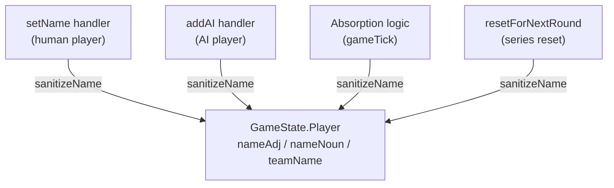

# Design Document: Name Sanitization Wiring

## Overview

This feature wires the existing `sanitizeName()` function into every code path in `GameRoom` that writes player name data (`nameAdj`, `nameNoun`, `teamName`) into `GameState`. The `sanitizeName()` function already exists and is tested — it strips characters outside printable ASCII (0x20–0x7E) and trims whitespace. The current gap is that only the `"setName"` handler calls it; AI name generation, team name composition during absorption, and team name recomposition on round reset all bypass sanitization.

The design is intentionally minimal: add `sanitizeName()` calls at each write site. No new modules, no schema changes, no new message types.

## Architecture

The sanitization layer sits between name-producing logic and `GameState` writes. Every code path that assigns a value to `nameAdj`, `nameNoun`, or `teamName` on a `Player` schema object must pass through `sanitizeName()` before the assignment.



There are exactly four write sites in `GameRoom.ts`:

1. **`"setName"` message handler** (lines ~170–195) — already sanitizes `adj` and `noun`, composes `teamName` from sanitized parts. Currently correct.
2. **`"addAI"` message handler** (lines ~220–245) — generates AI name via `generateAIName()`, writes directly without sanitization. Needs fix.
3. **Absorption block in `gameTick()`** (lines ~330–350) — prepends absorbed player's adjective to absorber's `teamName`, updates all team members. Needs fix.
4. **`resetForNextRound()`** (lines ~430–440) — recomposes `teamName` from `nameAdj` + `nameNoun`. Needs fix.

## Components and Interfaces

### Existing Components (no changes)

| Component | File | Role |
|---|---|---|
| `sanitizeName(input: string): string` | `server/logic/sanitize.ts` | Strips non-printable ASCII, trims whitespace |
| `generateAIName(takenAdjs, takenNouns)` | `server/logic/aiNames.ts` | Returns `{ adj, noun }` for AI players |
| `Player` schema | `server/state/GameState.ts` | Colyseus schema with `nameAdj`, `nameNoun`, `teamName` |

### Modified Component

| Component | File | Change |
|---|---|---|
| `GameRoom` | `server/rooms/GameRoom.ts` | Add `sanitizeName()` calls at 3 write sites (addAI, absorption, round reset) |

### Interface Contract

`sanitizeName` is already imported in `GameRoom.ts`. No new imports or exports needed.

The function signature remains:
```typescript
function sanitizeName(input: string): string
```

**Precondition**: Any string (including empty, Unicode, control characters).
**Postcondition**: Output contains only characters 0x20–0x7E with no leading/trailing whitespace.

## Data Models

No schema changes. The existing `Player` schema fields are unchanged:

```typescript
class Player extends Schema {
  @type("string") nameAdj: string = "";
  @type("string") nameNoun: string = "";
  @type("string") teamName: string = "";
  // ... other fields unchanged
}
```

The invariant this feature enforces is that these three fields only ever contain sanitized values (printable ASCII, trimmed).

### Write Site Details

**Site 1 — `"setName"` handler (already correct)**
```typescript
const adj = sanitizeName((data.adj || "").slice(0, 16));
const noun = sanitizeName((data.noun || "").slice(0, 16));
// ...
player.nameAdj = adj;
player.nameNoun = noun;
player.teamName = `${adj} ${noun}`;
```
`teamName` is composed from already-sanitized parts, so it's safe. No change needed.

**Site 2 — `"addAI"` handler (needs fix)**
```typescript
// Current (unsanitized):
player.nameAdj = aiName.adj;
player.nameNoun = aiName.noun;
player.teamName = `${aiName.adj} ${aiName.noun}`;

// Fixed:
player.nameAdj = sanitizeName(aiName.adj);
player.nameNoun = sanitizeName(aiName.noun);
player.teamName = sanitizeName(`${player.nameAdj} ${player.nameNoun}`);
```

**Site 3 — Absorption in `gameTick()` (needs fix)**
```typescript
// Current (unsanitized):
toPlayer.teamName = `${absorbedAdj} ${toPlayer.teamName}`;
// ... and later:
p.teamName = toPlayer.teamName;

// Fixed:
toPlayer.teamName = sanitizeName(`${absorbedAdj} ${toPlayer.teamName}`);
// ... and later:
p.teamName = toPlayer.teamName; // already sanitized via toPlayer
```

**Site 4 — `resetForNextRound()` (needs fix)**
```typescript
// Current (unsanitized):
player.teamName = `${player.nameAdj} ${player.nameNoun}`;

// Fixed:
player.teamName = sanitizeName(`${player.nameAdj} ${player.nameNoun}`);
```


## Correctness Properties

*A property is a characteristic or behavior that should hold true across all valid executions of a system — essentially, a formal statement about what the system should do. Properties serve as the bridge between human-readable specifications and machine-verifiable correctness guarantees.*

### Property 1: Name_Fields invariant — all stored names are printable ASCII and trimmed

*For any* player in `GameState`, after any game operation (setName, addAI, absorption, round reset), the values of `nameAdj`, `nameNoun`, and `teamName` SHALL contain only characters in the printable ASCII range (0x20–0x7E) with no leading or trailing whitespace.

This is the central invariant of the feature. Rather than testing each write site individually, we verify the end result: no matter what sequence of operations occurs, the name fields in state are always clean.

We test this by generating arbitrary Unicode strings as player name inputs, running them through the same logic the `"setName"` handler uses (truncate to 16 chars, sanitize, compose teamName), and verifying all three output fields satisfy the invariant. We also generate absorption scenarios where team names are composed by prepending adjectives, and verify the composed result satisfies the invariant.

**Validates: Requirements 1.1, 3.1, 5.1, 5.2, 5.3**

### Property 2: Sanitization is idempotent on composed names

*For any* sequence of already-sanitized name parts composed via string concatenation with space separators, applying `sanitizeName()` to the composed result SHALL produce the same string (i.e., `sanitizeName(composed) === composed`).

This validates the defense-in-depth approach: when we compose a `teamName` from parts that were individually sanitized, the extra `sanitizeName()` call on the composition is a no-op. This matters because absorption prepends adjectives to existing team names, and round reset recomposes from `nameAdj` + `nameNoun`. If the parts are already clean, the composition is already clean.

We test this by generating random printable-ASCII-only trimmed strings (simulating already-sanitized name parts), composing them with space separators, and verifying `sanitizeName(composed) === composed`.

**Validates: Requirements 2.2, 3.1, 4.1**

## Error Handling

This feature introduces no new error paths. The only existing error path is in the `"setName"` handler, which already rejects names that sanitize to empty by sending a `"nameRejected"` message. This behavior is unchanged.

For AI names (`"addAI"` handler), the name generator picks from hardcoded printable ASCII lists, so sanitization will never produce an empty string. No rejection path is needed.

For absorption and round reset, the name parts (`nameAdj`, `nameNoun`) were already validated at entry time (setName or addAI). Sanitization on composition is defense-in-depth and will not produce empty strings from valid parts.

**No new error handling code is required.**

## Testing Strategy

### Dual Testing Approach

This feature uses both unit tests and property-based tests for comprehensive coverage.

### Property-Based Tests (fast-check, minimum 100 iterations each)

Property-based tests verify the universal invariants using `fast-check`:

1. **Property 1 test**: Generate arbitrary Unicode strings as name inputs. Pass them through the sanitize-and-store logic (truncate → sanitizeName → compose teamName). Verify all three output fields contain only printable ASCII (0x20–0x7E) with no leading/trailing whitespace. Also generate absorption scenarios with multiple name parts and verify the composed teamName satisfies the invariant.
   - Tag: `Feature: name-sanitization-wiring, Property 1: Name_Fields invariant — all stored names are printable ASCII and trimmed`

2. **Property 2 test**: Generate random printable-ASCII trimmed strings (simulating sanitized name parts). Compose them with space separators. Verify `sanitizeName(composed) === composed`.
   - Tag: `Feature: name-sanitization-wiring, Property 2: Sanitization is idempotent on composed names`

**Note**: The existing `tests/property/nameSanitization.prop.ts` already tests the `sanitizeName` function itself (output is printable ASCII, empty-input rejection, duplicate detection). The new property tests focus on the *wiring* — that the function is called at every write site and that composition preserves the invariant.

### Unit Tests

Unit tests verify specific scenarios and edge cases:

1. **addAI sanitization**: Add an AI player and verify `nameAdj`, `nameNoun`, and `teamName` are all sanitized (pass through `sanitizeName`).
2. **Absorption sanitization**: Set up two players, trigger absorption, verify the composed `teamName` on the absorber and all team members is sanitized.
3. **Absorption propagation**: After absorption, verify all team members share the same sanitized `teamName` as the leader.
4. **Round reset sanitization**: Set up a series match, complete a round, verify all players' `teamName` values are sanitized after reset.
5. **setName truncation order**: Send a name longer than 16 characters and verify truncation happens before sanitization (existing behavior, regression test).

### Test Configuration

- Framework: vitest + fast-check
- Property test iterations: 100 minimum per property
- New test file: `tests/property/nameSanitizationWiring.prop.ts` for property tests
- New test file: `tests/unit/rooms/GameRoom.sanitize.test.ts` for unit tests (or co-located with existing GameRoom tests if present)
