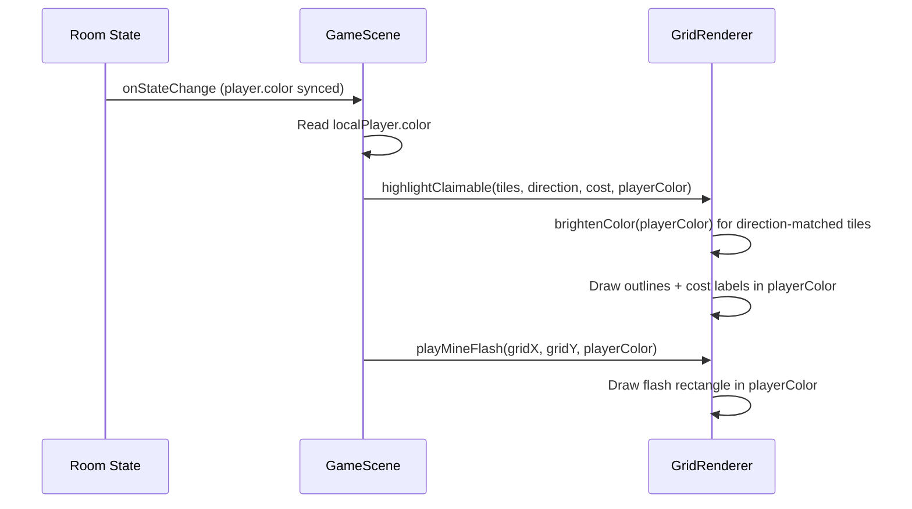

# Design Document: Player Color Visuals

## Overview

This feature replaces hardcoded gold/yellow colors in two visual systems — claimable tile highlighting and gear mine flash animations — with the local player's chosen color. The change is entirely client-side, touching `GameScene.ts` (caller) and `GridRenderer.ts` (renderer). No server changes are needed since the player color is already synced via Colyseus room state.

The core approach:
1. **GameScene** reads the local player's `color` from room state and passes it as a parameter to `highlightClaimable()` and `playMineFlash()`.
2. **GridRenderer** uses the provided color instead of hardcoded constants, and exposes a `brightenColor()` utility for direction-matched tile highlights.
3. Both call sites fall back to the existing gold defaults when no player color is assigned (`color < 0`).

## Architecture

The change follows the existing rendering pipeline. No new modules or architectural patterns are introduced.



**Key design decision**: The color parameter is added to existing method signatures rather than stored as renderer state. This keeps the renderer stateless with respect to "whose perspective" it's drawing, which matches the current pattern where `highlightClaimable` and `playMineFlash` are called per-frame or per-event with all needed data.

## Components and Interfaces

### Modified: `GridRenderer.highlightClaimable()`

**Current signature:**
```typescript
highlightClaimable(tiles: { x: number; y: number }[], direction: string, tileCost?: number): void
```

**New signature:**
```typescript
highlightClaimable(tiles: { x: number; y: number }[], direction: string, tileCost?: number, playerColor?: number): void
```

- `playerColor` is optional to maintain backward compatibility.
- When provided, replaces `HIGHLIGHT_COLOR` (0xffcc44) for outlines and cost label text.
- Direction-matched tiles use `brightenColor(playerColor)` instead of `HIGHLIGHT_DIRECTION_COLOR` (0xffee88).
- Opacity behavior is unchanged: 1.0 for direction-matched, 0.6 for non-matched.

### Modified: `GridRenderer.playMineFlash()`

**Current signature:**
```typescript
playMineFlash(gridX: number, gridY: number): void
```

**New signature:**
```typescript
playMineFlash(gridX: number, gridY: number, playerColor?: number): void
```

- `playerColor` is optional. When provided, replaces the hardcoded `0xffd700` gold.
- All animation parameters (opacity 0.6, scale 1.3x, fade 300ms, Power2 easing) are preserved.

### New: `GridRenderer.brightenColor()`

```typescript
static brightenColor(color: number, amount: number = 0.3): number
```

A pure static utility that lightens a hex color by blending each RGB channel toward 255.

**Algorithm:**
1. Extract R, G, B channels from the numeric hex color.
2. For each channel: `newChannel = channel + (255 - channel) * amount`
3. Clamp each channel to `[0, 255]` and floor to integer.
4. Recombine into a single numeric hex value.

The `amount` parameter (0.0–1.0) controls how far each channel moves toward white. Default 0.3 produces a visible but not washed-out brightening for dark colors like Tungsten (0x36454f), while clamping prevents overflow for already-bright colors like Chromium (0xdbe4eb).

**Rationale for static**: This is a pure function with no dependency on instance state. Making it static allows direct unit testing and potential reuse.

### Modified: `GameScene.highlightClaimableTiles()`

Reads `localPlayer.color` from room state and passes it to `gridRenderer.highlightClaimable()`. Falls back to `0xffcc44` if `color < 0`.

### Modified: `GameScene.handleTileClick()`

Reads `localPlayer.color` from room state and passes it to `gridRenderer.playMineFlash()`. Falls back to `0xffd700` if `color < 0`.

## Data Models

No data model changes are required. The `Player` schema already has a `color: number` field (default `-1`) that is synced to all clients via Colyseus. The client reads this value directly from `state.players.get(this.localSessionId)`.

**Existing field used:**
```typescript
// server/state/GameState.ts — Player schema
@type("number") color: number = -1;
```

The `-1` sentinel value indicates "no color assigned" and triggers fallback to the default gold constants on the client side.


## Correctness Properties

*A property is a characteristic or behavior that should hold true across all valid executions of a system — essentially, a formal statement about what the system should do. Properties serve as the bridge between human-readable specifications and machine-verifiable correctness guarantees.*

Most of this feature's acceptance criteria are wiring/integration checks (does GameScene pass the right color to GridRenderer?) or concrete constant checks (is opacity 0.6?). These are best covered by example-based unit tests.

The one area with meaningful input variation is the `brightenColor()` utility — a pure function that must produce correct results for any hex color in the 0x000000–0xFFFFFF range. The prework analysis identified two related properties (6.1: output ≥ input per channel, 6.3: output ≤ 255 per channel) that combine into a single channel-bounded invariant.

### Property 1: Channel-bounded brightening invariant

*For any* valid hex color (0x000000 to 0xFFFFFF) and any brightening amount in [0.0, 1.0], `brightenColor(color, amount)` SHALL produce a result where each RGB channel satisfies: `inputChannel ≤ outputChannel ≤ 255`.

**Validates: Requirements 6.1, 6.2, 6.3**

## Error Handling

This feature has a narrow error surface since it operates entirely on the client with data already validated by the server.

| Scenario | Handling |
|---|---|
| Player has no color assigned (`color < 0`) | GameScene falls back to existing default gold constants: `0xffcc44` for highlights, `0xffd700` for mine flash. |
| `playerColor` parameter omitted from `highlightClaimable()` or `playMineFlash()` | Both methods treat the parameter as optional. When `undefined`, they use the existing hardcoded defaults. This preserves backward compatibility if any other code path calls these methods without a color. |
| Color value outside valid hex range | Not expected — the server constrains colors to the `PLAYER_COLORS` palette. The `brightenColor()` utility clamps each channel to [0, 255] regardless, preventing visual artifacts from unexpected values. |

## Testing Strategy

### Property-Based Tests (fast-check, 100+ iterations)

One property test for the `brightenColor()` pure function:

- **Property 1: Channel-bounded brightening invariant** — Generate random hex colors and brightening amounts, verify each output channel is in [inputChannel, 255].
  - Tag: `Feature: player-color-visuals, Property 1: Channel-bounded brightening invariant`
  - Library: `fast-check` (already in devDependencies)
  - File: `tests/property/playerColorVisuals.prop.ts`

### Unit Tests (vitest)

Example-based tests covering the wiring and integration points:

1. **Highlight color passthrough** — When `highlightClaimable` receives a player color, outlines use that color instead of `0xffcc44`. (Validates 2.1)
2. **Direction-matched brightening** — Direction-matched tiles use `brightenColor(playerColor)` instead of `0xffee88`. (Validates 2.2)
3. **Opacity preservation** — Direction-matched outlines at 1.0 opacity, non-matched at 0.6. (Validates 2.3)
4. **Cost label color** — Cost labels use the provided player color string. (Validates 3.1)
5. **Mine flash color passthrough** — `playMineFlash` uses the provided color instead of `0xffd700`. (Validates 5.1)
6. **Mine flash animation parameters** — Tween uses opacity 0.6, scale 1.3x, 300ms duration, Power2 easing. (Validates 5.2)
7. **Highlight fallback** — When color is `< 0` or omitted, highlight uses `0xffcc44`. (Validates 1.2)
8. **Mine flash fallback** — When color is `< 0` or omitted, mine flash uses `0xffd700`. (Validates 4.2)
9. **brightenColor specific examples** — Tungsten (0x36454f) produces a visibly lighter result; Chromium (0xdbe4eb) stays ≤ 0xFFFFFF. (Validates 6.2, 6.3)

### Test File Locations

| Type | File |
|---|---|
| Property tests | `tests/property/playerColorVisuals.prop.ts` |
| Unit tests | `tests/unit/rendering/GridRenderer.test.ts` |
