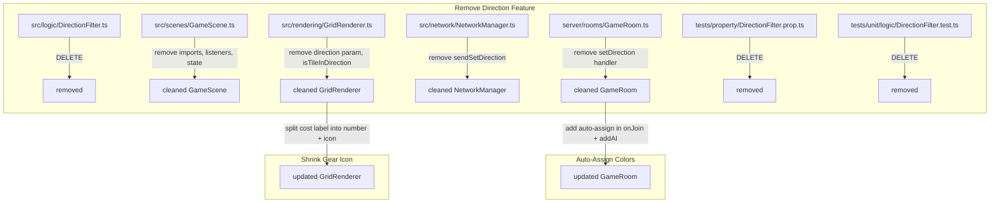

# Design Document: Pre-Ship Polish

## Overview

This design covers three independent polish items for the Scrapyard Steal game jam submission:

1. **Remove growth direction feature** — Delete the `DirectionFilter` module and strip all direction-related code from client (GameScene, GridRenderer, NetworkManager, HUDManager) and server (GameRoom, Player schema). Remove associated tests.
2. **Auto-assign colors on lobby join** — When a player (human or AI) joins the lobby, the server automatically picks the first available color from the palette. Players can still manually change color afterward. The assignment respects the 10/20-player mode palette.
3. **Shrink gear icon in scrap cost label** — Split the cost label into two Phaser text objects: one for the number at the current font size, one for the gear icon at a smaller size.

All three items are isolated changes with no cross-dependencies.

## Architecture

No new modules or services are introduced. All changes modify existing files:



## Components and Interfaces

### 1. Direction Feature Removal

**Files deleted:**
- `src/logic/DirectionFilter.ts` — entire module
- `tests/property/DirectionFilter.prop.ts` — property tests
- `tests/unit/logic/DirectionFilter.test.ts` — unit tests

**GameScene changes (`src/scenes/GameScene.ts`):**
- Remove `import { filterByDirection } from "../logic/DirectionFilter"`
- Remove `currentDirection` field
- Remove `setupDirectionKeys()` method entirely
- Remove the call to `setupDirectionKeys()` in `create()`
- In `highlightClaimableTiles()`, remove the `filterByDirection()` call — pass `claimable` directly to `highlightClaimable()`
- Remove `this.currentDirection` from the `highlightClaimable()` call
- Remove the ESC key listener that clears direction

**GridRenderer changes (`src/rendering/GridRenderer.ts`):**
- Remove `HIGHLIGHT_DIRECTION_COLOR` constant
- Simplify `highlightClaimable()` signature: remove `direction` parameter
- Remove `isTileInDirection()` private method
- In `highlightClaimable()`, use a single color/opacity for all tiles (use `baseColor` with full opacity)

**NetworkManager changes (`src/network/NetworkManager.ts`):**
- Remove `sendSetDirection()` method

**GameRoom changes (`server/rooms/GameRoom.ts`):**
- Remove the `this.onMessage("setDirection", ...)` handler
- Remove `player.direction = ""` from `onJoin()`
- Remove `player.direction = ""` from `resetForNextRound()`

**Player schema (`server/state/GameState.ts`):**
- The `direction` field on `Player` can remain in the schema to avoid breaking existing clients during the jam. It simply won't be written to or read. (Removing a Colyseus schema field mid-deployment can cause deserialization errors for connected clients.)

**HUDManager / Hint Popup (`src/scenes/GameScene.ts`):**
- The current hint popup in `showHintPopup()` does not mention arrow keys or direction. No changes needed. (Verified by reading the `controls` string in the source.)

**TutorialScene (`src/scenes/TutorialScene.ts`):**
- The tutorial pages do not mention arrow keys or growth direction. No changes needed.

### 2. Auto-Assign Colors on Lobby Join

**GameRoom changes (`server/rooms/GameRoom.ts`):**

Add a private helper method to find the first untaken color:

```typescript
/** Find the first color from the allowed palette not taken by any player. Returns -1 if all taken. */
private getNextAvailableColor(): number {
  const allowedColors = this.state.maxPlayers >= 20 ? ALL_COLORS : BASE_COLORS;
  const takenColors = new Set<number>();
  this.state.players.forEach((p) => {
    if (p.color >= 0) takenColors.add(p.color);
  });
  for (const color of allowedColors) {
    if (!takenColors.has(color)) return color;
  }
  return -1;
}
```

Note: `BASE_COLORS` and `ALL_COLORS` are already defined inside `onCreate()`. They need to be promoted to class-level constants (or the helper needs access to them). The simplest approach is to define them as module-level constants above the class, matching the existing pattern in `GridRenderer.ts` and `LobbyScene.ts`.

**In `onJoin()`:** After creating the player and setting `player.color = -1`, call:
```typescript
player.color = this.getNextAvailableColor();
```

**In the `addAI` handler:** Replace the existing color validation logic. Currently the host sends a color for the AI. Change this so the server auto-assigns a color (ignoring the client-provided color), using the same `getNextAvailableColor()` helper. This ensures consistency. The `addAI` message signature can keep the `color` field for backward compatibility but the server will override it.

Actually, looking more carefully at the current `addAI` handler, the host already picks a color from the available palette on the client side. The simplest change is to auto-assign on the server side instead, making the client-provided color optional/ignored:

```typescript
this.onMessage("addAI", (client) => {
  // ... existing validation ...
  const aiColor = this.getNextAvailableColor();
  if (aiColor === -1) return; // no colors available
  // ... create AI player with aiColor ...
});
```

**Existing `selectColor` handler:** No changes. Players can still manually swap colors after auto-assignment.

### 3. Shrink Gear Icon in Scrap Cost Label

**GridRenderer changes (`src/rendering/GridRenderer.ts`):**

In `highlightClaimable()`, the current cost label is a single `Phaser.GameObjects.Text`:
```typescript
const costText = this.scene.add.text(..., `-${tileCost}⚙️`, { fontSize: `${fontSize}px`, ... });
```

Split this into two text objects:
1. **Cost number**: `-{tileCost}` at the current font size (`Math.max(8, Math.floor(tileSize * 0.385))`)
2. **Gear icon**: `⚙️` at a smaller font size (roughly 70% of the cost number size, i.e., `Math.max(6, Math.floor(fontSize * 0.7))`)

Position the gear icon immediately to the right of the cost number text. Both objects are added to `this.costLabels` for cleanup.

## Data Models

No new data models. The existing `Player` schema field `direction: string` remains in `GameState.ts` but is no longer read or written by any code path. It will be removed in a future cleanup after the game jam.

The color auto-assignment uses the existing `player.color: number` field (default `-1` means unassigned, any palette hex value means assigned).

## Correctness Properties

*A property is a characteristic or behavior that should hold true across all valid executions of a system — essentially, a formal statement about what the system should do. Properties serve as the bridge between human-readable specifications and machine-verifiable correctness guarantees.*

### Property 1: Auto-assigned colors are unique and from the allowed palette

*For any* sequence of player joins (human or AI, up to palette size), each auto-assigned color SHALL be a member of the allowed palette AND no two players SHALL have the same color. When the palette is exhausted, the next player SHALL receive -1 (unassigned).

**Validates: Requirements 8.1, 8.2, 8.3**

### Property 2: Auto-assigned colors respect maxPlayers palette bounds

*For any* sequence of player joins with a given maxPlayers setting (10 or 20), every auto-assigned color SHALL be a member of the palette corresponding to that maxPlayers value (base 10-color palette when maxPlayers=10, full 20-color palette when maxPlayers=20).

**Validates: Requirements 9.1, 9.2**

## Error Handling

### Direction Removal
- If any file still references `DirectionFilter` after deletion, the TypeScript compiler will catch it at build time. No runtime error handling needed.
- The `direction` field remains in the Colyseus schema to prevent deserialization errors for any clients that connect during a rolling deploy.

### Auto-Assign Colors
- When the palette is exhausted (all colors taken), `getNextAvailableColor()` returns `-1`. The player joins with `color = -1` (unassigned) and must manually pick a color. This matches the existing behavior for the edge case.
- When `maxPlayers` is changed from 20 to 10 mid-lobby, the existing `setConfig` handler already resets extended colors to `-1`. Auto-assignment on subsequent joins will correctly use only the base palette.

### Shrink Gear Icon
- If `tileSize` is very small (< 16), cost labels are already skipped entirely (existing guard). No additional error handling needed.
- The gear icon minimum font size is clamped to 6px to prevent invisible text.

## Testing Strategy

### Unit Tests
- **GridRenderer cost label**: Verify the cost number font size formula is unchanged and the gear icon font size is smaller.
- **Auto-assign color**: Verify a player joining gets a color, verify manual `selectColor` still works after auto-assignment.
- **Direction removal smoke tests**: Verify the build compiles, the test suite passes, and no direction-related code remains.

### Property Tests (fast-check)
- **Property 1** (auto-assign uniqueness): Generate random join sequences of 1–11 players (10-player mode) or 1–21 players (20-player mode). Simulate the auto-assignment logic. Assert all assigned colors are unique, from the palette, and that the (palette_size + 1)th player gets -1.
- **Property 2** (palette bounds): Generate random join sequences parameterized on maxPlayers ∈ {10, 20}. Assert every assigned color belongs to the correct palette subset.

Both property tests use `fast-check` with minimum 100 iterations, following the project's existing pattern in `tests/property/`.

**Tag format:**
- `Feature: pre-ship-polish, Property 1: Auto-assigned colors are unique and from the allowed palette`
- `Feature: pre-ship-polish, Property 2: Auto-assigned colors respect maxPlayers palette bounds`

### What is NOT property-tested
- Direction feature removal — this is pure deletion work verified by compilation and existing test suite pass. No new logic to test.
- Gear icon shrink — this is a Phaser rendering change. Verified visually and with example-based unit tests checking font size values.
