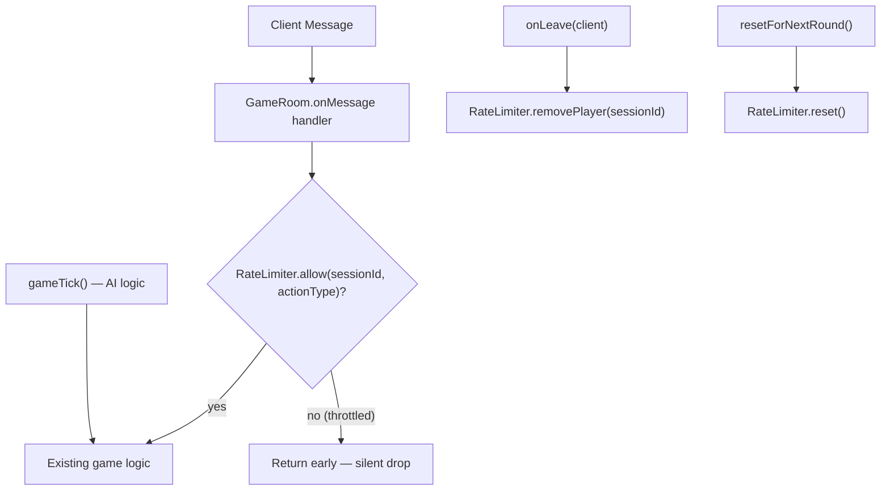

# Design Document: Rate Limiting

## Overview

This design introduces a server-side `RateLimiter` module that intercepts gameplay messages (`claimTile`, `upgradeAttack`, `upgradeDefense`, `mineGear`) in the Colyseus `GameRoom` before they reach existing game logic. The module enforces per-player, per-action-type cooldown windows so that each player can perform a given action at most once per configurable time interval. Excess messages are silently dropped — no error is sent to the client and no game state is modified.

The rate limiter is a pure logic layer that sits between message receipt and handler execution. AI players are exempt because their actions originate from the server-side `gameTick()` method, which bypasses message handlers entirely.

### Design Decisions

1. **Standalone module, not middleware**: Colyseus does not have a built-in middleware pipeline for `onMessage`. The rate limiter is implemented as a plain TypeScript class that `GameRoom` calls at the top of each rate-limited handler. This keeps the module testable in isolation without Colyseus dependencies.

2. **Timestamp-based, not token-bucket**: A simple "last accepted timestamp" approach is sufficient for the game's needs. Each action type has a flat cooldown window — there is no burst allowance. This is simpler to reason about and test than a token-bucket algorithm.

3. **AI bypass by architecture**: AI actions happen inside `gameTick()` and never flow through `onMessage` handlers. No special flag or check is needed in the rate limiter itself — the bypass is structural.

4. **Silent rejection**: Throttled messages return early from the handler with no side effects. The client sees no error; the action simply doesn't take effect. This matches the existing pattern where invalid actions (wrong phase, insufficient resources) already return silently.

## Architecture



The `RateLimiter` is instantiated once per `GameRoom` in `onCreate()`. Each rate-limited `onMessage` handler calls `rateLimiter.allow(sessionId, actionType)` as its first check. If it returns `false`, the handler returns immediately. AI actions in `gameTick()` never touch the rate limiter.

### Integration Points

| Event | GameRoom method | RateLimiter call |
|---|---|---|
| Room created | `onCreate()` | `new RateLimiter(config)` |
| Rate-limited message received | `onMessage("claimTile", ...)` etc. | `rateLimiter.allow(sessionId, actionType)` |
| Player disconnects | `onLeave(client)` | `rateLimiter.removePlayer(sessionId)` |
| New round starts | `resetForNextRound()` | `rateLimiter.reset()` |

## Components and Interfaces

### RateLimiter Class

**File**: `server/logic/RateLimiter.ts`

```typescript
/** Cooldown configuration per action type (milliseconds). */
export interface RateLimiterConfig {
  claimTile?: number;
  upgradeAttack?: number;
  upgradeDefense?: number;
  mineGear?: number;
}

/** The four rate-limited action types. */
export type ActionType = "claimTile" | "upgradeAttack" | "upgradeDefense" | "mineGear";

/** Default cooldown for all action types (ms). */
const DEFAULT_COOLDOWN_MS = 200;

export class RateLimiter {
  private cooldowns: Record<ActionType, number>;
  private timestamps: Map<string, Map<ActionType, number>>;

  /**
   * @param config - Optional per-action cooldown overrides.
   * @param now - Optional clock function for testability (defaults to Date.now).
   */
  constructor(config?: RateLimiterConfig, private now: () => number = Date.now) {
    this.cooldowns = {
      claimTile: config?.claimTile ?? DEFAULT_COOLDOWN_MS,
      upgradeAttack: config?.upgradeAttack ?? DEFAULT_COOLDOWN_MS,
      upgradeDefense: config?.upgradeDefense ?? DEFAULT_COOLDOWN_MS,
      mineGear: config?.mineGear ?? DEFAULT_COOLDOWN_MS,
    };
    this.timestamps = new Map();
  }

  /**
   * Check whether an action should be allowed.
   * If allowed, records the current timestamp and returns true.
   * If throttled, returns false without side effects.
   */
  allow(sessionId: string, action: ActionType): boolean;

  /**
   * Remove all tracking data for a player (called on disconnect).
   */
  removePlayer(sessionId: string): void;

  /**
   * Clear all tracking data (called on new round).
   */
  reset(): void;
}
```

### GameRoom Integration

Changes to `server/rooms/GameRoom.ts`:

1. Import `RateLimiter` and `RateLimiterConfig`.
2. Add a `private rateLimiter: RateLimiter` field.
3. In `onCreate()`, instantiate `this.rateLimiter = new RateLimiter()`.
4. At the top of each rate-limited `onMessage` handler, add:
   ```typescript
   if (!this.rateLimiter.allow(client.sessionId, "claimTile")) return;
   ```
5. In `onLeave()`, call `this.rateLimiter.removePlayer(client.sessionId)`.
6. In `resetForNextRound()`, call `this.rateLimiter.reset()`.

No changes to `GameState`, `Player`, `Tile`, or any client-side code.

## Data Models

### Internal State

The `RateLimiter` maintains a two-level `Map`:

```
timestamps: Map<sessionId, Map<ActionType, lastAcceptedTimestamp>>
```

- **Outer key**: Player session ID (`string`)
- **Inner key**: Action type (`ActionType` — one of four string literals)
- **Value**: Unix timestamp in milliseconds of the last accepted action

### Configuration

```
cooldowns: Record<ActionType, number>
```

A flat record mapping each action type to its cooldown window in milliseconds. Populated from the optional `RateLimiterConfig` at construction time, falling back to `DEFAULT_COOLDOWN_MS` (200) for any unspecified action.

### Memory Characteristics

- Each active player adds at most 4 entries (one per action type), created lazily on first action.
- Player entries are removed on disconnect (`removePlayer`) and all entries are cleared on round reset (`reset`).
- With a max of 20 clients per room, the map holds at most 80 entries — negligible memory.

## Correctness Properties

*A property is a characteristic or behavior that should hold true across all valid executions of a system — essentially, a formal statement about what the system should do. Properties serve as the bridge between human-readable specifications and machine-verifiable correctness guarantees.*

### Property 1: Accept/reject correctness

*For any* sequence of timestamped actions for a single player and action type, and *for any* cooldown window, the `RateLimiter` SHALL accept an action if and only if it is the first action of that type for that player OR the elapsed time since the previous accepted action of that type is greater than or equal to the cooldown window.

**Validates: Requirements 1.1, 1.2, 1.3, 2.1, 2.2, 2.3, 3.1, 3.2, 8.1**

### Property 2: Partition conservation

*For any* sequence of actions submitted to the `RateLimiter`, the count of accepted actions plus the count of throttled actions SHALL equal the total count of input actions.

**Validates: Requirements 8.2**

### Property 3: Per-player isolation

*For any* two distinct player session IDs and *for any* interleaved sequence of actions from both players, the accept/reject decision for each player's action SHALL depend only on that player's own action history, not on the other player's actions.

**Validates: Requirements 4.1**

### Property 4: Cleanup restores fresh state

*For any* player session that has accumulated rate limit history, after calling `removePlayer(sessionId)` (or `reset()` for all players), the next action from that session SHALL be accepted as if it were the first action of its type.

**Validates: Requirements 4.2, 4.3**

### Property 5: Custom configuration determines cooldown

*For any* action type and *for any* positive cooldown value provided in the configuration, the `RateLimiter` SHALL use that configured value (not the default) when deciding whether to accept or reject actions of that type.

**Validates: Requirements 5.1**

## Error Handling

The `RateLimiter` is a pure synchronous module with no I/O, no exceptions, and no failure modes beyond its intended behavior:

| Scenario | Behavior |
|---|---|
| Unknown `sessionId` passed to `allow()` | Treated as first action — accepted and timestamp recorded. |
| Unknown `sessionId` passed to `removePlayer()` | No-op (Map.delete on missing key is safe). |
| `reset()` called when map is already empty | No-op. |
| Negative or zero cooldown in config | Accepted as-is — every action passes (elapsed >= 0 is always true). This is a valid configuration for disabling rate limiting on a specific action. |
| `allow()` called with an action type not in the `ActionType` union | TypeScript compiler prevents this at build time. |

No error messages are sent to clients for throttled actions (Requirement 6). The existing `GameRoom` handler pattern already returns silently for invalid states (wrong phase, insufficient resources), so throttled actions follow the same convention.

## Testing Strategy

### Property-Based Tests

**Library**: `fast-check` (already in devDependencies)
**File**: `tests/property/RateLimiter.prop.ts`
**Minimum iterations**: 100 per property

Each property test uses a deterministic clock function injected via the `RateLimiter` constructor's `now` parameter, allowing precise control over timestamps without real-time delays.

| Test | Property | Approach |
|---|---|---|
| Accept/reject correctness | Property 1 | Generate sorted arrays of timestamps with random gaps. Replay through `RateLimiter` with injected clock. Verify each decision matches `elapsed >= cooldown \|\| first`. |
| Partition conservation | Property 2 | Generate random action sequences. Count accepted + throttled. Assert sum equals input length. |
| Per-player isolation | Property 3 | Generate interleaved actions for two players. Run through single `RateLimiter`. Compare results against two independent `RateLimiter` instances (one per player). |
| Cleanup restores fresh state | Property 4 | Generate action history, call `removePlayer` or `reset`, submit new action, assert accepted. |
| Custom config determines cooldown | Property 5 | Generate random cooldown configs and action pairs that straddle the boundary. Verify the configured cooldown (not default) governs the decision. |

**Tag format**: Each test is tagged with a comment referencing its design property, e.g.:
```
// Feature: rate-limiting, Property 1: Accept/reject correctness
```

### Unit Tests

**File**: `tests/unit/logic/RateLimiter.test.ts`

Unit tests cover specific examples, defaults, and integration edge cases:

- Default cooldowns are 200ms for all four action types (Requirements 5.2, 5.3, 5.4)
- First action of each type is always accepted (Requirement 1.3)
- Action at exactly the cooldown boundary is accepted (boundary condition)
- Action 1ms before cooldown expires is rejected (boundary condition)
- Different action types have independent cooldowns (e.g., claimTile throttled does not affect upgradeAttack)
- `removePlayer` clears only the specified player's data
- `reset` clears all players' data

### Integration Tests

**Scope**: Verify `GameRoom` integration points (not the `RateLimiter` logic itself):

- Throttled `claimTile` does not modify tile ownership or player resources (Requirement 6.2)
- Throttled action does not send any message to the client (Requirement 6.1)
- AI actions in `gameTick()` execute without rate limiter involvement (Requirement 7.1)
- `onLeave` triggers `removePlayer` cleanup
- `resetForNextRound` triggers `reset`

### Test Balance

- **Property tests** handle comprehensive input coverage for the `RateLimiter` logic (5 properties × 100+ iterations each)
- **Unit tests** handle specific examples, boundary conditions, and default value verification (~7-10 tests)
- **Integration tests** handle GameRoom wiring and side-effect verification (~5 tests)

