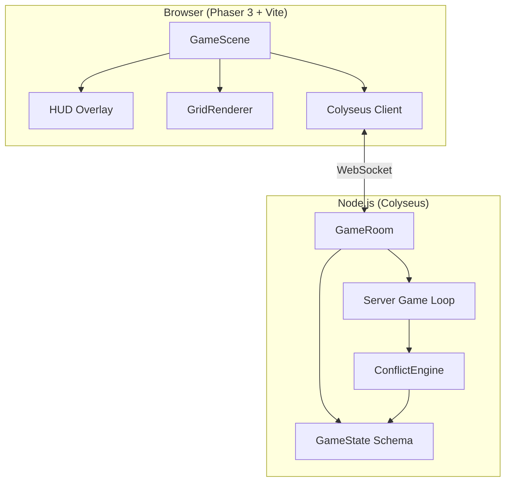
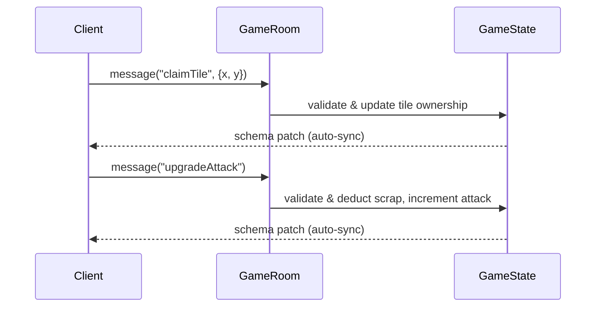
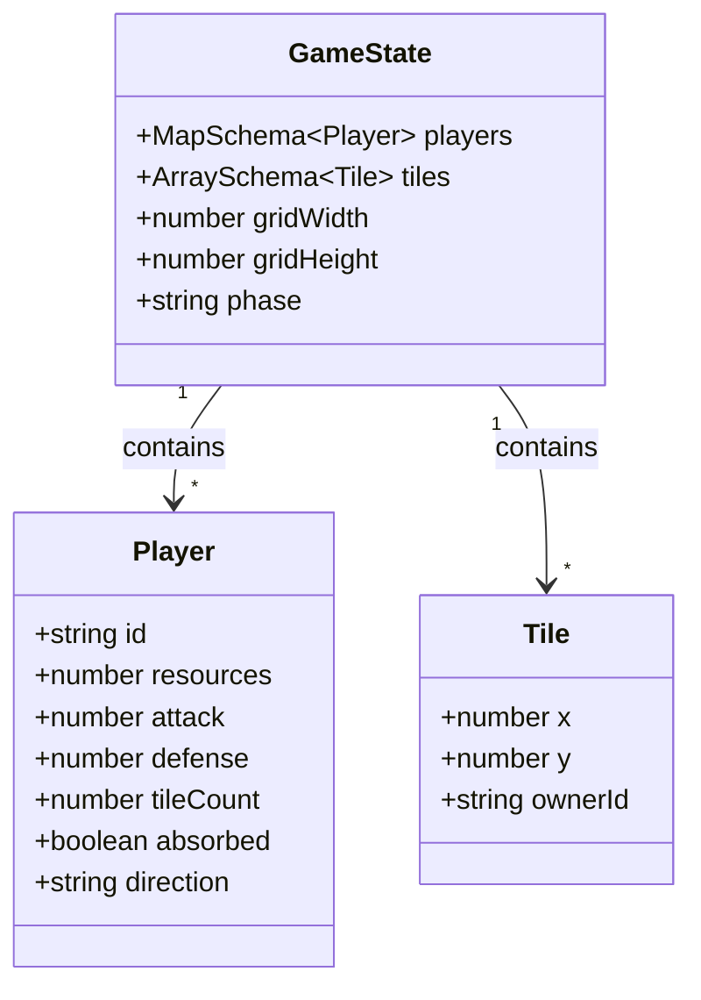

# Design Document — Scrapyard Steal

## Overview

Scrapyard Steal is a real-time multiplayer clicker/strategy game where 10–20 players compete on a shared tile grid. Each player controls a stationary factory-machine in a scrapyard, expanding territory by claiming neutral tiles, upgrading attack/defense stats, and absorbing opponents through border conflict. The game runs on a Phaser 3 + TypeScript client communicating with a Colyseus authoritative server over WebSockets.

The server is the single source of truth for all game state. Clients send action messages (claim tile, upgrade attack, upgrade defense, set direction) and render the synchronized state they receive. All game logic — resource income, tile claiming, border conflict resolution, absorption — executes server-side.

## Architecture

### High-Level Architecture



### Client-Server Communication

All player actions are sent as Colyseus messages. The server validates and processes each action, then Colyseus automatically synchronizes the updated `GameState` schema to all clients.



### Server Game Loop

The server runs a fixed-interval loop (1 tick per second) that:
1. Awards resource income to each player (1 Scrap per owned tile)
2. Evaluates all borders between opposing players
3. Resolves border conflicts by comparing attack pressure vs defense
4. Handles absorption when a player's tileCount reaches 0

## Components and Interfaces

### Server Components

#### `GameState` (Schema)
The authoritative state synchronized to all clients via Colyseus.

```typescript
// server/state/GameState.ts
class Tile extends Schema {
  @type("number") x: number;
  @type("number") y: number;
  @type("string") ownerId: string; // "" for neutral
}

class Player extends Schema {
  @type("string") id: string;
  @type("number") resources: number;
  @type("number") attack: number;
  @type("number") defense: number;
  @type("number") tileCount: number;
  @type("boolean") absorbed: boolean;
  @type("string") direction: string; // "north"|"south"|"east"|"west"|""
}

class GameState extends Schema {
  @type({ map: Player }) players: MapSchema<Player>;
  @type([ Tile ]) tiles: ArraySchema<Tile>;
  @type("number") gridWidth: number;
  @type("number") gridHeight: number;
  @type("string") phase: string; // "waiting"|"active"|"ended"
}
```

#### `GameRoom` (Room Handler)
Manages the game session lifecycle, message handling, and the server game loop.

```typescript
interface GameRoomMessages {
  "claimTile": { x: number; y: number };
  "upgradeAttack": {};
  "upgradeDefense": {};
  "setDirection": { direction: "north"|"south"|"east"|"west"|"" };
}
```

Key responsibilities:
- `onCreate()`: Initialize state, set phase to "waiting"
- `onJoin(client)`: Add player with initial stats, check if player count ≥ 2 to start
- `onLeave(client)`: Convert player's tiles to neutral
- Message handlers: Validate and execute player actions
- `startGameLoop()`: Begin the 1-second interval tick

#### `ConflictEngine` (Pure Logic Module)
A stateless module containing pure functions for border conflict resolution. Keeping this separate from the room handler makes it independently testable.

```typescript
// server/logic/ConflictEngine.ts
interface BorderInfo {
  playerAId: string;
  playerBId: string;
  sharedTilesA: Tile[]; // A's tiles on the border
  sharedTilesB: Tile[]; // B's tiles on the border
}

function findBorders(tiles: Tile[], gridWidth: number, gridHeight: number): BorderInfo[];
function resolveBorder(border: BorderInfo, playerA: Player, playerB: Player): TileTransfer | null;
function calculateBorderPressure(attack: number, borderTileCount: number): number;
function calculateTileClaimCost(currentTileCount: number): number;
function calculateUpgradeCost(currentStatValue: number): number;
```

#### `GridManager` (Pure Logic Module)
Handles grid initialization and tile adjacency logic.

```typescript
// server/logic/GridManager.ts
function initializeGrid(width: number, height: number): Tile[];
function assignStartingPositions(players: string[], gridWidth: number, gridHeight: number, minDistance: number): Map<string, {x: number, y: number}>;
function getAdjacentTiles(x: number, y: number, gridWidth: number, gridHeight: number): {x: number, y: number}[];
function isAdjacent(tileX: number, tileY: number, playerTiles: Tile[]): boolean;
```

### Client Components

#### `GridRenderer`
Renders the tile grid using Phaser graphics. Listens to state changes and redraws tiles whose ownership changed.

```typescript
// src/rendering/GridRenderer.ts
class GridRenderer {
  constructor(scene: Phaser.Scene, gridWidth: number, gridHeight: number);
  renderTile(x: number, y: number, ownerId: string, animate?: boolean): void;
  highlightClaimable(tiles: {x: number, y: number}[], direction: string): void;
  playAbsorptionEffect(tiles: {x: number, y: number}[]): void;
}
```

#### `HUDManager`
Manages the heads-up display showing player stats, upgrade buttons, and leaderboard.

```typescript
// src/ui/HUDManager.ts
class HUDManager {
  constructor(scene: Phaser.Scene);
  updateStats(scrap: number, attack: number, defense: number, tileCount: number, incomeRate: number): void;
  updateLeaderboard(players: {id: string, tileCount: number}[]): void;
  updateUpgradeCosts(attackCost: number, defenseCost: number): void;
  showNotification(message: string): void;
}
```

#### `NetworkManager`
Wraps the Colyseus client, handles room joining, message sending, and state change callbacks.

```typescript
// src/network/NetworkManager.ts
class NetworkManager {
  constructor(client: Client);
  async joinGame(): Promise<Room<GameState>>;
  sendClaimTile(x: number, y: number): void;
  sendUpgradeAttack(): void;
  sendUpgradeDefense(): void;
  sendSetDirection(direction: string): void;
  onStateChange(callback: (state: GameState) => void): void;
}
```

## Data Models

### Server-Side State (Colyseus Schema)

The `GameState` schema is the authoritative representation. Colyseus handles delta serialization automatically.



### Initial Player Values

| Field      | Initial Value |
|------------|---------------|
| resources  | 0             |
| attack     | 1             |
| defense    | 1             |
| tileCount  | 1             |
| absorbed   | false         |
| direction  | ""            |

### Game Formulas

| Formula                | Expression                                        |
|------------------------|---------------------------------------------------|
| Tile claim cost        | `floor(10 * (1 + 0.02 * currentTileCount))`       |
| Attack upgrade cost    | `50 * currentAttack`                               |
| Defense upgrade cost   | `50 * currentDefense`                              |
| Resource income        | `1 Scrap per owned Tile per second`                |
| Border pressure        | `attack * sharedBorderTileCount`                   |
| Conflict threshold     | Attacker pressure > defender `defense * defenderBorderTileCount` |
| Absorption bonus       | `floor(0.25 * absorbedPlayer.totalAccumulatedScrap)` |

### Grid Sizing

| Players | Minimum Grid Size |
|---------|-------------------|
| 10      | 30 × 30           |
| 15      | 38 × 38           |
| 20      | 45 × 45           |

Grid scales proportionally: `size = ceil(30 * sqrt(playerCount / 10))`

### Tile Ownership Lookup

For efficient adjacency and border checks, the server maintains a 2D lookup in addition to the flat `ArraySchema`:

```typescript
// Internal server-side lookup (not part of schema)
type TileGrid = (string | null)[][]; // [y][x] → ownerId or null for neutral
```

This avoids O(n) scans of the tile array for every adjacency check during the game loop.


## Correctness Properties

*A property is a characteristic or behavior that should hold true across all valid executions of a system — essentially, a formal statement about what the system should do. Properties serve as the bridge between human-readable specifications and machine-verifiable correctness guarantees.*

### Property 1: Player initialization invariant

*For any* player joining a GameRoom, the resulting Player entry in GameState shall have resources = 0, attack = 1, defense = 1, tileCount = 1, and absorbed = false.

**Validates: Requirements 1.1**

### Property 2: Disconnection neutralizes territory

*For any* player who disconnects from a GameRoom, all Tiles previously owned by that player shall have ownerId set to "" (neutral), and no tile in the grid shall reference the disconnected player's id.

**Validates: Requirements 1.3**

### Property 3: Grid sizing scales with player count

*For any* player count N between 10 and 20, the generated grid dimensions shall be at least `ceil(30 * sqrt(N / 10))` in both width and height, and the total tile count shall equal gridWidth × gridHeight.

**Validates: Requirements 2.1**

### Property 4: Starting positions maintain minimum distance

*For any* set of players assigned starting positions on a grid, every pair of starting positions shall have a Manhattan distance of at least 5, and all non-starting tiles shall be neutral.

**Validates: Requirements 2.2, 2.3**

### Property 5: Valid tile claim updates state correctly

*For any* player with sufficient Scrap and *any* neutral tile orthogonally adjacent to that player's territory, claiming the tile shall: (a) deduct exactly `floor(10 * (1 + 0.02 * currentTileCount))` Scrap from the player, (b) set the tile's ownerId to the player's id, and (c) increment the player's tileCount by 1.

**Validates: Requirements 3.1, 3.4, 3.5**

### Property 6: Invalid tile claims are rejected

*For any* tile claim request where the tile is not orthogonally adjacent to the player's territory OR the player's Scrap is less than the claim cost, the GameState shall remain unchanged (no tile ownership change, no Scrap deduction, no tileCount change).

**Validates: Requirements 3.2, 3.3**

### Property 7: Resource income equals tile count

*For any* player with tileCount = N, after one server tick the player's resources shall increase by exactly N.

**Validates: Requirements 4.1**

### Property 8: Attack upgrade deducts correct cost and increments stat

*For any* player whose Scrap >= 50 × currentAttack, requesting an attack upgrade shall deduct exactly 50 × currentAttack from Scrap and increment attack by 1. The player's other stats (defense, tileCount) shall remain unchanged.

**Validates: Requirements 5.1, 5.2**

### Property 9: Defense upgrade deducts correct cost and increments stat

*For any* player whose Scrap >= 50 × currentDefense, requesting a defense upgrade shall deduct exactly 50 × currentDefense from Scrap and increment defense by 1. The player's other stats (attack, tileCount) shall remain unchanged.

**Validates: Requirements 6.1, 6.2**

### Property 10: Upgrade rejection on insufficient scrap

*For any* upgrade request (attack or defense) where the player's Scrap is less than the upgrade cost, the GameState shall remain unchanged (no Scrap deduction, no stat change).

**Validates: Requirements 5.3, 6.3**

### Property 11: Border conflict resolution transfers tiles correctly

*For any* two players sharing a border, if player A's border pressure (A.attack × A's shared border tile count) exceeds player B's border defense (B.defense × B's shared border tile count), then exactly one of B's border tiles shall be transferred to A, A's tileCount shall increase by 1, and B's tileCount shall decrease by 1. If pressures are equal or the attacker's pressure does not exceed the defender's defense, no tiles shall be transferred.

**Validates: Requirements 7.2, 7.3, 7.4, 7.5**

### Property 12: Absorption triggers at zero tiles

*For any* player whose tileCount reaches 0 as a result of border conflict, the player's absorbed flag shall be set to true.

**Validates: Requirements 8.1**

### Property 13: Absorption bonus calculation

*For any* absorption event, the absorbing player shall receive exactly `floor(0.25 * absorbedPlayer.totalAccumulatedScrap)` bonus Scrap added to their resources.

**Validates: Requirements 8.2**

### Property 14: Direction-based tile filtering

*For any* player with a selected direction and *any* set of claimable neutral tiles adjacent to the player's territory, the filtered result shall contain only tiles that lie in the selected direction relative to the player's territory centroid, and shall be a subset of all claimable tiles.

**Validates: Requirements 9.1**

### Property 15: Leaderboard sorting

*For any* set of active (non-absorbed) players, the leaderboard shall list them in strictly non-increasing order of tileCount.

**Validates: Requirements 11.2**

### Property 16: GameState serialization round-trip

*For any* valid GameState instance containing arbitrary players and tiles, serializing to the Colyseus schema format and then deserializing shall produce a GameState that is equivalent to the original (all player fields and tile ownerships match).

**Validates: Requirements 13.1, 13.2, 13.3**

## Error Handling

### Server-Side Error Handling

| Error Condition | Handling Strategy |
|---|---|
| Player joins full room (20 players) | Colyseus rejects with `maxClients` limit; client receives error callback |
| Tile claim on non-adjacent tile | Server ignores message, no state change; client can detect via lack of state update |
| Tile claim with insufficient Scrap | Server ignores message, no state change |
| Upgrade with insufficient Scrap | Server ignores message, no state change |
| Claim on already-owned tile | Server ignores message (tile ownerId != "") |
| Invalid direction value | Server ignores message if direction not in allowed set |
| Player disconnects mid-action | `onLeave` handler converts tiles to neutral; partial actions are never committed (server processes atomically) |
| Malformed message payload | Server validates message shape before processing; ignores invalid payloads |

### Client-Side Error Handling

| Error Condition | Handling Strategy |
|---|---|
| WebSocket connection failure | Display reconnection prompt; retry with exponential backoff |
| Room join rejected (full) | Display "room full" message; offer to try again |
| State desync detected | Client re-renders from latest received state (Colyseus handles reconciliation) |
| Action feedback timeout | Client does not optimistically update; waits for server state patch |

### Design Decision: No Optimistic Updates

The client does not apply optimistic state changes. All mutations flow through the server. This simplifies error handling — the client never needs to roll back local state. The tradeoff is slightly higher perceived latency for actions, but since the game loop ticks at 1Hz and actions are simple clicks, this is acceptable.

## Testing Strategy

### Dual Testing Approach

This project uses both unit tests and property-based tests for comprehensive coverage:

- **Unit tests**: Verify specific examples, edge cases, integration points, and error conditions
- **Property-based tests**: Verify universal properties across randomly generated inputs

Both are complementary. Unit tests catch concrete bugs at known boundaries. Property tests verify general correctness across the input space.

### Property-Based Testing Configuration

- **Library**: [fast-check](https://github.com/dubzzz/fast-check) (TypeScript-native PBT library)
- **Test runner**: Vitest (compatible with Vite toolchain already in use)
- **Minimum iterations**: 100 per property test
- **Each property test must reference its design property with a tag comment**:
  ```
  // Feature: scrapyard-steal-game, Property N: <property title>
  ```
- **Each correctness property is implemented by a single property-based test**

### Test Organization

```
tests/
├── unit/
│   ├── GameRoom.test.ts          # Room lifecycle, message handling
│   ├── GridManager.test.ts       # Grid init, adjacency edge cases
│   └── ConflictEngine.test.ts    # Conflict resolution edge cases
├── property/
│   ├── initialization.prop.ts    # Properties 1, 2, 3, 4
│   ├── tileClaiming.prop.ts      # Properties 5, 6
│   ├── economy.prop.ts           # Properties 7, 8, 9, 10
│   ├── conflict.prop.ts          # Properties 11, 12, 13
│   ├── clientLogic.prop.ts       # Properties 14, 15
│   └── serialization.prop.ts     # Property 16
```

### Unit Test Focus Areas

- **Edge cases**: Room at exactly 20 players (reject 21st), player with 0 scrap attempting actions, border conflict resulting in exactly 0 tiles (absorption trigger), stalemate conditions (equal pressure)
- **Integration**: GameRoom message handlers calling ConflictEngine and GridManager correctly
- **Error conditions**: Malformed messages, invalid tile coordinates, out-of-bounds grid access

### Property Test Focus Areas

Each of the 16 correctness properties maps to one property-based test. Generators will produce:
- Random Player states (varying scrap, attack, defense, tileCount)
- Random grid configurations with valid tile ownership patterns
- Random border configurations between player pairs
- Random sequences of actions (claims, upgrades)

### What Is NOT Tested

- Visual rendering, animations, and theme aesthetics (Requirements 12.x, 2.4)
- Frame-level rendering performance (Requirements 10.2, 10.3, 11.3)
- Colyseus transport mechanism choice (Requirement 10.1)
- HUD display layout (Requirements 4.3, 5.4, 6.4, 11.1, 11.4)
- Notification display (Requirement 8.3)

These are verified through manual playtesting.
