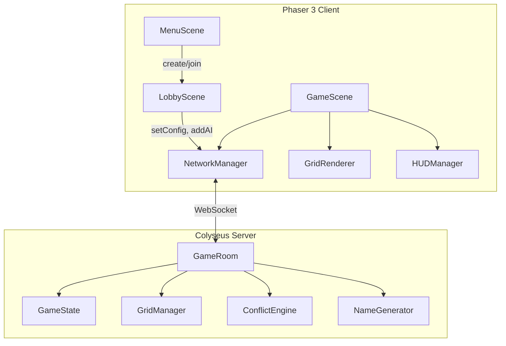
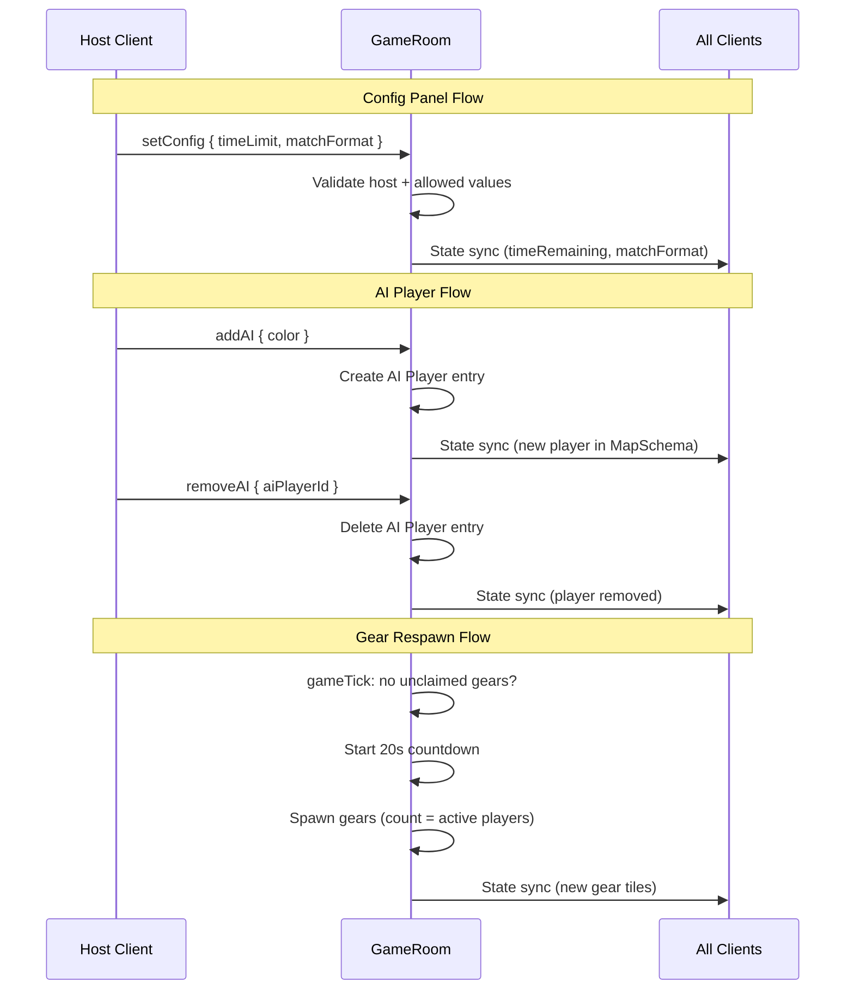

# Design Document — v0.5 Server Config, AI & Hints

## Overview

This design covers 11 tickets for the v0.5 release of Scrapyard Steal. The changes span three layers: server-side game logic (gear respawn, name sanitization, match format, AI players), client-side UI (config panel, hint popup, lobby cancel, reroll label, connection errors), and rendering (gear mining flash, color picker disconnect sync). All changes build on the existing Colyseus GameRoom / Phaser 3 scene architecture without introducing new services or infrastructure.

The design groups changes into four categories:

1. **Server gameplay** — Gear respawn countdown, name sanitization, match format series logic, AI player lifecycle
2. **Lobby UI** — Server config panel (time limit, match format, AI players), cancel/back button, reroll label
3. **In-game UI** — Hint popup, gear mining flash animation, connection error handling
4. **State sync fixes** — Color picker disconnect cleanup

## Architecture

### System Context



### Message Flow for New Features



### Component Responsibilities

| Component | New Responsibilities |
|-----------|---------------------|
| **GameRoom** | Gear respawn timer, name sanitization, `setConfig`/`addAI`/`removeAI` handlers, match format series logic, AI player creation |
| **GameState** | New fields: `matchFormat`, `gearRespawnTimer`, `seriesScores`, `roundNumber`, `isAI` on Player |
| **GridManager** | No changes (existing spawn/grid logic reused) |
| **NameGenerator** | New `HOUSEHOLD_ROID` noun pool, `generateAIName()` function |
| **LobbyScene** | Config panel overlay, cancel/back button, reroll label, connection error popup, AI player display |
| **GameScene** | Hint popup button + overlay, gear mining flash trigger |
| **GridRenderer** | `playMineFlash()` method for gear mining feedback |
| **HUDManager** | Series score display next to leaderboard title |
| **NetworkManager** | New send methods: `sendSetConfig()`, `sendAddAI()`, `sendRemoveAI()` |

## Components and Interfaces

### 1. Gear Respawn (Requirement 1)

**Server — GameRoom.gameTick()**

Add gear respawn logic to the existing 1-second game tick:

```typescript
// New state on GameRoom (not schema — internal only)
private gearRespawnCountdown: number = -1; // -1 = not counting

// In gameTick():
// Check if any unclaimed gear tiles remain
const hasUnclaimedGear = this.state.tiles.some(
  (t) => t.ownerId === "" && t.hasGear && t.gearScrap > 0
);

if (!hasUnclaimedGear && this.gearRespawnCountdown === -1) {
  this.gearRespawnCountdown = 20;
} else if (this.gearRespawnCountdown > 0) {
  this.gearRespawnCountdown -= 1;
} else if (this.gearRespawnCountdown === 0) {
  this.spawnNewGears();
  this.gearRespawnCountdown = -1;
}
```

`spawnNewGears()` picks random unclaimed non-spawn tiles, sets `hasGear = true` and `gearScrap = 50`. Count = number of active (non-absorbed) players.

**Client — GridRenderer**

The existing `onStateUpdate` in GameScene already syncs gear tiles via `setGearTile`/`removeGearTile`. New gears appear automatically on the next state change — no client changes needed for display.

### 2. Name Sanitization (Requirement 2)

**Server — GameRoom "setName" handler**

Insert sanitization before the existing duplicate check:

```typescript
function sanitizeName(input: string): string {
  // Strip non-printable ASCII (keep 0x20–0x7E)
  const stripped = input.replace(/[^\x20-\x7E]/g, "");
  return stripped.trim();
}

// In "setName" handler, before duplicate check:
const adj = sanitizeName((data.adj || "").slice(0, 16));
const noun = sanitizeName((data.noun || "").slice(0, 16));

if (adj === "" || noun === "") {
  client.send("nameRejected", { adj, noun, reason: "empty" });
  return;
}
```

This is a pure function, easily unit-testable.

### 3. Color Picker Disconnect Fix (Requirement 3)

**Server — GameRoom.onLeave()**

Already calls `this.state.players.delete(client.sessionId)` which removes the player and their color from state. No server change needed.

**Client — LobbyScene.setupStateListener()**

The existing `onStateChange` callback already rebuilds `takenColors` from the current player list and updates ✕ overlays. When a player is removed from state, their color drops out of `takenColors` on the next state change, and the ✕ is hidden. The current implementation handles this correctly — the fix is to verify this path works (it does based on code review). No code change needed; this is already working.

### 4. Gear Mining Flash (Requirement 4)

**Client — GridRenderer**

Add a public method that reuses the existing `playClaimAnimation` pattern:

```typescript
playMineFlash(gridX: number, gridY: number): void {
  const { px, py } = this.gridToPixel(gridX, gridY);
  const flash = this.scene.add.rectangle(
    px + this.tileSize / 2, py + this.tileSize / 2,
    this.tileSize, this.tileSize,
    0xffd700, 0.6  // gold flash
  ).setDepth(10);

  this.scene.tweens.add({
    targets: flash,
    scaleX: 1.3, scaleY: 1.3, alpha: 0,
    duration: 300, ease: "Power2",
    onComplete: () => flash.destroy(),
  });
}
```

**Client — GameScene.handleTileClick()**

Call `this.gridRenderer.playMineFlash(gridPos.x, gridPos.y)` immediately when a gear mine action is triggered (before sending the network message), providing optimistic visual feedback.

### 5. Server Config Panel — Time Limit (Requirement 5)

**Server — GameRoom**

New message handler:

```typescript
this.onMessage("setConfig", (client, data) => {
  if (this.state.phase !== "waiting") return;
  if (client.sessionId !== this.hostId) return;

  const ALLOWED_TIMES = [120, 300, 420, 600];
  if (data.timeLimit !== undefined && ALLOWED_TIMES.includes(data.timeLimit)) {
    this.state.timeRemaining = data.timeLimit;
  }

  const ALLOWED_FORMATS = ["single", "bo3", "bo5"];
  if (data.matchFormat !== undefined && ALLOWED_FORMATS.includes(data.matchFormat)) {
    this.state.matchFormat = data.matchFormat;
  }
});
```

**Client — LobbyScene**

A new `openConfigPanel()` method creates a modal overlay with:
- Dark background overlay (0x000000, 0.7 alpha)
- Centered panel box (0x1a1a2e, 0.95 alpha)
- "⚙ CONFIG" title
- Time limit row: four buttons (2, 5, 7, 10 min) with highlight on selected
- Match format row: three buttons (Single, Bo3, Bo5)
- AI players section (see Requirement 7)
- "DONE" button to dismiss

The "⚙ CONFIG" button is shown next to the START button, only visible to the host.

**Client — NetworkManager**

```typescript
sendSetConfig(config: { timeLimit?: number; matchFormat?: string }): void {
  this.room?.send("setConfig", config);
}
```

### 6. Match Format Series (Requirement 6)

**Server — GameState**

New schema fields:

```typescript
@type("string") matchFormat: string = "single";
@type("number") roundNumber: number = 1;
@type("string") seriesScoresJSON: string = "{}"; // JSON map of playerId → wins
```

Using a JSON string for series scores avoids adding a new MapSchema type for a simple counter map.

**Server — GameRoom**

When a round ends (phase → "ended"):
- If `matchFormat` is "bo3" or "bo5", check if any player reached the required win count
- If not, schedule a 5-second delay then call `resetForNextRound()` which re-initializes the grid, reassigns starting positions, and sets phase back to "active"
- If a player has won the series, broadcast the series winner

**Client — HUDManager**

When `matchFormat !== "single"`, prepend series scores to the leaderboard title: `"LEADERBOARD [1-0]  4:32"`

### 7. AI Players (Requirement 7)

**Server — GameRoom**

New message handlers:

```typescript
this.onMessage("addAI", (client, data: { color: number }) => {
  if (this.state.phase !== "waiting") return;
  if (client.sessionId !== this.hostId) return;

  // Count existing AI players
  let aiCount = 0;
  this.state.players.forEach((p) => { if (p.isAI) aiCount++; });
  if (aiCount >= 4) return;

  // Validate color
  if (!ALLOWED_COLORS.includes(data.color)) return;
  let colorTaken = false;
  this.state.players.forEach((p) => { if (p.color === data.color) colorTaken = true; });
  if (colorTaken) return;

  // Generate AI name from household-roid pool
  const taken = this.getTakenNames();
  const aiName = generateAIName(taken.adjs, taken.nouns);

  const aiId = `ai_${Date.now()}_${aiCount}`;
  const player = new Player();
  player.id = aiId;
  player.isAI = true;
  player.color = data.color;
  player.nameAdj = aiName.adj;
  player.nameNoun = aiName.noun;
  player.teamName = `${aiName.adj} ${aiName.noun}`;
  // ... standard player init
  this.state.players.set(aiId, player);
});

this.onMessage("removeAI", (client, data: { aiPlayerId: string }) => {
  if (this.state.phase !== "waiting") return;
  if (client.sessionId !== this.hostId) return;
  const player = this.state.players.get(data.aiPlayerId);
  if (!player || !player.isAI) return;
  this.state.players.delete(data.aiPlayerId);
});
```

**Server — GameState (Player)**

New field:

```typescript
@type("boolean") isAI: boolean = false;
```

**NameGenerator — Household-Roid Pool**

New export in `src/utils/nameGenerator.ts`:

```typescript
export const HOUSEHOLD_ROID: string[] = [
  "Fridgeroid", "Toasteroid", "Blenderoid", "Vacuumroid", "Microwaveroid",
  "Dishwasheroid", "Ovenroid", "Kettleroid", "Mixeroid", "Grilleroid",
  "Washeroid", "Dryeroid", "Ironroid", "Fanroid", "Lamproid",
  "Clockroid", "Radioroid", "Speakeroid", "Printeroid", "Scanneroid",
  "Routeroid", "Moproid", "Broomroid", "Heateroid", "Cooleroid",
  "Juiceroid", "Chopperoid", "Steameroid", "Fryeroid", "Bakeroid",
];

export function generateAIName(
  takenAdjs: Set<string>,
  takenNouns: Set<string>
): { adj: string; noun: string } {
  const availAdjs = ADJECTIVES.filter((a) => !takenAdjs.has(a));
  const availNouns = HOUSEHOLD_ROID.filter((n) => !takenNouns.has(n));

  const adj = availAdjs.length > 0
    ? availAdjs[Math.floor(Math.random() * availAdjs.length)]
    : ADJECTIVES[Math.floor(Math.random() * ADJECTIVES.length)];

  const noun = availNouns.length > 0
    ? availNouns[Math.floor(Math.random() * availNouns.length)]
    : HOUSEHOLD_ROID[Math.floor(Math.random() * HOUSEHOLD_ROID.length)];

  return { adj, noun };
}
```

**Client — LobbyScene (Config Panel)**

The AI section in the config panel shows:
- "AI PLAYERS" label with current count
- "+" button (adds AI, opens mini color picker for that AI)
- "−" button (removes last AI)
- Each AI entry shows: 🤖 icon + generated name + color swatch
- Max 4 AI players enforced client-side and server-side

**Client — LobbyScene (Player List)**

In the state change callback, prefix AI player names with "🤖 " in the display string.

### 8. Hint Button (Requirement 8)

**Client — GameScene**

Add a 💡 button in the lower-left corner:

```typescript
private createHintButton(): void {
  const btn = this.add.text(20, 560, "💡", {
    fontSize: "24px", fontFamily: "monospace",
  }).setInteractive({ useHandCursor: true }).setDepth(100);

  btn.on("pointerdown", () => this.showHintPopup());
}
```

The hint popup is a simple overlay:
- Dark background (0x000000, 0.7)
- Centered box with controls summary text
- "✕" close button
- Does NOT pause the game — state updates continue rendering behind the overlay

Controls summary content:
```
CONTROLS
Click tile    → Claim / Mine gear
Arrow keys    → Set expansion direction
Same arrow    → Clear direction
Escape        → Clear direction
⚔ ATK / 🛡 DEF → Upgrade (costs scrap)
```

### 9. Cancel/Back Button (Requirement 9)

**Client — LobbyScene**

Add a "BACK" button at the bottom of the lobby, visible to all players:

```typescript
this.makeButton(400, 540, "BACK", () => {
  this.room?.leave();
  this.scene.start("MenuScene");
});
```

Uses the existing `makeButton` pattern from MenuScene. When the host disconnects, the server's existing `onLeave` logic handles host migration.

### 10. Reroll Label (Requirement 10)

**Client — LobbyScene**

Add a non-interactive "reroll" text label immediately to the right of the existing ♻ button:

```typescript
this.add.text(330, 155, "reroll", {
  fontSize: "11px", color: AMBER, fontFamily: FONT,
}).setOrigin(0, 0.5);
```

### 11. Connection Error Handling (Requirement 11)

**Client — LobbyScene**

Wrap the connection promise `.catch()` to show a styled error popup instead of just setting status text:

```typescript
private showErrorPopup(message: string): void {
  const overlay = this.add.rectangle(400, 300, 800, 600, 0x000000, 0.7)
    .setDepth(200).setInteractive();
  const box = this.add.rectangle(400, 280, 360, 180, 0x1a1a2e, 0.95)
    .setDepth(201).setStrokeStyle(2, 0x3a3a2a);
  const title = this.add.text(400, 240, "CONNECTION ERROR", {
    fontSize: "16px", color: GOLD, fontFamily: FONT,
  }).setOrigin(0.5).setDepth(202);
  const msg = this.add.text(400, 275, message, {
    fontSize: "12px", color: AMBER, fontFamily: FONT,
    wordWrap: { width: 320 }, align: "center",
  }).setOrigin(0.5).setDepth(202);

  const backBtn = this.makeButton(400, 330, "BACK TO MENU", () => {
    this.scene.start("MenuScene");
  });
  backBtn.setDepth(202);

  // Auto-kick after 5 seconds
  this.time.delayedCall(5000, () => {
    this.scene.start("MenuScene");
  });
}
```

Also listen for mid-lobby disconnects:

```typescript
this.room.onLeave((code: number) => {
  if (!this.transitioned) {
    this.showErrorPopup("Disconnected from server");
  }
});
```

**Client — NetworkManager**

No changes needed — the existing methods already throw on connection failure, which LobbyScene catches.

## Data Models

### GameState Schema Changes

```typescript
// Existing fields (unchanged)
@type("string") phase: string = "waiting";
@type("number") timeRemaining: number = 300;
@type("string") hostId: string = "";
// ...

// New fields
@type("string") matchFormat: string = "single";    // "single" | "bo3" | "bo5"
@type("number") roundNumber: number = 1;
@type("string") seriesScoresJSON: string = "{}";    // JSON: { [playerId]: winCount }
```

### Player Schema Changes

```typescript
// Existing fields (unchanged)
@type("string") id: string = "";
@type("string") nameAdj: string = "";
@type("string") nameNoun: string = "";
@type("number") color: number = -1;
// ...

// New field
@type("boolean") isAI: boolean = false;
```

### Internal GameRoom State (Not Schema)

```typescript
// Gear respawn (server-only, not synced to clients)
private gearRespawnCountdown: number = -1;

// Series tracking (server-only working state)
private seriesScores: Map<string, number> = new Map();
```

### New Message Types

| Message | Direction | Payload | Handler |
|---------|-----------|---------|---------|
| `setConfig` | Client → Server | `{ timeLimit?: number, matchFormat?: string }` | GameRoom — host only |
| `addAI` | Client → Server | `{ color: number }` | GameRoom — host only, max 4 |
| `removeAI` | Client → Server | `{ aiPlayerId: string }` | GameRoom — host only |
| `nameRejected` | Server → Client | `{ adj, noun, reason? }` | LobbyScene — auto-reroll |

### NameGenerator Data

New export array `HOUSEHOLD_ROID` with 30 entries (e.g., "Fridgeroid", "Toasteroid", ...). Used exclusively for AI player noun generation via `generateAIName()`.


## Correctness Properties

*A property is a characteristic or behavior that should hold true across all valid executions of a system — essentially, a formal statement about what the system should do. Properties serve as the bridge between human-readable specifications and machine-verifiable correctness guarantees.*

### Property 1: Gear spawn correctness

*For any* grid state where no unclaimed gear tiles (ownerId === "" and hasGear === true and gearScrap > 0) exist, and there are N active (non-absorbed) players, calling the gear spawn function should produce exactly N new gear tiles, each placed on an unclaimed tile where isSpawn === false, with gearScrap set to 50 and hasGear set to true.

**Validates: Requirements 1.1, 1.3, 1.4**

### Property 2: Name sanitization output

*For any* arbitrary Unicode string, applying `sanitizeName` should produce a string that contains only characters in the printable ASCII range (0x20–0x7E) and has no leading or trailing whitespace.

**Validates: Requirements 2.1, 2.2**

### Property 3: Empty name rejection

*For any* string that consists entirely of non-printable characters (outside 0x20–0x7E) or whitespace, sanitizing it should produce an empty string, which triggers name rejection.

**Validates: Requirements 2.3**

### Property 4: Sanitization-aware duplicate detection

*For any* two strings that are identical after sanitization (e.g., "Turbo" and "Turbo\x00"), the server should detect them as duplicates and reject the second name.

**Validates: Requirements 2.4**

### Property 5: Config value validation

*For any* integer value sent as `timeLimit` in a `setConfig` message, the server should only update `GameState.timeRemaining` if the value is one of {120, 300, 420, 600}. *For any* string value sent as `matchFormat`, the server should only update `GameState.matchFormat` if the value is one of {"single", "bo3", "bo5"}.

**Validates: Requirements 5.6, 6.4**

### Property 6: Config authorization

*For any* player who is not the host, sending a `setConfig` message should not change any GameState fields (timeRemaining, matchFormat).

**Validates: Requirements 5.7**

### Property 7: Series completion logic

*For any* sequence of round winners in a "bo3" series, the series should end exactly when some player reaches 2 wins. *For any* sequence of round winners in a "bo5" series, the series should end exactly when some player reaches 3 wins. Before that threshold, the series should continue with a new round.

**Validates: Requirements 6.5, 6.7**

### Property 8: AI player creation correctness

*For any* valid color from the allowed palette that is not already taken, creating an AI player should produce a Player entry where `isAI === true`, the noun is drawn from the `HOUSEHOLD_ROID` pool, and the adjective is drawn from the `ADJECTIVES` pool.

**Validates: Requirements 7.5, 7.8**

### Property 9: HOUSEHOLD_ROID pool validity

*For any* entry in the `HOUSEHOLD_ROID` array, it should be a non-empty string ending with "roid", and the array should contain at least 30 entries with no duplicates.

**Validates: Requirements 7.7**

### Property 10: AI and human name uniqueness

*For any* set of existing players (human and AI) in a lobby, generating a new AI name should produce an adjective and noun that do not duplicate any existing player's adjective or noun, provided alternatives remain available in the pools.

**Validates: Requirements 7.9**

### Property 11: AI removal frees color

*For any* AI player in the lobby, removing that AI player should delete them from the players map and make their previously selected color available for selection by other players.

**Validates: Requirements 7.10**

### Property 12: Disconnect removes player from lobby

*For any* player in the lobby during the "waiting" phase, when that player disconnects, their entry should be removed from the players MapSchema, and the set of taken colors should no longer include their color.

**Validates: Requirements 3.1**

### Property 13: Host migration on disconnect

*For any* lobby with more than one player, when the host disconnects, the next player in the players map should be assigned as the new host (isHost === true, hostId updated). If no players remain, the room should be disposed.

**Validates: Requirements 9.3**

## Error Handling

| Scenario | Handler | Behavior |
|----------|---------|----------|
| `setConfig` from non-host | GameRoom | Silently ignore the message |
| `setConfig` with invalid timeLimit | GameRoom | Ignore; state unchanged |
| `setConfig` with invalid matchFormat | GameRoom | Ignore; state unchanged |
| `addAI` when 4 AI already exist | GameRoom | Ignore; no new player created |
| `addAI` with taken color | GameRoom | Ignore; no new player created |
| `addAI` from non-host | GameRoom | Ignore |
| `removeAI` for non-AI player | GameRoom | Ignore; only AI players can be removed via this message |
| `setName` with non-printable chars | GameRoom | Strip chars, proceed with sanitized version |
| `setName` resulting in empty adj/noun | GameRoom | Send `nameRejected` to client; client auto-rerolls |
| Gear respawn with no valid tiles | GameRoom | Skip spawn, reset countdown to -1, re-check next tick |
| Connection failure (create/join) | LobbyScene | Show error popup with reason, auto-kick to MenuScene after 5s |
| Mid-lobby disconnect | LobbyScene | Show "Disconnected from server" popup, auto-kick after 5s |
| Host disconnect during waiting | GameRoom | Migrate host to next player; if none, dispose room |
| Series round end with no winner yet | GameRoom | Reset grid, reassign positions, start new round after 5s delay |

## Testing Strategy

### Property-Based Testing

Use **fast-check** (already installed as a dev dependency) with **vitest** for all property-based tests. Each property test should run a minimum of 100 iterations.

Each test file should reference the design property it validates using the tag format:

```
Feature: v05-server-config-ai-hints, Property {N}: {title}
```

Properties to implement as property-based tests:

| Property | Test File | Key Generators |
|----------|-----------|----------------|
| P1: Gear spawn correctness | `tests/property/gearRespawn.prop.ts` | Random grid states, random active player counts (1–10) |
| P2: Name sanitization output | `tests/property/nameSanitization.prop.ts` | `fc.fullUnicode()` strings |
| P3: Empty name rejection | `tests/property/nameSanitization.prop.ts` | Strings of only non-printable/whitespace chars |
| P4: Sanitization-aware duplicates | `tests/property/nameSanitization.prop.ts` | Pairs of strings differing only by non-printable chars |
| P5: Config value validation | `tests/property/serverConfig.prop.ts` | `fc.integer()` for timeLimit, `fc.string()` for matchFormat |
| P6: Config authorization | `tests/property/serverConfig.prop.ts` | Random player IDs, random config payloads |
| P7: Series completion logic | `tests/property/matchFormat.prop.ts` | Random sequences of player IDs as round winners |
| P8: AI player creation | `tests/property/aiPlayers.prop.ts` | Random colors from allowed palette, random taken name sets |
| P9: HOUSEHOLD_ROID pool validity | `tests/property/aiPlayers.prop.ts` | Index into HOUSEHOLD_ROID array |
| P10: AI/human name uniqueness | `tests/property/aiPlayers.prop.ts` | Random subsets of ADJECTIVES and HOUSEHOLD_ROID as taken |
| P11: AI removal frees color | `tests/property/aiPlayers.prop.ts` | Random AI player entries |
| P12: Disconnect removes player | `tests/property/lobbyState.prop.ts` | Random player maps |
| P13: Host migration | `tests/property/lobbyState.prop.ts` | Random player maps with 2+ players |

### Unit Testing

Unit tests complement property tests by covering specific examples, edge cases, and integration points:

| Area | Test File | Cases |
|------|-----------|-------|
| Gear respawn timing | `tests/unit/gearRespawn.test.ts` | Countdown starts at 20, decrements each tick, spawns at 0, resets to -1 |
| Name sanitization edge cases | `tests/unit/nameSanitization.test.ts` | Empty string, only whitespace, emoji-only, mixed printable/non-printable |
| Config panel defaults | `tests/unit/serverConfig.test.ts` | Default timeRemaining=300, default matchFormat="single" |
| Series score tracking | `tests/unit/matchFormat.test.ts` | Bo3 ends at 2 wins, bo5 ends at 3 wins, single match has no series |
| AI player max cap | `tests/unit/aiPlayers.test.ts` | Adding 5th AI is rejected, removing AI frees slot |
| Connection error popup | `tests/unit/connectionError.test.ts` | Error message displayed, auto-kick timer fires |
| HOUSEHOLD_ROID data | `tests/unit/nameGenerator.test.ts` | Array length >= 30, all entries end with "roid", no duplicates |

### Test Configuration

- All tests run via `vitest --run` (single execution, no watch mode)
- Property tests: minimum 100 iterations per property (`{ numRuns: 100 }`)
- Test files follow existing naming: `*.prop.ts` for property tests, `*.test.ts` for unit tests
- Tests import server logic directly (pure functions) — no Colyseus room instantiation needed for most properties
- Phaser-dependent tests (UI rendering, animations) are excluded from automated testing; those are verified manually
