<p align="center">
  
  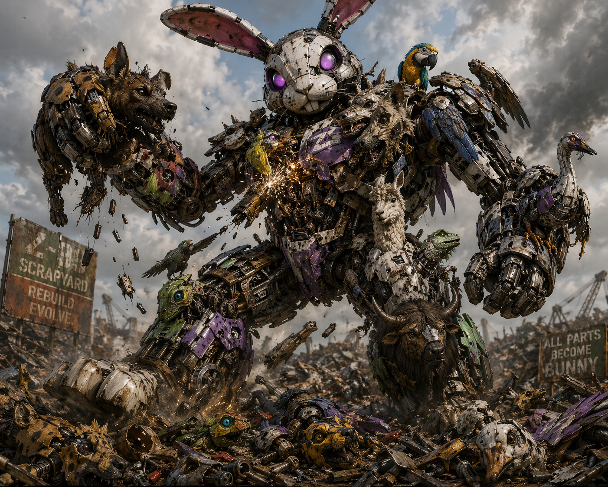
</p>

<h1 align="center">🏭 Scrapyard Steal</h1>

<p align="center">
  <em>Expand. Absorb. Dominate the scrapyard.</em>
</p>

<p align="center">
  <a href="https://itch.io/jam/gamedevjs-2026"></a>
  
  
  
</p>

<p align="center">
  
  
  
  
  
  <a href="https://github.com/stephthedevops/ScrapyardSteal"></a>
</p>

---

<p align="center">
  🎮 <a href="https://stephthedevops.github.io/ScrapyardSteal/"><strong>Play Now on GitHub Pages</strong></a> · <a href="https://felartaillier.itch.io/scrapyardsteal"><strong>Play on itch.io</strong></a> · <a href="https://wavedash.com/playtest/scrapyard-steal/433395d9-d241-4ea4-911b-3e539f42ba40"><strong>Play on Wavedash</strong></a>
</p>

---

## Table of Contents

- [What is Scrapyard Steal?](#what-is-scrapyard-steal)
- [How to Play](#-how-to-play)
- [Screenshots](#-screenshots)
- [Tech Stack](#-tech-stack)
- [Architecture Overview](#-architecture-overview)
- [Quick Start](#-quick-start)
- [Project Structure](#-project-structure)
- [Features](#-features)
- [Testing](#-testing)
- [Deployment](#-deployment)
- [Configuration](#-configuration)
- [Troubleshooting](#-troubleshooting)
- [Architecture Documentation](#-architecture-documentation)
- [Jam Challenge Tracks](#-jam-challenge-tracks)
- [Issue Tracking](#-issue-tracking)
- [Team](#-team)
- [Contributing](#-contributing)
- [License](#-license)

## What is Scrapyard Steal?

A multiplayer clicker/strategy game where 2–20 players compete in a shared scrapyard. Control a factory-machine, expand your territory by claiming scrap tiles, build an army of bots, and attack rival machines. When you destroy an opponent's last tile, they join your team. Lose your factory and you're demoted — but you can still help your team by building defenses and collecting scrap.

Built for the [Gamedev.js Jam 2026](https://itch.io/jam/gamedevjs-2026) (Theme: **Machines**).

## 🎮 How to Play

| Action | Control |
|--------|---------|
| Claim a tile | Click an adjacent neutral tile |
| Mine a gear | Click a ⚙️ tile you own or is unclaimed |
| Attack a tile | Click an enemy tile next to your territory |
| Buy ⚔️ ATK Bot | Click the ATK button (team lead only) |
| Buy 🛡️ DEF Bot | Click the DEF button |
| Place DEF Bot | Click 🛡️ icon, then click a tile you own |
| Buy ⚙️ COL Bot | Click the COL button |
| Place COL Bot | Click ⚒ icon, then click a tile you own |
| View stats | Click 📊 Stats button |

### Game Flow

1. **Create or Join** — Host creates a game and shares the 5-character room code. Others join with the code, or use Quick Play for a random public game.
2. **Lobby** — Pick your color, get a random bot name (🎲 to reroll). Host can configure time limit (including Deathmatch), match format, scrap supply, max players, and add AI opponents.
3. **Expand** — Claim neutral tiles adjacent to your territory. Each tile costs scrap, and the cost scales as you grow.
4. **Mine** — Click gear tiles (⚙️) to extract scrap. Mining yields 5 × factories owned.
5. **Build Bots** — Buy ATK bots (more simultaneous attacks), DEF bots (place on tiles for +5 defense each), and COL bots (auto-mine gears and generate factory income).
6. **Attack** — Click enemy border tiles to start battles. Each battle tick (2×/sec) deals damage based on your attack pressure: `factories + floor(ATK bots / active battles)`. Tiles become unclaimed at 0 defense.
7. **Defend** — Every tile has 5 base defense. Place up to 4 DEF bots per tile for up to 25 total defense. When defense drops past thresholds, bots are destroyed (50% chance to repair).
8. **Absorb** — When a player loses all tiles, they join the attacker's team. Lose your factory and you're demoted to non-leader.
9. **Win** — Most tiles when the timer runs out, or last team standing in Deathmatch.

### Roles

| Action | Team Lead | Member |
|--------|-----------|--------|
| Buy ⚔️ ATK Bots | ✅ | ❌ |
| Attack tiles | ✅ | ❌ |
| Buy 🛡️ DEF / ⚙️ COL Bots | ✅ | ✅ |
| Place bots | ✅ | ✅ |
| Claim tiles | ✅ | ✅ |
| Mine gears | ✅ | ✅ |

## 📸 Screenshots

### Gameplay

<p align="center">
  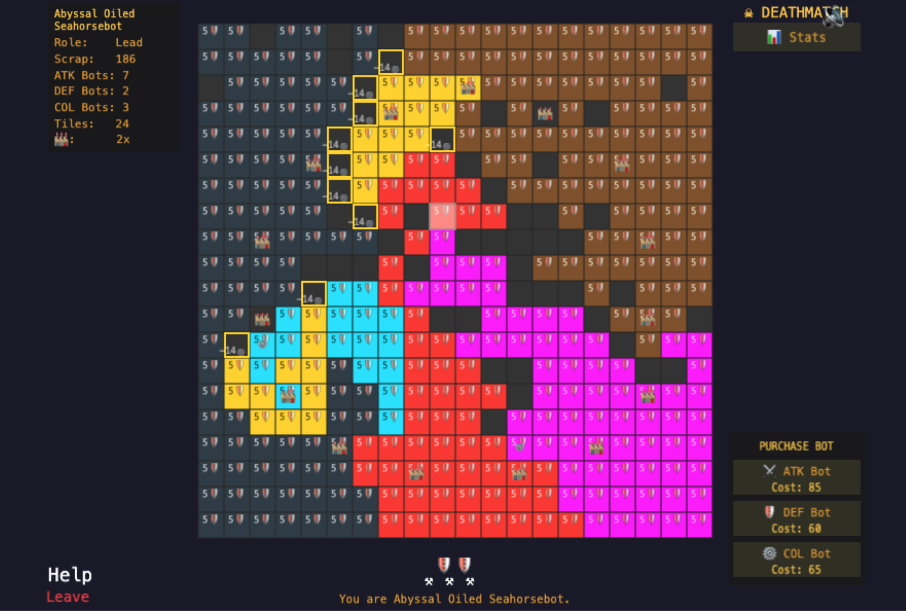
</p>
<p align="center"><em>Expand your territory, mine gears, and battle rival machines on the scrapyard grid.</em></p>

<p align="center">
  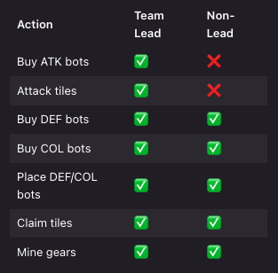
</p>
<p align="center"><em>Buy ATK, DEF, and COL bots to attack enemies, fortify tiles, and auto-mine resources.</em></p>

### Lobby & Configuration

<p align="center">
  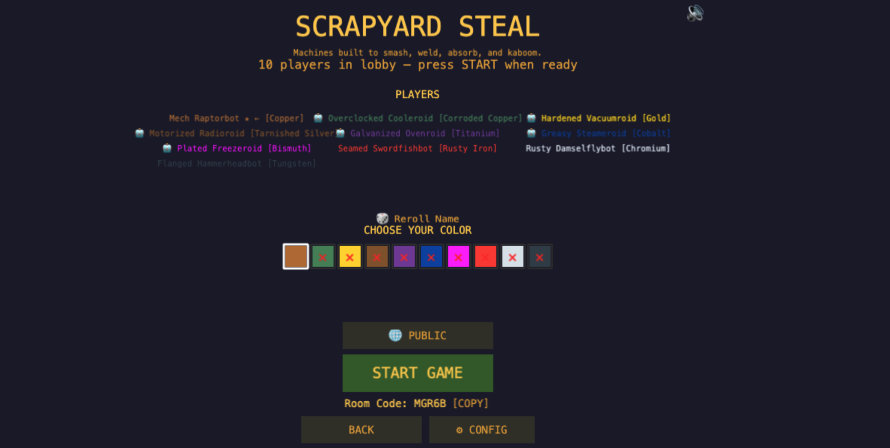
  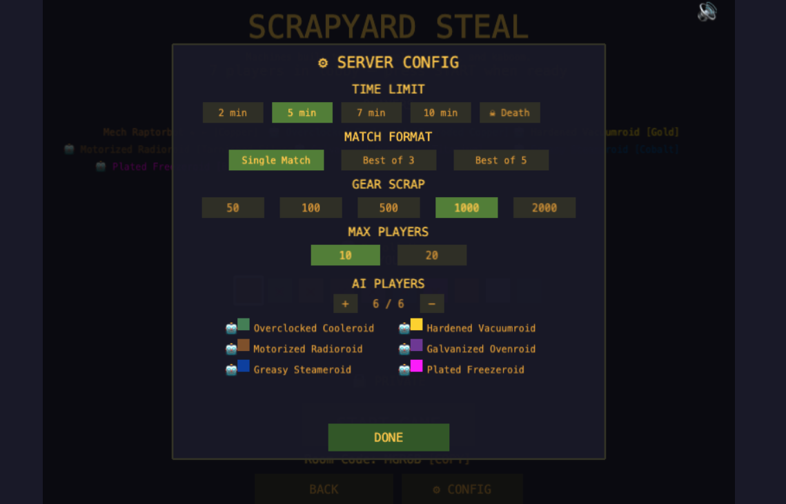
</p>
<p align="center"><em>Left: Pick your color and bot name in the lobby. Right: Host configures match settings.</em></p>

<p align="center">
  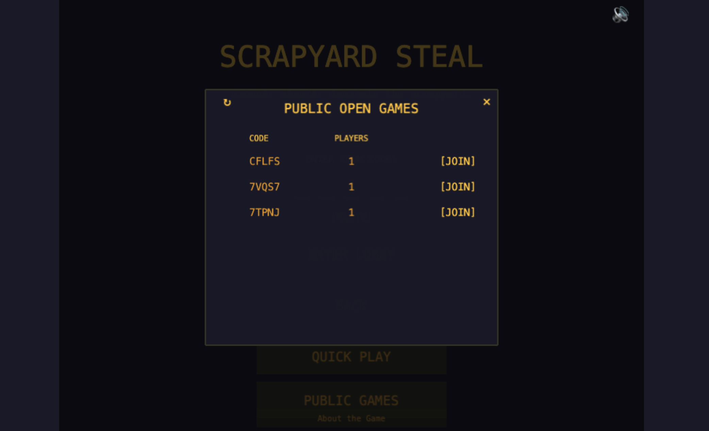
</p>
<p align="center"><em>Browse public lobbies and jump into a game with Quick Play.</em></p>

### Team & Stats

<p align="center">
  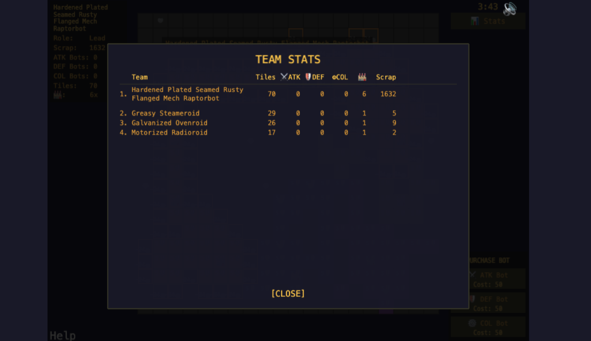
  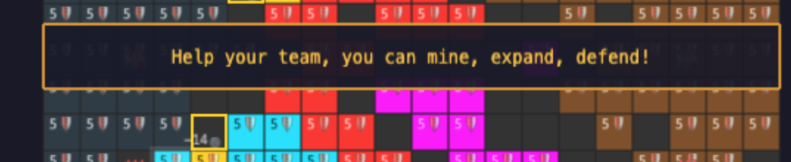
</p>
<p align="center"><em>Left: Full team stats breakdown. Right: Absorbed players contribute to their new team.</em></p>

### Elite Bots

<p align="center">
  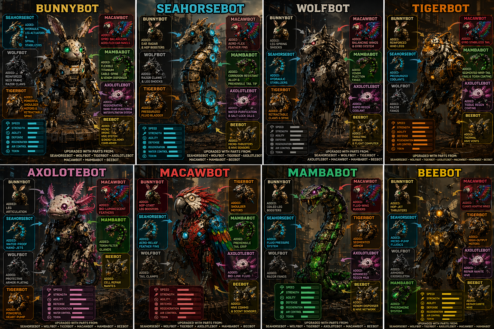
</p>

<p align="center">
  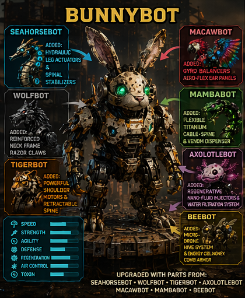
  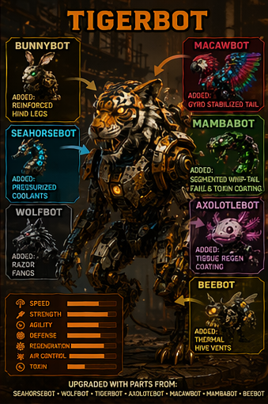
  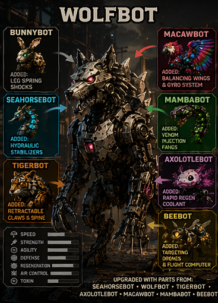
  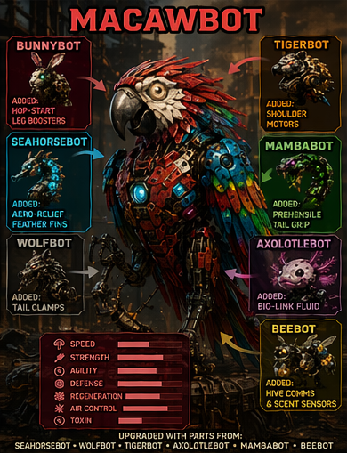
  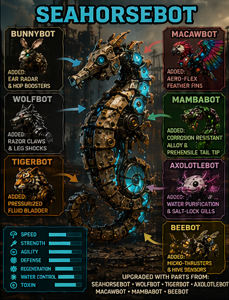
</p>
<p align="center">
  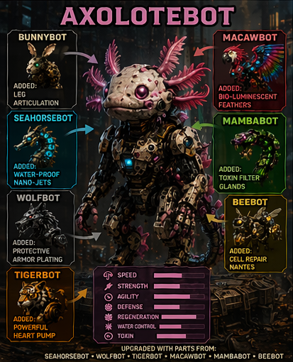
  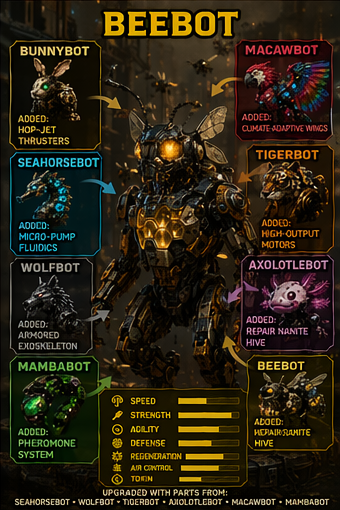
  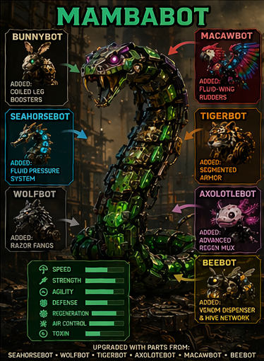
</p>
<p align="center"><em>The 8 elite secret bots — hidden in the lobby tagline. Can you find them all?</em></p>

## 🛠 Tech Stack

| Layer | Technology | Version |
|-------|-----------|---------|
| Game Engine | [Phaser 3](https://phaser.io/) | ^3.80.0 |
| Multiplayer | [Colyseus](https://colyseus.io/) | ^0.15.57 |
| Language | [TypeScript](https://www.typescriptlang.org/) | ^5.4.0 |
| Bundler | [Vite](https://vitejs.dev/) | ^5.4.0 |
| Testing | [Vitest](https://vitest.dev/) + [fast-check](https://github.com/dubzzz/fast-check) + [Playwright](https://playwright.dev/) | ^4.1.4 / ^4.6.0 / ^1.59.1 |
| Server Runtime | Node.js | 20+ |
| Deployment (Server) | [Colyseus Cloud](https://cloud.colyseus.io/) (US-ORD) | — |
| Deployment (Client) | GitHub Pages, [itch.io](https://itch.io/), [Wavedash](https://wavedash.com/) | — |

## 🏗 Architecture Overview

Scrapyard Steal uses a client-server architecture with an authoritative Colyseus server. All game state lives on the server; the Phaser 3 client renders state and sends player actions as messages.

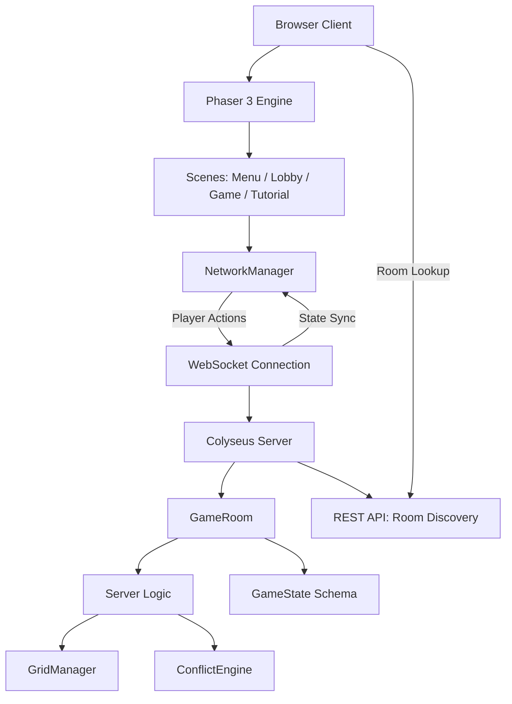

**Two-tick loop:** The server runs two intervals — a game tick (1×/sec) for tile claiming, gear mining, bot placement, and AI behavior, and a battle tick (2×/sec) for resolving attack damage.

## 🚀 Quick Start

### Prerequisites

- Node.js 20+ (`node --version`)
- npm (bundled with Node.js)

### Install

```bash
git clone https://github.com/stephthedevops/ScrapyardSteal.git
cd ScrapyardSteal
npm install
```

### Run locally

You need **two terminals** running simultaneously:

**Terminal 1 — Colyseus server (port 2567):**

```bash
npm run server:dev
```

**Terminal 2 — Vite dev server (port 3000):**

```bash
npm run dev
```

Open `http://localhost:3000` in two browser tabs to test multiplayer.

### Build for production

```bash
npm run build          # Client build
npm run server:build   # Server build
npm run build:prod     # Production client build (Colyseus Cloud URL + zip for itch.io)
```

## 📁 Project Structure

```
├── server/                 # Colyseus server
│   ├── index.ts            # Server entry + short code lookup endpoint
│   ├── app.config.ts       # Colyseus Cloud config
│   ├── config/
│   │   └── gameConfig.ts   # Centralized game balance constants
│   ├── rooms/
│   │   └── GameRoom.ts     # Game room: lifecycle, messages, game loop, battle tick
│   ├── logic/
│   │   ├── GridManager.ts  # Grid init, adjacency, circular spawn placement
│   │   ├── ConflictEngine.ts # Attack pressure, cost formulas
│   │   ├── aiNames.ts      # AI bot name generation
│   │   └── sanitize.ts     # Name sanitization
│   └── state/
│       └── GameState.ts    # Colyseus schema: Player, Tile, GameState
├── src/                    # Phaser client
│   ├── main.ts             # Game bootstrap
│   ├── scenes/
│   │   ├── MenuScene.ts    # Create/Join game menu + About popup
│   │   ├── LobbyScene.ts   # Color pick, name, room code, config, AI, start
│   │   ├── GameScene.ts    # Main game: grid, HUD, input, state sync, battles
│   │   └── TutorialScene.ts # 13-page How to Play
│   ├── rendering/
│   │   └── GridRenderer.ts # Tile rendering, animations, highlights, defense display
│   ├── ui/
│   │   ├── HUDManager.ts   # Stats, purchase bots, timer, stats popup, bot icons
│   │   └── MusicToggle.ts  # Global mute toggle across scenes
│   ├── network/
│   │   ├── client.ts       # Colyseus client config
│   │   └── NetworkManager.ts # Message wrapper (claim, attack, mine, bots, config)
│   └── utils/
│       └── nameGenerator.ts # Random "Adjective Animalbot" names
├── tests/                  # Test suite
│   ├── unit/               # Vitest unit tests (7 files)
│   ├── property/           # fast-check property-based tests (18 files)
│   └── e2e/                # Playwright end-to-end tests (1 file)
├── docs/                   # Architecture documentation (10 docs)
├── doc/                    # Design docs, changelog, transcripts
├── issue_tracking/         # Markdown-based project tracking
└── images/                 # Bot stat cards and game assets
```

## 🎨 Features

- **Multiplayer** — 2–20 players in real-time via WebSockets
- **Room codes** — 5-character codes to share and join specific games
- **Quick Play** — Join a random public game instantly
- **Manual combat** — Click enemy tiles to attack; battle ticks run 2×/sec
- **Attack pressure** — Damage scales with factories and ATK bots, split across active battles
- **Defense bots** — Place 🛡️ bots on tiles for +5 defense each (max 4 per tile, permanent)
- **Collection bots** — Place ⚒ bots to auto-mine gears and generate passive factory income
- **Team absorption** — Defeated players join the victor's team and keep clicking
- **Factory demotion** — Lose your factory and you're demoted to non-leader (can't attack or buy ATK bots)
- **Stacking names** — Each absorption adds an adjective: "Turbo Hydraulic Otterbot"
- **Gear mining** — ⚙️ tiles with configurable scrap (default 1000), mined at 5 × factories
- **Deathmatch mode** — Infinite time, last team standing wins
- **Match formats** — Single match, Best of 3, Best of 5
- **AI opponents** — Up to 6 AI bots that mine, claim, upgrade, and attack
- **Server config** — Host configures time limit, match format, scrap supply, max players
- **Color persistence** — Your team always shows in your chosen color on your screen
- **10+ metal colors** — Copper, Gold, Titanium, Cobalt, Bismuth, Chromium, and more (20 in expanded mode)
- **Stats popup** — Full-screen team stats with tiles, ATK, DEF, COL, factories, and scrap
- **Sound effects** — Mining clanks, attack guitar loops, error feedback, and background music with toggle
- **8 secret elite bots** — Hidden in the lobby tagline (find the clickable letters!)

## 🧪 Testing

157 tests across 26 files covering unit, property-based, and end-to-end testing.

| Category | Files | Framework | Description |
|----------|-------|-----------|-------------|
| Unit | 7 in `tests/unit/` | Vitest | ConflictEngine, GridManager, GameState, GridRenderer, nameGenerator, autoAssignColor, factoryCaptureChoice |
| Property-based | 18 in `tests/property/` | Vitest + fast-check | Randomized input testing for game mechanics: gear economy, lobby transitions, match formats, grid management, conflict resolution |
| End-to-end | 1 in `tests/e2e/` | Playwright | Browser-based game load verification (Chromium) |

### Test Commands

```bash
npm test              # Run all unit and property tests (Vitest)
npm run test:watch    # Watch mode — re-runs on file changes
npm run test:coverage # Tests with V8 code coverage (output in coverage/)
npm run test:e2e      # Playwright end-to-end tests (requires Chromium)
npm run test:all      # Vitest tests + Playwright e2e tests
```

> **Note:** Playwright requires Chromium. Run `npx playwright install chromium` if e2e tests fail with a missing browser error.

## 🚢 Deployment

| Component | Platform | Details |
|-----------|----------|---------|
| **Server** | [Colyseus Cloud](https://cloud.colyseus.io/) | US-ORD region, managed via `.colyseus-cloud.json` and `ecosystem.config.js` (PM2) |
| **Client** | [GitHub Pages](https://stephthedevops.github.io/ScrapyardSteal/) | Static build from `dist/`, auto-deployed |
| **Client** | [itch.io](https://felartaillier.itch.io/scrapyardsteal) | Uploaded as `dist.zip` via `npm run build:prod` |
| **Client** | [Wavedash](https://wavedash.com/playtest/scrapyard-steal/433395d9-d241-4ea4-911b-3e539f42ba40) | Static hosting via `@wvdsh/sdk-js`, configured in `wavedash.toml` |

### Production Build

```bash
# Build client with production server URL and create dist.zip for itch.io
npm run build:prod

# Build server for Colyseus Cloud
npm run server:build
```

The `build:prod` script sets `VITE_SERVER_URL` to the Colyseus Cloud WebSocket endpoint and packages the client into `dist.zip` for itch.io upload.

## ⚙ Configuration

### Environment Variables

| Variable | Default | Description |
|----------|---------|-------------|
| `VITE_SERVER_URL` | `ws://localhost:2567` | WebSocket URL for the Colyseus server. Set automatically by `build:prod` for production builds. No `.env` file needed for local development. |

### Game Balance Constants

All game balance values are centralized in [`server/config/gameConfig.ts`](server/config/gameConfig.ts):

| Constant | Value | Description |
|----------|-------|-------------|
| `RATE_LIMIT_MS` | 100 | Minimum ms between player actions |
| `BASE_TILE_DEFENSE` | 5 | Starting defense for every tile |
| `DEFENSE_PER_BOT` | 5 | Defense added per placed DEF bot |
| `MAX_DEFENSE_BOTS_PER_TILE` | 4 | Maximum DEF bots on a single tile |
| `BASE_MINE_EXTRACT` | 5 | Base scrap per mine click (multiplied by factories) |
| `GAME_TICK_MS` | 1000 | Game loop interval |
| `BATTLE_TICK_MS` | 500 | Battle resolution interval |
| `TILE_CLAIM_COST_BASE` | 10 | Base cost to claim a tile |
| `UPGRADE_COST_BASE` | 50 | Base cost for bot upgrades |
| `GRID_SIZE_MIN` / `MAX` | 12 / 20 | Grid size range (scales with player count) |

### Host-Configurable Settings (Lobby)

The game host can configure these settings from the lobby CONFIG panel before starting:

- **Time limit** — 2, 5, 7, or 10 minutes (or Deathmatch for infinite)
- **Match format** — Single Match, Best of 3, Best of 5
- **Scrap supply** — Gear scrap amount per tile
- **Max players** — Room capacity
- **AI opponents** — Up to 4 AI bots with color selection
- **Public/Private** — Toggle room visibility for Quick Play

## 🔧 Troubleshooting

| Problem | Cause | Fix |
|---------|-------|-----|
| `npm install` fails | Node.js version too old | Upgrade to Node.js 20+ (`node --version` to check) |
| Port 2567 already in use | Another process on that port | `lsof -i :2567` to find it, then kill the process |
| Port 3000 already in use | Another process on that port | `lsof -i :3000` to find it, then kill the process |
| WebSocket connection error in browser | Colyseus server not running | Start the server first with `npm run server:dev` |
| Tests fail after pull | Dependencies out of date | Run `npm install` to sync `node_modules` |
| Playwright tests fail | Browsers not installed | Run `npx playwright install chromium` |
| `Cannot find module 'ts-node'` | Missing dev dependencies | Run `npm install` |
| Build fails with type errors | TypeScript strict mode | Fix the type errors — strict mode is intentional |
| Schema changes not reflected | Server needs restart | Restart `npm run server:dev` (nodemon handles this automatically) |
| Game won't load in browser | Only one server running | Both Colyseus server (port 2567) and Vite dev server (port 3000) must be running |

## 📚 Architecture Documentation

Detailed architecture documentation lives in [`docs/architecture/`](docs/architecture/):

| Document | Description |
|----------|-------------|
| [01 — Module Inventory](docs/architecture/01-module-inventory.md) | Maps every module with directory, purpose, key files, and dependencies |
| [02 — Endpoint Catalog](docs/architecture/02-endpoint-catalog.md) | All Express REST endpoints and Colyseus message handlers |
| [03 — Schema Catalog](docs/architecture/03-schema-catalog.md) | Complete Colyseus schema (Player, Tile, GameState) with all fields |
| [04 — Data Flow Maps](docs/architecture/04-data-flow-maps.md) | Sequence diagrams for key game operations |
| [05 — Security Architecture](docs/architecture/05-security-architecture.md) | Security model, rate limiting, input validation, OWASP checklist |
| [06 — Integration Map](docs/architecture/06-integration-map.md) | External service integrations (Colyseus Cloud, Wavedash, GitHub Pages) |
| [07 — Configuration Analysis](docs/architecture/07-configuration-analysis.md) | Build and runtime configuration analysis |
| [08 — Code Organization](docs/architecture/08-code-organization.md) | Code structure and organization patterns |
| [09 — Business Workflows](docs/architecture/09-business-workflows.md) | Game lifecycle state machine, absorption flow, series management |
| [10 — Tech Stack Summary](docs/architecture/10-tech-stack-summary.md) | Complete technology inventory with versions and recommendations |

## 🏆 Jam Challenge Tracks

| Challenge | Status |
|-----------|--------|
| Build it with Phaser | ✅ Eligible |
| Open Source by GitHub | ✅ Eligible |
| Deploy to Wavedash | ✅ [Submitted](https://wavedash.com/dev-portal/scrapyardsteal/scrapyard-steal/builds) |

## 📋 Issue Tracking

We use a lightweight markdown-based issue tracking system in [`issue_tracking/`](issue_tracking/).

| File | What it tracks |
|------|---------------|
| [Core Priorities](issue_tracking/core-priorities.md) | Must-do before jam submission |
| [Known Bugs](issue_tracking/known-bugs.md) | Confirmed bugs |
| [Nice-to-Haves](issue_tracking/nice-to-haves.md) | Polish items |
| [Backlog](issue_tracking/backlog.md) | Post-jam / future features |
| [Completed](issue_tracking/completed.md) | Done and verified |
| [Rejected](issue_tracking/rejected.md) | Decided against |

See [`issue_tracking/00_README.md`](issue_tracking/00_README.md) for how to add items, tag for triage, and assign work.

## 👥 Team

| Name | Role |
|------|------|
| Steph Hicks (Felar) | Developer |
| Nathan Engert (Valokor) | Developer |
| Evan Kuhlmann | Software Quality Engineer |
| Pete Wanamaker | Software Quality Engineer |

## 🤝 Contributing

This project was built for the Gamedev.js Jam 2026. Contributions, ideas, and feedback are welcome.

See [CONTRIBUTING.md](CONTRIBUTING.md) for the full guide covering branch naming, commit conventions, testing requirements, and code review process.

## 📄 License

[MIT](LICENSE) — Copyright (c) 2025 Scrapyard Steal Team

---

<p align="center">
  <sub>Built with 🏭 for the <a href="https://itch.io/jam/gamedevjs-2026">Gamedev.js Jam 2026</a></sub>
</p>
