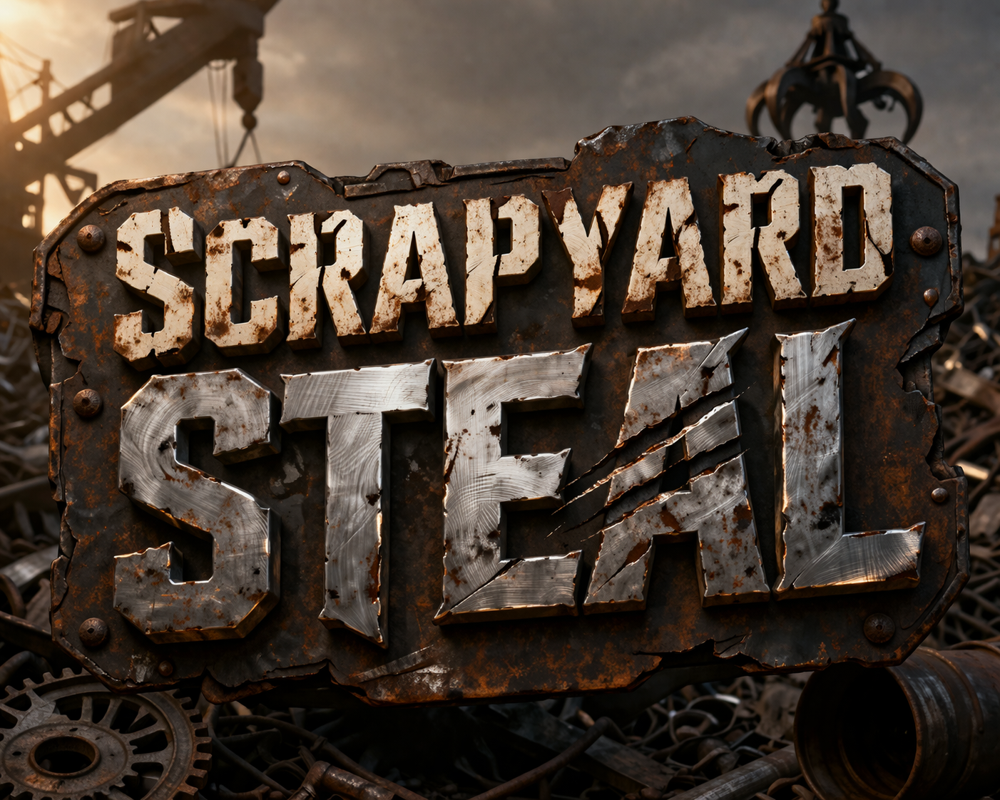

<p align="center">
  
</p>

<h1 align="center">🏭 Scrapyard Steal</h1>

<p align="center">
  <em>Expand. Absorb. Dominate the scrapyard.</em>
</p>

<p align="center">
  <a href="https://itch.io/jam/gamedevjs-2026"></a>
  
  
  
</p>

<p align="center">
  
  
  
  
  
</p>

---

## What is Scrapyard Steal?

A multiplayer clicker/strategy game where 2–20 players compete in a shared scrapyard. Control a factory-machine, expand your territory by claiming scrap tiles, upgrade your attack and defense, and absorb rival machines. When you absorb an opponent, they join your team and help you grow even faster.

Built for the [Gamedev.js Jam 2026](https://itch.io/jam/gamedevjs-2026) (Theme: **Machines**).

## 🎮 How to Play

| Action | Control |
|--------|---------|
| Claim a tile | Click an adjacent neutral tile |
| Mine a gear | Click a ⚙ tile you own or is unclaimed |
| Upgrade Attack | Click ⚔ ATK button |
| Upgrade Defense | Click 🛡 DEF button |
| Steer growth | Arrow keys (↑↓←→) to set direction |
| Clear direction | Press same arrow again or Escape |

### Game Flow

1. **Create or Join** — Host creates a game and shares the 5-character room code. Others join with the code.
2. **Lobby** — Pick your color, get a random bot name (♻ to reroll), host clicks START.
3. **Play** — Expand territory, mine gears for scrap, upgrade stats, absorb opponents.
4. **Absorb** — When you take all of an opponent's tiles, they join your team. Their adjective stacks onto your team name.
5. **Win** — Most tiles when the 5-minute timer runs out wins.

## 🛠 Tech Stack

| Layer | Technology |
|-------|-----------|
| Game Engine | [Phaser 3](https://phaser.io/) |
| Multiplayer | [Colyseus](https://colyseus.io/) |
| Language | TypeScript |
| Bundler | [Vite](https://vitejs.dev/) |
| Testing | [Vitest](https://vitest.dev/) + [fast-check](https://github.com/dubzzz/fast-check) |

## 🚀 Quick Start

### Prerequisites

- Node.js 20+
- npm

### Install

```bash
npm install
```

### Run locally

Start the Colyseus server:

```bash
npm run server:dev
```

Start the Vite dev server:

```bash
npm run dev
```

Open `http://localhost:3000` in two browser tabs to test multiplayer.

### Build for production

```bash
npm run build
```

## 📁 Project Structure

```
├── server/                 # Colyseus server
│   ├── index.ts            # Server entry + short code lookup endpoint
│   ├── rooms/
│   │   └── GameRoom.ts     # Game room: lifecycle, messages, game loop
│   ├── logic/
│   │   ├── GridManager.ts  # Grid init, adjacency, circular spawn placement
│   │   └── ConflictEngine.ts # Border conflict, cost formulas
│   └── state/
│       └── GameState.ts    # Colyseus schema: Player, Tile, GameState
├── src/                    # Phaser client
│   ├── main.ts             # Game bootstrap
│   ├── scenes/
│   │   ├── MenuScene.ts    # Create/Join game menu
│   │   ├── LobbyScene.ts   # Color pick, name, room code, start
│   │   └── GameScene.ts    # Main game: grid, HUD, input, state sync
│   ├── rendering/
│   │   └── GridRenderer.ts # Tile rendering, animations, highlights
│   ├── ui/
│   │   └── HUDManager.ts   # Stats, leaderboard, upgrade buttons
│   ├── network/
│   │   ├── client.ts       # Colyseus client config
│   │   └── NetworkManager.ts # Message wrapper
│   ├── logic/
│   │   └── DirectionFilter.ts # Growth direction filtering
│   └── utils/
│       └── nameGenerator.ts # Random "Adjective Animalbot" names
├── issue_tracking/         # Project tracking
├── doc/                    # Design docs, transcripts
└── tests/                  # Vitest + fast-check tests
```

## 🎨 Features

- **Multiplayer** — 2–20 players in real-time via WebSockets
- **Room codes** — 5-character codes to share and join specific games
- **Team absorption** — Defeated players join the victor's team and keep clicking
- **Stacking names** — Each absorption adds an adjective: "Turbo Hydraulic Otterbot"
- **Gear mining** — ⚙ tiles with 50 scrap each, mined at your attack rate
- **Color persistence** — Your team always shows in your chosen color on your screen
- **10 metal colors** — Copper, Corroded Copper, Gold, Tarnished Silver, Titanium, Cobalt, Bismuth, Rusty Iron, Chromium, Tungsten

## 🏆 Jam Challenge Tracks

| Challenge | Status |
|-----------|--------|
| Build it with Phaser | ✅ Eligible |
| Open Source by GitHub | ✅ Eligible |
| Deploy to Wavedash | 🔲 Pending |

## 📄 License

MIT

## 🤝 Contributing

This project was built for the Gamedev.js Jam 2026. Contributions, ideas, and feedback are welcome. Open an issue or submit a PR.

---

<p align="center">
  <sub>Built with 🏭 for the Gamedev.js Jam 2026</sub>
</p>
