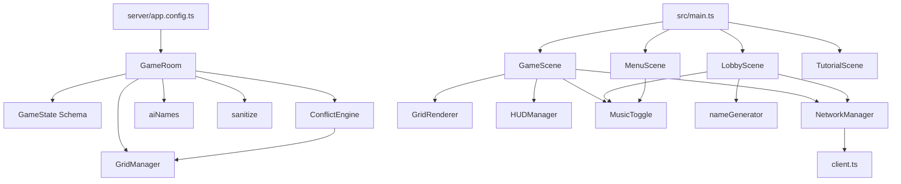

# Module Inventory

## Overview

Scrapyard Steal is split into two TypeScript codebases sharing a single repository: a Colyseus authoritative server and a Phaser 3 browser client. Both compile from the same `node_modules` but use separate `tsconfig` files and build pipelines.

## Server Modules

### Entry Point

| File | Purpose |
|------|---------|
| `server/index.ts` | Calls `listen(app)` from `@colyseus/tools` to start the HTTP + WebSocket server |
| `server/app.config.ts` | Registers `GameRoom`, Express REST endpoints, and `@colyseus/monitor` |

### Room

| File | Purpose |
|------|---------|
| `server/rooms/GameRoom.ts` | Single room type handling the full game lifecycle: `onCreate`, `onJoin`, `onLeave`, `onDispose`, 15+ message handlers, `gameTick` (1 s), `battleTick` (500 ms), AI logic, series/round management, rate limiting, absorption flow |

### State

| File | Purpose |
|------|---------|
| `server/state/GameState.ts` | Colyseus `@type` schema classes: `Player` (23 fields), `Tile` (6 fields), `GameState` (15 fields) |

### Logic

| File | Purpose |
|------|---------|
| `server/logic/GridManager.ts` | Pure functions: `initializeGrid`, `getAdjacentTiles`, `isAdjacent`, `assignStartingPositions`, `calculateGridSize`, `spawnNewGears` |
| `server/logic/ConflictEngine.ts` | Pure functions: `findBorders`, `calculateAttackPressure`, `resolveBorder`, `calculateTileClaimCost`, `calculateUpgradeCost` |
| `server/logic/aiNames.ts` | `generateAIName` — picks from 35 adjectives and 35 household-roid nouns |
| `server/logic/sanitize.ts` | `sanitizeName` — strips non-printable-ASCII characters and trims whitespace |

## Client Modules

### Entry Point

| File | Purpose |
|------|---------|
| `src/main.ts` | Creates `Phaser.Game` with four scenes, initializes Wavedash SDK in `postBoot` callback |

### Scenes

| File | Purpose |
|------|---------|
| `src/scenes/MenuScene.ts` | Main menu: Create Game, Join Game (short code input), Quick Play, Public Games list, How to Play, About popup |
| `src/scenes/LobbyScene.ts` | Pre-game lobby: color picker (10 base + 10 extended), name reroll, config panel (time/format/scrap/maxPlayers), AI management, public toggle, start game |
| `src/scenes/GameScene.ts` | Core gameplay: state sync via `room.onStateChange`, grid rendering, HUD wiring, tile click handling (claim/mine/attack/place bots), tooltips, absorption detection, end screen |
| `src/scenes/TutorialScene.ts` | 12-page paginated tutorial with keyboard navigation and gear decorations |

### Rendering

| File | Purpose |
|------|---------|
| `src/rendering/GridRenderer.ts` | Tile rendering with HUD-aware margins, color management, animations (mine flash, claim pulse, absorption flash, self-destruct explosion), claimable tile highlights, defense display, pixel-to-grid conversion |

### UI

| File | Purpose |
|------|---------|
| `src/ui/HUDManager.ts` | Stats panel (left), timer + stats popup (right), purchase bot buttons (bottom-right), notifications, capture choice modal, collector/defense bot icon rows |
| `src/ui/MusicToggle.ts` | `addMusicToggle` — global mute toggle persisting across scene transitions |

### Network

| File | Purpose |
|------|---------|
| `src/network/client.ts` | Creates `colyseus.js` `Client` instance using `VITE_SERVER_URL` env var (defaults to `ws://localhost:2567`) |
| `src/network/NetworkManager.ts` | 20+ typed send methods wrapping `room.send()`, plus `joinGame`, `createGame`, `joinByShortCode`, `joinById`, `joinPublicRoom` |

### Utilities

| File | Purpose |
|------|---------|
| `src/utils/nameGenerator.ts` | 200 adjectives, 230+ animals, `generateName`, `generateAIName`, `formatName` — client-side name generation |

## Module Dependency Diagram

## Test Modules

| Directory | Count | Type |
|-----------|-------|------|
| `tests/unit/logic/` | 4 files | Unit tests for ConflictEngine, GridManager, autoAssignColor, factoryCaptureChoice |
| `tests/unit/rendering/` | 1 file | Unit test for GridRenderer |
| `tests/unit/state/` | 1 file | Unit test for GameState |
| `tests/unit/` | 1 file | Unit test for nameGenerator |
| `tests/property/` | 18 files | Property-based tests (fast-check) covering game mechanics |
| `tests/e2e/` | 1 file | Playwright end-to-end test |
