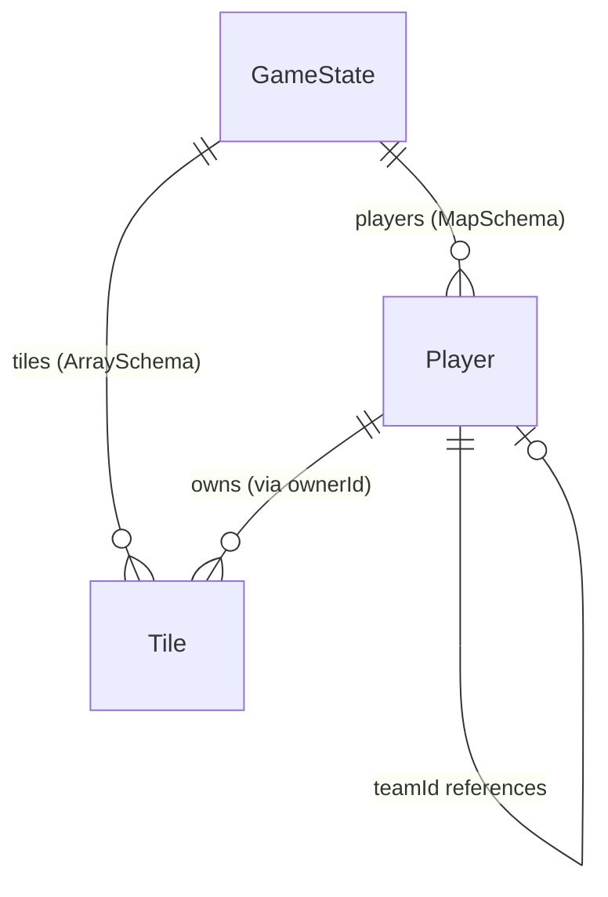

# Schema Catalog

## Overview

All game state is defined in `server/state/GameState.ts` using Colyseus `@type` decorators. The schema is automatically synchronized to all connected clients over WebSocket. There is no database — all state lives in memory for the lifetime of a room.

## ER Diagram

## GameState

Root schema class. One instance per `GameRoom`.

| Field | Type | Default | Description |
|-------|------|---------|-------------|
| `players` | `MapSchema<Player>` | `{}` | All players keyed by session ID (or AI ID) |
| `tiles` | `ArraySchema<Tile>` | `[]` | Flat array of all grid tiles (width × height) |
| `gridWidth` | `number` | `0` | Grid width in tiles |
| `gridHeight` | `number` | `0` | Grid height in tiles |
| `phase` | `string` | `"waiting"` | Game phase: `"waiting"`, `"active"`, or `"ended"` |
| `hostId` | `string` | `""` | Session ID of the room host |
| `shortCode` | `string` | `""` | 5-character room code (e.g., `"A3K7P"`) |
| `timeRemaining` | `number` | `300` | Seconds remaining; `0` = deathmatch (infinite) |
| `isPublic` | `boolean` | `false` | Whether the room appears in public listings |
| `matchFormat` | `string` | `"single"` | Match format: `"single"`, `"bo3"`, or `"bo5"` |
| `roundNumber` | `number` | `1` | Current round number in a series |
| `seriesScoresJSON` | `string` | `"{}"` | JSON-encoded `Record<string, number>` of round wins per player |
| `gearScrapSupply` | `number` | `1000` | Scrap amount assigned to each new gear tile |
| `maxPlayers` | `number` | `10` | Maximum players allowed (10 or 20) |

## Player

One instance per human or AI player.

| Field | Type | Default | Description |
|-------|------|---------|-------------|
| `id` | `string` | `""` | Session ID or AI-generated ID (e.g., `"ai_1714000000_0"`) |
| `nameAdj` | `string` | `""` | Adjective part of display name (e.g., `"Rusty"`) |
| `nameNoun` | `string` | `""` | Noun part of display name (e.g., `"Falconbot"`) |
| `color` | `number` | `-1` | Hex color value; `-1` = unselected |
| `teamId` | `string` | `""` | ID of the team leader (self if independent) |
| `teamName` | `string` | `""` | Composite team name with stacked adjectives |
| `isTeamLead` | `boolean` | `true` | Whether this player is the team leader |
| `isHost` | `boolean` | `false` | Whether this player is the room host |
| `resources` | `number` | `0` | Current scrap (currency) |
| `attack` | `number` | `1` | ATK bot count (max 50) |
| `defense` | `number` | `0` | DEF bot count (max 50) |
| `defenseBotsJSON` | `string` | `"[]"` | JSON array of `{x, y}` placed defense bot positions |
| `collection` | `number` | `0` | COL bot count (max 50) |
| `collectorsJSON` | `string` | `"[]"` | JSON array of `{x, y}` placed collector positions |
| `tileCount` | `number` | `1` | Number of tiles currently owned |
| `absorbed` | `boolean` | `false` | Whether this player has been absorbed into another team |
| `pendingAbsorption` | `boolean` | `false` | Whether this player is in the capture choice phase |
| `captorId` | `string` | `""` | ID of the player who triggered absorption |
| `direction` | `string` | `""` | Reserved for future directional mechanics |
| `spawnX` | `number` | `-1` | X coordinate of this player's factory (spawn tile) |
| `spawnY` | `number` | `-1` | Y coordinate of this player's factory (spawn tile) |
| `isAI` | `boolean` | `false` | Whether this player is controlled by AI |

### JSON-Encoded Fields

Colyseus schema does not natively support nested arrays of objects, so two fields use JSON strings:

- `defenseBotsJSON` — Array of `{ x: number, y: number }` for placed defense bots
- `collectorsJSON` — Array of `{ x: number, y: number }` for placed collectors

These are parsed with `JSON.parse()` on both server and client.

## Tile

One instance per grid cell.

| Field | Type | Default | Description |
|-------|------|---------|-------------|
| `x` | `number` | `0` | Grid X coordinate |
| `y` | `number` | `0` | Grid Y coordinate |
| `ownerId` | `string` | `""` | Player ID of the owner; `""` = unclaimed |
| `isSpawn` | `boolean` | `false` | Whether this tile is a factory (spawn point) |
| `hasGear` | `boolean` | `false` | Whether this tile currently has a gear pile |
| `gearScrap` | `number` | `0` | Remaining scrap in the gear pile |

## Schema Synchronization

The Colyseus framework automatically synchronizes schema changes to all connected clients via binary patches over WebSocket. Clients receive updates through `room.onStateChange()` callbacks. The client never modifies state directly — it sends messages and the server applies validated changes.
