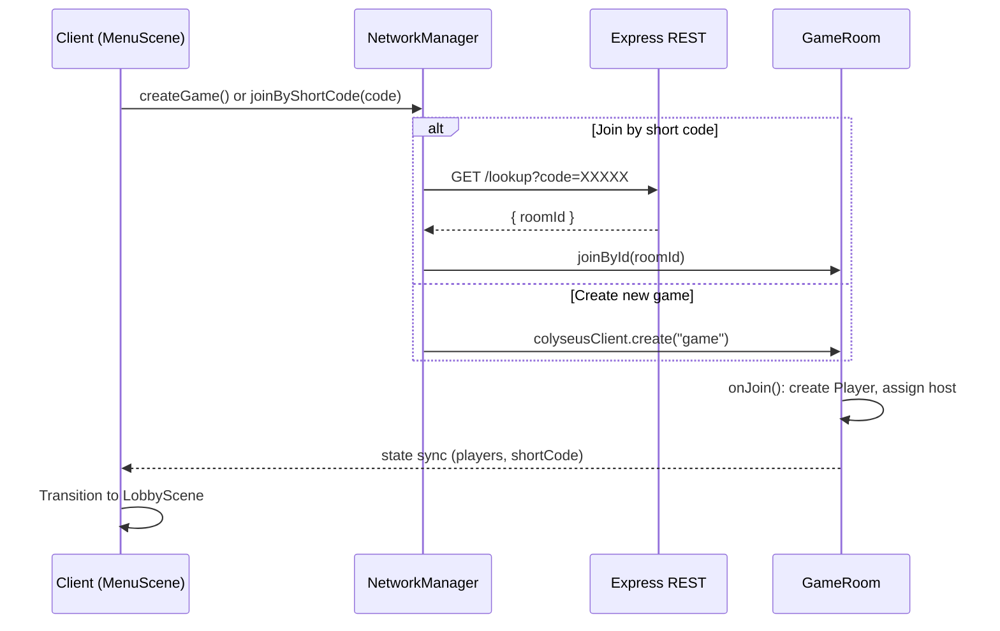
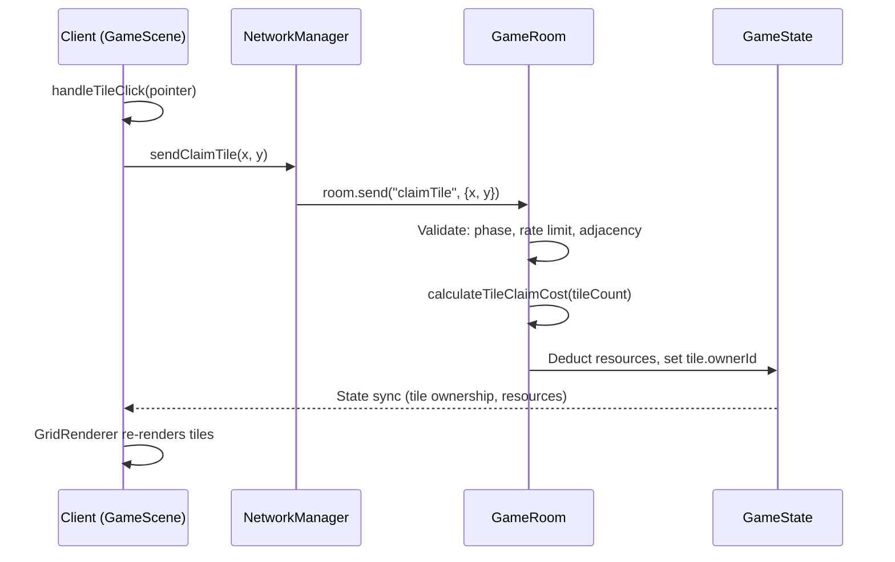
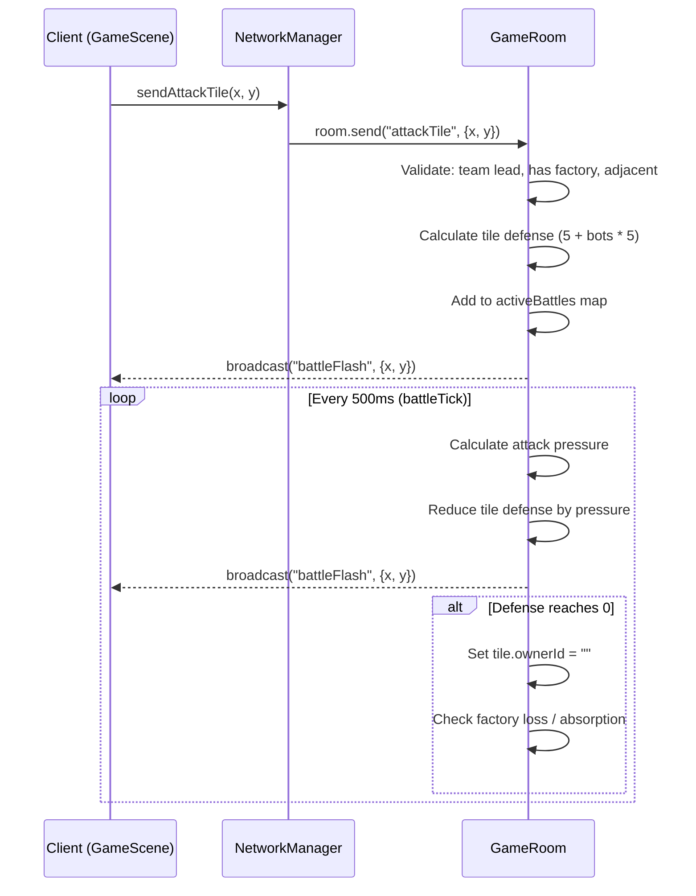
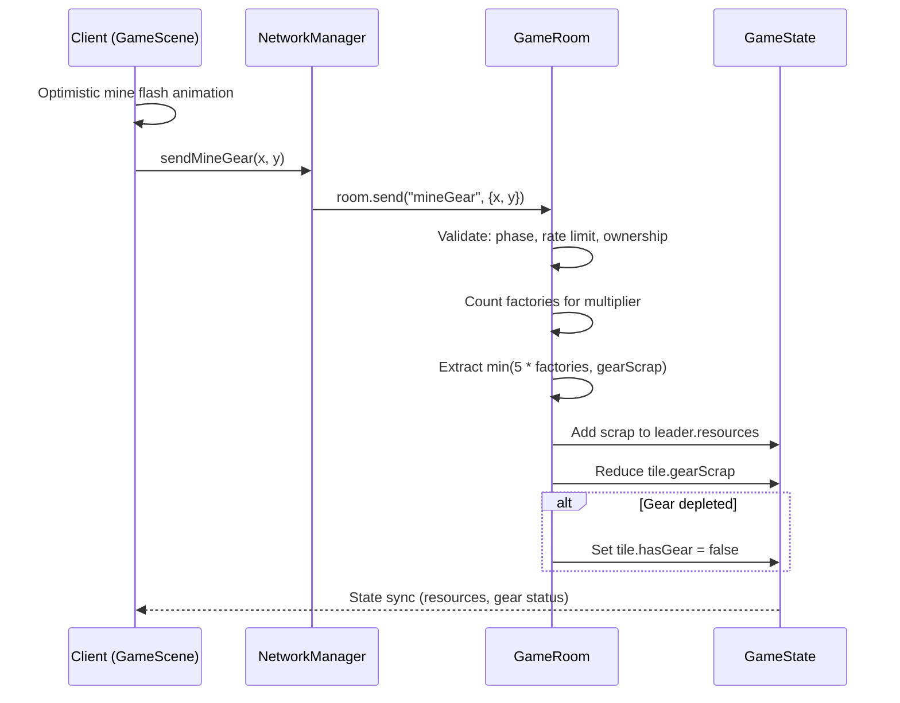
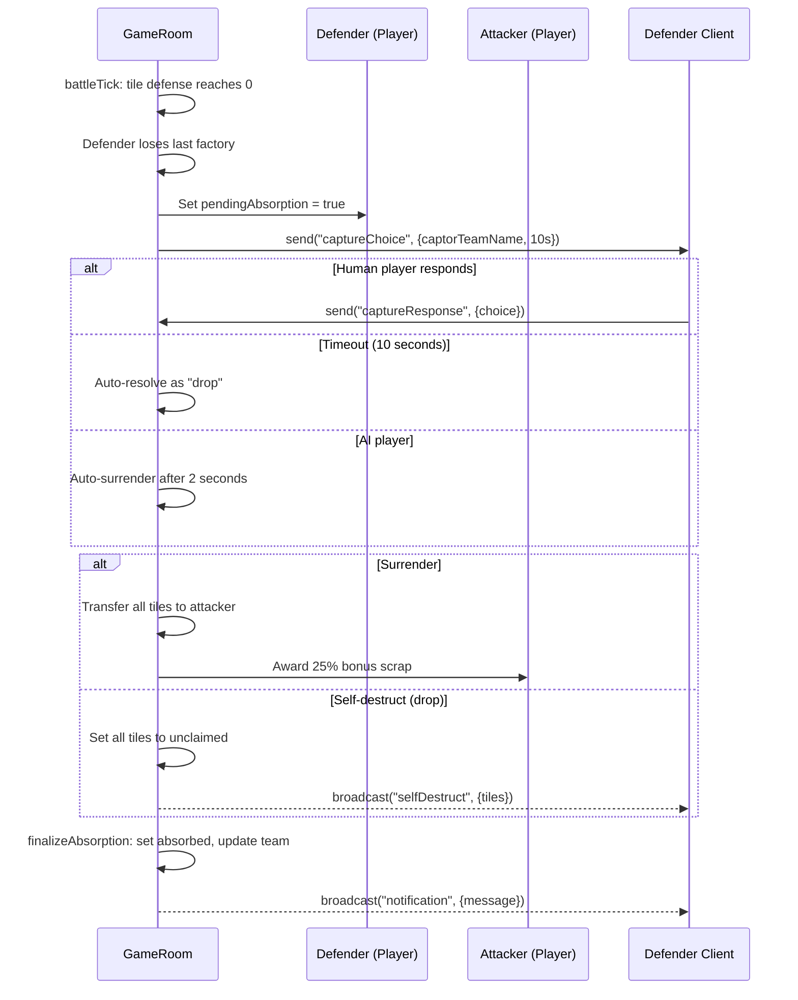

# Data Flow Maps

## Overview

Scrapyard Steal uses an authoritative server architecture. All game logic runs server-side in `GameRoom`. The client sends messages via Colyseus WebSocket, the server validates and applies changes to the schema, and Colyseus automatically synchronizes state back to all clients.

## 1. Joining a Game

## 2. Claiming a Tile

## 3. Attacking a Tile

## 4. Mining a Gear

## 5. Absorption Flow

## State Synchronization Model

All data flows follow the same pattern:

1. Client sends a message via `NetworkManager` (wraps `room.send()`)
2. Server validates the request in the message handler
3. Server mutates the Colyseus schema (`GameState`, `Player`, `Tile`)
4. Colyseus automatically computes binary diffs and pushes to all clients
5. Client receives updates via `room.onStateChange()` callback
6. `GameScene.onStateUpdate()` re-renders the grid and HUD

The client never directly modifies game state. The only client-side optimism is the mine flash animation, which plays immediately before server confirmation.
