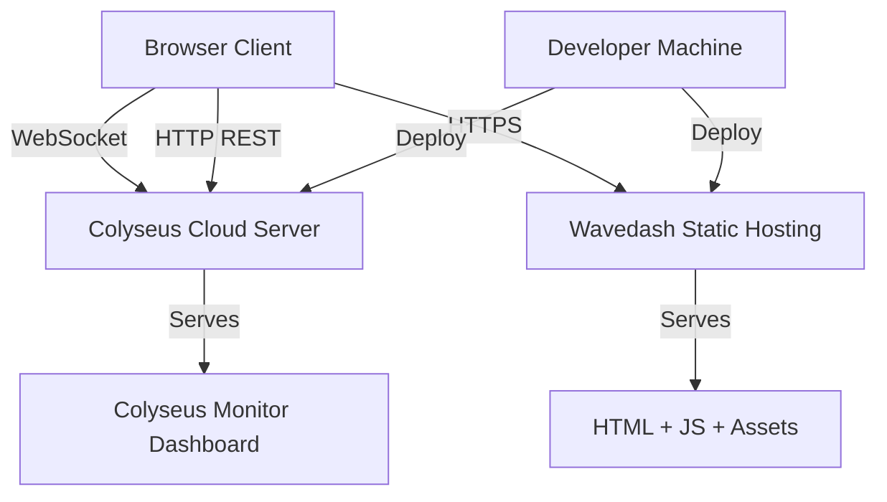

# Integration Map

## Overview

Scrapyard Steal integrates with a small set of external services for deployment and real-time communication. There is no database, no third-party API, and no external authentication provider.

## Integration Diagram



## External Systems

### 1. Colyseus Cloud

| Aspect | Detail |
|--------|--------|
| Purpose | Hosts the authoritative game server |
| Protocol | WebSocket (wss://) for game state, HTTP for REST endpoints |
| Configuration | `.colyseus-cloud.json` — `applicationId`, deployment `token` |
| Production URL | `wss://us-ord-ef0ec457.colyseus.cloud` |
| Region | US-ORD (Chicago) |
| Deployment | `npx @colyseus/cloud deploy` (uses `.colyseus-cloud.json`) |

Colyseus Cloud runs the compiled server code (`build/index.js`) via PM2 (configured in `ecosystem.config.js`). It handles WebSocket connection management, room lifecycle, and horizontal scaling.

### 2. Wavedash

| Aspect | Detail |
|--------|--------|
| Purpose | Static hosting for the Phaser 3 client |
| Configuration | `wavedash.toml` — `game_id`, `upload_dir`, `entrypoint` |
| Upload directory | `./dist` (Vite build output) |
| Entrypoint | `index.html` |
| SDK | `@wvdsh/sdk-js` (^1.2.4) — initialized in `src/main.ts` `postBoot` callback |

The client is a static single-page application. Wavedash serves the built assets and provides the Wavedash SDK for platform integration.

### 3. Colyseus Monitor (`@colyseus/monitor`)

| Aspect | Detail |
|--------|--------|
| Purpose | Real-time dashboard for inspecting rooms, clients, and state |
| Endpoint | `GET /colyseus` |
| Registration | `app.use("/colyseus", monitor())` in `server/app.config.ts` |
| Access | Unauthenticated (see Security Architecture for concerns) |

### 4. Colyseus WebSocket Protocol

| Aspect | Detail |
|--------|--------|
| Client library | `colyseus.js` (^0.15.28) |
| Server library | `colyseus` (^0.15.57) |
| Schema sync | Binary delta patches via `@colyseus/schema` decorators |
| Room type | Single type `"game"` defined in `app.config.ts` |
| Connection | Client creates `new Client(SERVER_URL)` in `src/network/client.ts` |

## Client-Server Communication Paths

### WebSocket (Primary)

All real-time game communication flows over a single WebSocket connection per client:

- **Client → Server**: `room.send(type, payload)` via `NetworkManager` methods
- **Server → Client**: Schema state sync (automatic) + targeted/broadcast messages
- **Connection URL**: `VITE_SERVER_URL` env var, defaults to `ws://localhost:2567`

### HTTP REST (Secondary)

Used only for room discovery before WebSocket connection:

- `GET /lookup?code=XXXXX` — resolve short code to room ID
- `GET /public` — find a public room to join
- `GET /public/list` — list all public rooms

The client constructs the HTTP URL by replacing `ws://` or `wss://` with `http://` or `https://` from the same `VITE_SERVER_URL`.

## Environment Variables

| Variable | Used By | Default | Purpose |
|----------|---------|---------|---------|
| `VITE_SERVER_URL` | Client (`src/network/client.ts`, `NetworkManager`) | `ws://localhost:2567` | WebSocket server URL |
| `NODE_ENV` | Server (`ecosystem.config.js`) | — | Set to `"production"` in PM2 config |

## Build and Deploy Pipeline

### Client Build

```
npm run build:prod
```

Sets `VITE_SERVER_URL` to the production WebSocket URL, runs `vite build`, and zips the `dist/` directory.

### Server Build

```
npm run server:build
```

Compiles `server/` to `build/` using `tsconfig.server.json` (CommonJS, ES2020 target).

### Deployment

- **Server**: Deployed to Colyseus Cloud via their CLI tool
- **Client**: `dist/` uploaded to Wavedash via their CLI tool
