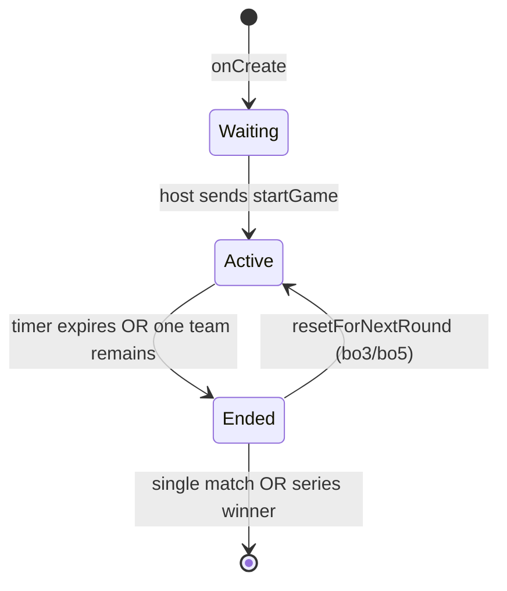
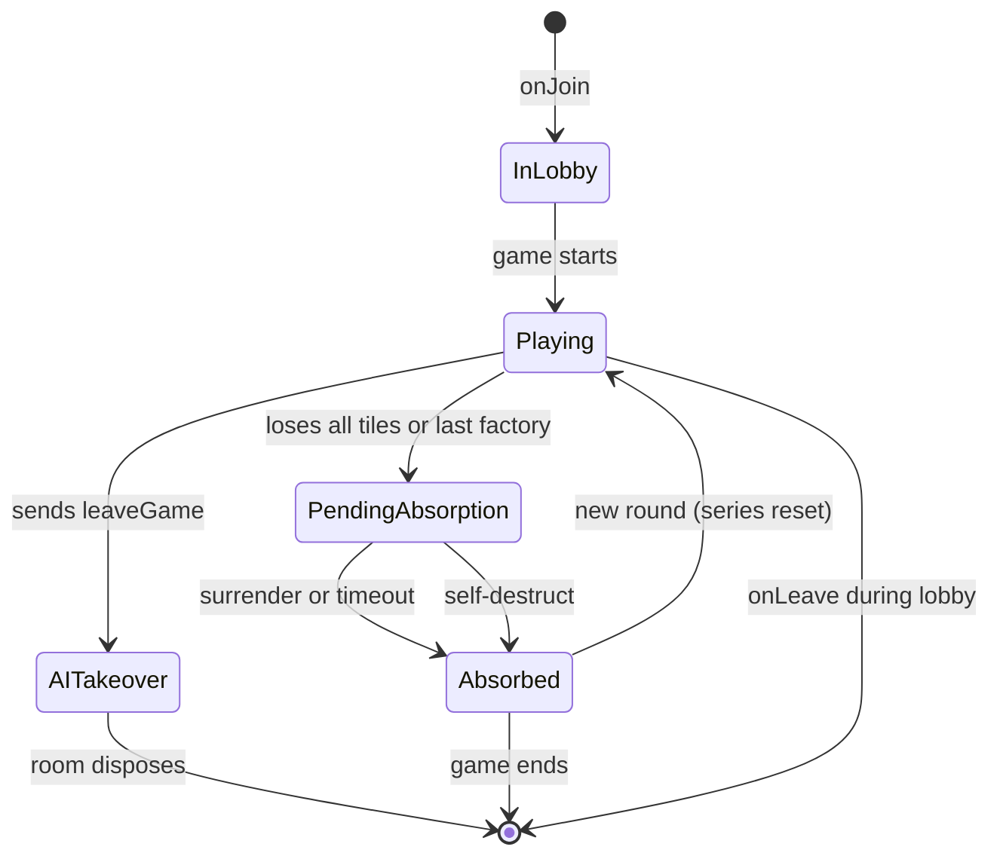
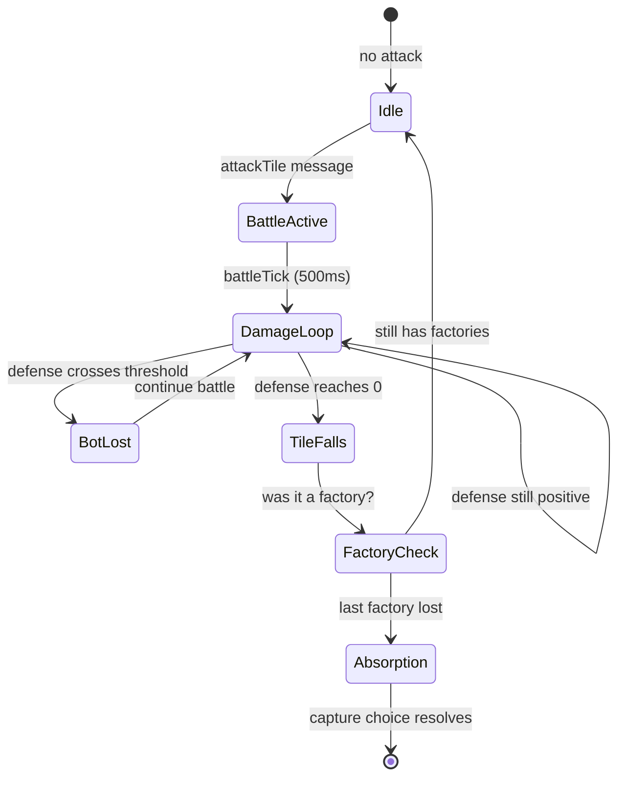
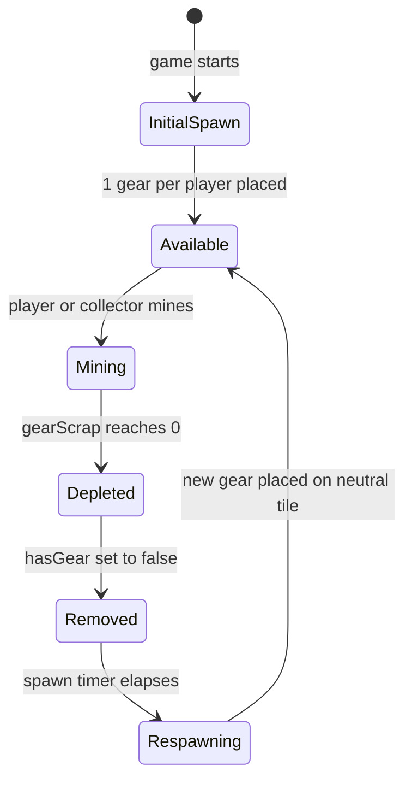

# Business Workflows

## Overview

Scrapyard Steal has several interconnected workflows that govern the game lifecycle, player elimination, and series progression. All workflow logic runs server-side in `GameRoom`.

## 1. Game Phase State Machine

The `GameState.phase` field drives the top-level game lifecycle.



### Phase Details

| Phase | Duration | Allowed Actions |
|-------|----------|-----------------|
| `"waiting"` | Until host starts | `setName`, `selectColor`, `setConfig`, `addAI`, `removeAI`, `togglePublic`, `startGame` |
| `"active"` | Until win condition | All gameplay actions: claim, mine, attack, upgrade, place bots |
| `"ended"` | 5 seconds (series) or permanent (single) | No actions; end screen displayed |

### Win Conditions

1. **Timer expires** — `timeRemaining` reaches 0 (not applicable in deathmatch mode)
2. **Sole survivor** — only one team remains for 2 consecutive `gameTick` cycles (`soloTeamTicks >= 2`)

## 2. Player Lifecycle



## 3. Absorption & Capture Choice Flow

When a player loses their last factory (spawn tile) in battle, they enter the capture choice flow.

### Trigger

In `battleTick`, when a tile's defense reaches 0 and the defender has no remaining factories:

```
defender has no spawn tiles with ownerId === defenderId
→ enterPendingAbsorption(defenderId, attackerId)
```

### Pending Absorption State

1. `defender.pendingAbsorption = true`
2. `defender.captorId = attackerId`
3. `defender.isTeamLead = false`
4. All active battles initiated by the defender are cancelled

### Choice Resolution

| Player Type | Behavior | Timeout |
|-------------|----------|---------|
| Human | Receives `captureChoice` message with modal | 10 seconds → auto-drop |
| AI | Auto-surrenders | 2 seconds |

### Surrender Path

1. All defender tiles transfer to captor (`tile.ownerId = captorId`)
2. Captor receives 25% of defender's scrap as bonus
3. Defender joins captor's team (`teamId = captorId`)
4. Defender's adjective may be prepended to captor's team name

### Self-Destruct (Drop) Path

1. All defender tiles become unclaimed (`tile.ownerId = ""`)
2. `selfDestruct` broadcast triggers explosion animation on all clients
3. Captor receives 25% of defender's scrap as bonus
4. Defender joins captor's team (absorbed but tiles are gone)

### Finalization

Both paths end with `finalizeAbsorption`:

- `defender.absorbed = true`
- `defender.pendingAbsorption = false`
- Defense bots and collectors cleared
- Team name updated across all team members
- Notification broadcast to all clients

## 4. Battle Flow



### Battle Mechanics

- **Attack pressure**: `factories + floor(attackBots / activeBattles)` (minimum 1)
- **Tile defense**: `5 + (defenseBots on tile × 5)`
- **Defense thresholds**: At 20, 15, 10, 5 — one defense bot removed, 50% repair chance
- **Attacker attrition**: Every 5 cumulative damage dealt, 50% chance to lose an ATK bot

## 5. Series / Round Management

For `bo3` and `bo5` match formats, the game supports multiple rounds.

### Round End Flow

1. `handleRoundEnd()` stops both tick loops and clears active battles
2. Determines round winner (player with most tiles among non-absorbed players)
3. Updates `seriesScores` map and syncs to `seriesScoresJSON`
4. Checks win threshold: 2 for bo3, 3 for bo5

### Between Rounds

If no series winner yet:

1. Phase set to `"ended"` temporarily
2. 5-second delay via `this.clock.setTimeout`
3. `resetForNextRound()` called

### Round Reset (`resetForNextRound`)

1. Increment `roundNumber`
2. Recalculate grid size for current player count
3. Re-initialize grid with fresh neutral tiles
4. Reassign starting positions (circular placement)
5. Place initial gears (1 per player)
6. Reset all player stats: resources=0, attack=1, defense=0, collection=0, tileCount=1
7. Clear absorption state: `absorbed=false`, `isTeamLead=true`, `teamId=self`
8. Reset timer to configured time limit
9. Restart both tick loops
10. Set phase to `"active"`

## 6. AI Takeover (Voluntary Leave)

When a human player sends `leaveGame` during an active game:

1. Player's noun gets `"roid"` suffix (e.g., `"Falconbot"` → `"Falconbotroid"`)
2. Team name updated for all team members
3. Player converted to AI: `isAI = true`, new ID `ai_{sessionId}`
4. All tiles re-mapped to the new AI ID
5. All team member references updated
6. Player entry moved from old session key to new AI key
7. AI logic in `gameTick` takes over automatically

## 7. Gear Economy Lifecycle



### Gear Spawning Rules

- **Initial delay**: 20 seconds after round start (`gearRespawnCountdown`)
- **Spawn interval**: `max(1, 21 - activePlayers)` seconds
- **Gear cap**: `5 + activePlayers` unclaimed gears maximum
- **Placement**: Random unclaimed, non-spawn tiles without existing gears
- **Scrap amount**: Configured `gearScrapSupply` (default 1000)
